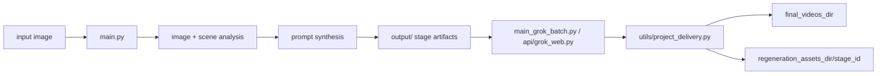
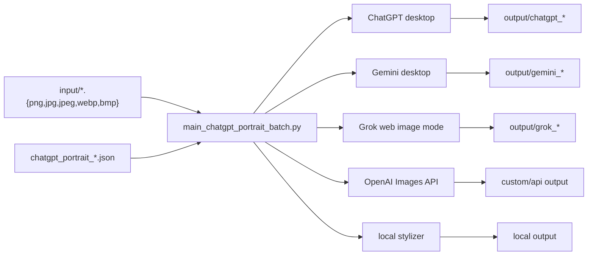
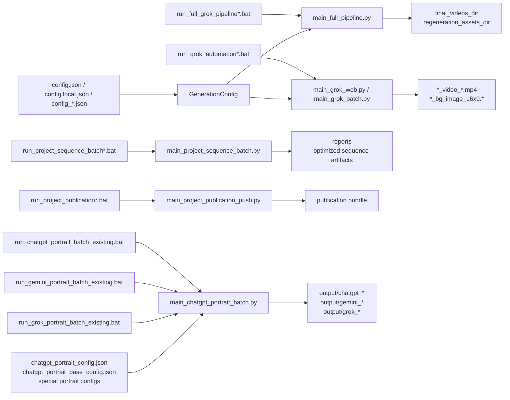

# Project Structure Web Map

<main>

<section id="hero">

# Memory-to-Video Agent

**Живая карта проекта, пайплайнов, точек риска и обязательных проверок.**

Этот файл переписан как web-страница внутри Markdown: его удобно читать сверху вниз, открывать как документацию в браузере/GitHub и использовать как стартовую панель для изменений.

| Быстрый ответ | Где смотреть |
| --- | --- |
| Как устроен проект | [Architecture](#architecture) |
| Какие есть подсистемы | [Subsystem Cards](#subsystem-cards) |
| Как идут данные | [Data Flows](#data-flows) |
| Как запускать `.bat` | [Launch Map](#launch-map) |
| Что нельзя ломать | [Invariants](#invariants) |
| Что проверять при изменениях | [Change Control](#change-control) |
| Где тесты | [Test Matrix](#test-matrix) |
| Как публиковать внешний bundle | [Publication Sync](#publication-sync) |

</section>

---

<section id="architecture">

## Architecture

Проект состоит из связанных pipeline-маршрутов вокруг одного базового объекта: **`stage_id`**.

<table>
<tr>
<th>Слой</th>
<th>Назначение</th>
<th>Главные файлы</th>
</tr>
<tr>
<td>Input</td>
<td>Входные изображения из <code>input/</code> или явно переданный файл.</td>
<td><code>input/</code>, <code>main.py</code>, <code>main_full_pipeline.py</code></td>
</tr>
<tr>
<td>Analysis</td>
<td>Локальный анализ изображения и scene-analysis через OpenAI.</td>
<td><code>utils/image_analysis.py</code>, <code>api/openai_scene.py</code>, <code>models/scene_analysis.py</code></td>
</tr>
<tr>
<td>Prompting</td>
<td>Описание сцены, motion, video prompt, background prompt, final-frame prompt, music prompt.</td>
<td><code>utils/prompt_builder.py</code>, <code>api/openai_prompt_synthesizer.py</code>, <code>utils/grok_prompt_json.py</code></td>
</tr>
<tr>
<td>Execution</td>
<td>Генерация через Grok Web, ChatGPT, Gemini, OpenAI Images API или локальный stylizer.</td>
<td><code>api/grok_web.py</code>, <code>api/chatgpt_desktop_v2.py</code>, <code>api/gemini_desktop.py</code>, <code>api/openai_image.py</code></td>
</tr>
<tr>
<td>Delivery</td>
<td>Доставка видео и non-video артефактов в финальные каталоги.</td>
<td><code>utils/project_delivery.py</code>, <code>final_videos_dir</code>, <code>final_output_dir</code>, <code>regeneration_assets_dir</code></td>
</tr>
<tr>
<td>Post</td>
<td>Sequence optimization, Premiere XML/PRPROJ export, reports.</td>
<td><code>main_sequence_optimizer.py</code>, <code>main_project_sequence_batch.py</code>, <code>utils/premiere_*.py</code></td>
</tr>
</table>

### Four Core Contracts

1. `GenerationConfig` в `config.py` является единой точкой правды для generation-флагов.
2. Все артефакты одного этапа имеют общий префикс `stage_id`.
3. `output/` является временной рабочей зоной; итоговая доставка идет через `utils/project_delivery.py`.
4. Sequence-утилиты используют stage-based артефакты из `regeneration_assets_dir`.

</section>

---

<section id="subsystem-cards">

## Subsystem Cards

| Подсистема | Основные файлы | Ответственность | Выходы |
| --- | --- | --- | --- |
| Config & Paths | `config.py`, `config.json`, `config_BASE.json`, `config_*.json` | Описание флагов, validation, canonical paths | `GenerationConfig`, `Settings` |
| Image & Scene Analysis | `utils/image_analysis.py`, `api/openai_scene.py`, `models/scene_analysis.py`, `main_scene.py` | Visual metadata и scene payload | `*_scene_analysis.json`, summaries |
| Prompt Synthesis | `utils/prompt_builder.py`, `utils/grok_prompt_json.py`, `api/openai_prompt_synthesizer.py`, `api/openai_motion_selector.py`, `utils/camera_movements.py` | Video/background/final-frame/music prompts, Grok multiscene JSON, motion selection | `*_v_prompt_*.txt`, `*_v_prompt_*.json`, `*_bg_prompt.txt`, `*_assoc_bg_prompt.txt`, `*_final_frame_prompt_*.txt`, `*_m_prompt.txt` |
| Multi-Scene Composer | `main_video_prompt_composer.py`, `video_prompt_config.py`, `api/openai_video_prompt_composer.py`, `utils/video_prompt_composer.py`, `services/Seedance_2.0_Director.md` | Один EN/RU prompt, Seedance EN/RU JSON, scenario variants | `Gen_Video_<ts>.txt`, `Gen_Video_RU_<ts>.txt`, `Gen_Video_Seedance_<VariantId>_<ts>.json`, `Gen_Video_Seedance_RU_<VariantId>_<ts>.json` |
| Main Generation | `main.py` | Склеивает analysis, scene, motion, prompt generation, optional final frames | stage-артефакты в `output/` |
| API Final Frames | `main_desktop_pipeline.py` | Многокадровый pipeline, manifest, non-video sync | `*_api_pipeline_manifest.json`, final-frame outputs |
| Grok Runtime | `api/grok_web.py`, `main_grok_web.py` | Background image/video generation для одной prompt-пары | `*_bg_image_16x9.png`, `*_video_*.mp4` |
| Grok Batch | `main_grok_batch.py` | Пакетный Grok-run по готовым `*_v_prompt_*` | videos и bg-images по всем stages |
| Full Sequential Pipeline | `main_full_pipeline.py` | Prompt generation + Grok-run для каждого изображения из `input/` | delivered stage outputs, cleanup of `input/` and `output/` |
| Delivery & Lifecycle | `utils/project_delivery.py`, `utils/artifact_cleanup.py`, `main_cleanup_artifacts.py` | Доставка, очистка, перенос ошибок, архивирование | `final_videos_dir`, `final_output_dir`, `regeneration_assets_dir`, `error/`, cleanup reports |
| Sequence Optimization | `main_sequence_optimizer.py`, `utils/sequence_optimizer.py`, `utils/sequence_optimizer_runtime.py`, `utils/premiere_xml.py`, `utils/premiere_project.py`, `models/video_sequence.py` | Рекомендованный порядок клипов и export | optimized JSON/TXT/XML/PRPROJ |
| Reports & Batch Orchestration | `main_project_sequence_batch.py`, `main_sequence_reports.py`, `main_human_sequence_report.py`, `utils/project_sequence_batch.py`, `utils/current_sequence_reports.py`, `utils/human_profile_sequence_report.py`, `utils/sequence_structure_report.py`, `utils/transition_recommendations.py`, `utils/fcp_translation_results.py` | Reports, batch delivery, human-profile overlays, transition recommendations | reports, batch summaries, transition reports |
| Desktop/Web Automation | `main_desktop.py`, `api/chatgpt_desktop.py`, `api/chatgpt_desktop_v2.py`, `api/gemini_desktop.py`, `api/chatgpt_web.py`, `api/grok_web.py` | Prompt-driven interaction with external UIs | submitted prompts, saved media |
| Portrait/Image Batch | `main_chatgpt_portrait_batch.py`, `api/chatgpt_desktop_v2.py`, `api/gemini_desktop.py`, `api/grok_web.py`, `chatgpt_portrait_config.json`, `chatgpt_portrait_base_config.json`, `run_chatgpt_portrait_batch_existing.bat`, `run_gemini_portrait_batch_existing.bat`, `run_grok_portrait_batch_existing.bat` | Batch generation of artistic portraits and image-edit tasks through ChatGPT, Gemini, Grok, OpenAI API, or local stylizer | `output/chatgpt_*`, `output/gemini_*`, `output/grok_*`, optional `final_output_dir` copy, optional response text |

</section>

---

<section id="data-flows">

## Data Flows

### Full Generation Route



### Grok Runtime Route

1. `main_grok_web.py` получает исходное изображение и `*_v_prompt_*.txt` или `*_v_prompt_*.json`.
2. Если включен `generate_source_background`, сначала создается background image.
3. Затем Grok генерирует video.
4. `utils/project_delivery.py` копирует media в `final_videos_dir`.
5. `main_grok_batch.py` повторяет это по всем prompt-файлам.

### Full Sequential Route

1. `main_full_pipeline.py` читает изображения из `input/`.
2. Для каждого изображения вызывает `_run_generation()` из `main.py`.
3. Запускает Grok через `main_grok_batch.py`.
4. После успешной доставки может удалить обработанный input-файл.
5. После стадии очищает `output/`.

This route is high-risk: any lifecycle change can affect source-file safety.

### Sequence Optimization Route

1. `main_sequence_optimizer.py` читает XML или PRPROJ.
2. Parser извлекает clips и связывает их со stage-артефактами в `regeneration_assets_dir`.
3. `utils/sequence_optimizer.py` вычисляет новый порядок.
4. Exporters создают JSON/TXT и, если нужно, XML/PRPROJ.
5. Reporting utilities создают structure reports, transition recommendations, human-profile overlays.
6. Финальный optimized `.prproj` сохраняется рядом с исходным `project_path`; `reports/temp_projects` хранит только временную batch-копию.

### Multi-Scene Prompt Composer Route

1. `main_video_prompt_composer.py` читает JSON request или полный `--config-file` JSON/JSONC.
2. `utils/video_prompt_composer.py` берет stage descriptions и scene-analysis из `regeneration_assets_dir`.
3. `video_prompt_config.py` валидирует параметры и применяет defaults.
4. `api/openai_video_prompt_composer.py` строит один EN prompt и один RU prompt с `Shot N:`.
5. При `--seedance-json` создаются Seedance EN/RU control JSON.
6. Для video-generation задач EN и RU artifacts должны появляться в одном запуске.

### Portrait/Image Batch Route



Portrait batch rules:

1. `main_chatgpt_portrait_batch.py` builds one job for each image/style pair.
2. Result filename is `<image_stem>_<style_slug>.png`.
3. `--skip-existing` is the restart contract.
4. Gemini and Grok mirror `output/chatgpt_*` config folders into `output/gemini_*` and `output/grok_*` when `--output-dir` is not explicit.
5. ChatGPT and Gemini desktop flows depend on dedicated single-tab Chrome windows.
6. Grok uses `.browser-profile/grok-web` and `https://grok.com/imagine` through Playwright image mode.
7. `--delivery-config-file config_*.json` preserves the project-side restart copy in `output/...` and also copies every newly saved PNG into `final_output_dir` while mirroring the same relative subfolder path, such as `output/grok_portraits/...` -> `final_output_dir/grok_portraits/...`.

</section>

---

<section id="launch-map">

## Launch Map



### Common Commands

```bat
.\run_full_grok_pipeline.bat --config-file .\config_Yakov.json --upload-timeout 300
```

```bat
.\run_grok_automation_all.bat --skip-existing --upload-timeout 300
```

```bat
.\run_chatgpt_portrait_batch_existing.bat --config-file chatgpt_portrait_base_config.json --skip-existing --desktop-reactivate-delay 0 --desktop-click-composer
```

```bat
.\run_chatgpt_portrait_batch_existing.bat --config-file chatgpt_portrait_config.json --delivery-config-file .\config_Yakov.json --skip-existing --desktop-reactivate-delay 0 --desktop-click-composer
```

```bat
.\run_gemini_portrait_batch_existing.bat --config-file chatgpt_portrait_config.json --skip-existing --continue-on-error --desktop-reactivate-delay 0 --desktop-click-composer
```

```bat
.\run_grok_portrait_batch_existing.bat --config-file chatgpt_portrait_base_config.json --skip-existing --continue-on-error
```

Parameter precedence:

1. Hardcoded `.bat` arguments.
2. Extra arguments forwarded through `%*`.
3. JSON config values.
4. Python defaults.

</section>

---

<section id="invariants">

## Invariants

<details open>
<summary><strong>Configuration</strong></summary>

- Every new generation flag must be added to `config.py`.
- Update the matching field set, `GenerationConfig`, `from_dict()`, `override()`, docs, and tests.
- Only one framing mode may be enabled at a time:
  - `prefer_face_closeups`
  - `use_ai_optimal_framing`
  - `use_ai_optimal_then_identity_safe_framing`
  - `generate_dual_framing_videos`
  - `generate_identity_safe_closeup_videos`
  - `generate_triple_framing_videos`
- `ai_optimal_then_identity_safe_ai_optimal_percent` is a ratio parameter, not a separate mode.

</details>

<details open>
<summary><strong>Artifacts</strong></summary>

- Stage artifacts must share the same `stage_id` prefix.
- Naming changes must be checked everywhere filenames are written, read, parsed, synced, or reported.
- Sequence tools and delivery functions depend on stable naming.

</details>

<details open>
<summary><strong>Lifecycle</strong></summary>

- `main_grok_batch.py` clears `input/` and `output/` after a successful batch unless `--keep-workdirs` is set.
- `main_full_pipeline.py` can remove processed input images.
- Any cleanup behavior change is high-risk.

</details>

<details open>
<summary><strong>Prompts</strong></summary>

- Prompt semantics must stay aligned across OpenAI synthesizer, local `PromptBuilder`, manifests, docs, and tests.
- If both English and Russian prompt artifacts are written, semantic changes must not silently affect only one language branch.

</details>

<details open>
<summary><strong>Delivery</strong></summary>

- `.mp4` files go to `final_videos_dir`.
- Portrait/image-edit PNG copies go to `final_output_dir` when `--delivery-config-file` is present, preserving the project `output/...` subfolder structure.
- Non-video stage assets go to `regeneration_assets_dir/<stage_id>/`.
- Background image handling must not break non-video sync.

</details>

</section>

---

<section id="change-control">

## Change Control

### Required Workflow

1. Classify the change: config, prompt, scene schema, naming, Grok runtime, delivery, optimizer, reports, portrait batch.
2. Open `project_structure_registry.json`.
3. Select the matching `change_type`.
4. Review all `must_touch` and `must_review` files.
5. Update user-facing docs if behavior changes.
6. Add or update tests for changed contracts.
7. Run at least one targeted test.
8. For high-risk changes, run an integration route to a real artifact.

### Impact Areas

| Change Type | Must Review | Minimum Check |
| --- | --- | --- |
| Generation flag | `config.py`, `config.json`, `config_BASE.json`, profile configs, `main.py`, `main_desktop_pipeline.py`, `main_full_pipeline.py`, `api/openai_prompt_synthesizer.py`, `utils/prompt_builder.py`, user guides | Config load, CLI override, manifest serialization, prompt output, targeted tests |
| Scene-analysis schema | `models/scene_analysis.py`, `api/openai_scene.py`, `main_scene.py`, `main.py`, prompt builders, sequence/report readers | Save/read `*_scene_analysis.json`, compatibility if required, parse/prompt tests |
| Naming / `stage_id` | `main.py`, `main_desktop_pipeline.py`, `main_grok_web.py`, `main_grok_batch.py`, `main_full_pipeline.py`, delivery, Premiere exporters, reports | End-to-end artifact naming and sync check |
| Grok automation | `api/grok_web.py`, `main_grok_web.py`, `main_grok_batch.py`, `main_full_pipeline.py`, timeout/options | Single-stage run, batch run, background-only run, `--no-submit` |
| Delivery / cleanup | `utils/project_delivery.py`, `main_grok_batch.py`, `main_full_pipeline.py`, cleanup tools | Final file copy, `regeneration_assets_dir` sync, `error/` behavior, no surprise input deletion |
| Sequence optimization | sequence models, optimizer, runtime, XML/PRPROJ exporters, reports | JSON/TXT output, XML/PRPROJ export if touched, optimizer/report tests |
| Portrait/image batch | `main_chatgpt_portrait_batch.py`, `api/chatgpt_desktop_v2.py`, `api/gemini_desktop.py`, `api/grok_web.py`, portrait configs, launchers | Config/job dry-run, output folder mirroring, selected backend sanity check |

</section>

---

<section id="risk-zones">

## High-Risk Zones

| Area | Why It Is Risky |
| --- | --- |
| `config.py` | Breaks every generation pipeline if a field is parsed or overridden incorrectly. |
| `main.py` | Central assembly point for stage artifacts. |
| `main_grok_web.py` and `api/grok_web.py` | Real browser automation and media saving. |
| `main_full_pipeline.py` | Can alter lifecycle of input files and output cleanup. |
| `utils/project_delivery.py` | Controls final result preservation. |
| `api/chatgpt_desktop_v2.py` and `api/gemini_desktop.py` | UI automation depends on focus, DPI, monitors, localization, and service UI changes. |
| `main_chatgpt_portrait_batch.py` | Defines `input/` to `output/chatgpt_*`, `output/gemini_*`, and `output/grok_*` contracts. |
| Naming contracts and `stage_id` | Used across delivery, regeneration assets, reports, and Premiere sequence tools. |
| `models/scene_analysis.py` and `models/video_sequence.py` | Data contracts shared by multiple subsystems. |

</section>

---

<section id="test-matrix">

## Test Matrix

| Class | Tests |
| --- | --- |
| Prompt/config | `test/test_config_cli_defaults.py`, `test/test_scene_pipeline_integration.py`, `test/test_motion_selection.py`, `test/test_video_framing_modes.py`, `tests/test_selfie_phone_prompt.py` |
| Grok pipeline | `test/test_grok_web_app.py`, `test/test_grok_batch_app.py`, `test/test_full_pipeline.py`, `test/test_project_delivery.py` |
| Scene analysis | `test/test_openai_scene.py`, `test/test_scene_app.py`, `test/test_scene_pipeline_integration.py` |
| Sequence/reporting | `test/test_sequence_optimizer_app.py`, `test/test_project_delivery.py` |
| Portrait/image batch | `test/test_chatgpt_portrait_batch.py`, syntax check for `api/chatgpt_desktop_v2.py`, `api/gemini_desktop.py`, `api/grok_web.py`, `main_chatgpt_portrait_batch.py` |

Useful targeted commands:

```powershell
python -m pytest -p no:cacheprovider test\test_chatgpt_portrait_batch.py
```

```powershell
python -m pytest -p no:cacheprovider test\test_grok_web_app.py test\test_grok_batch_app.py
```

```powershell
python -m pytest -p no:cacheprovider test\test_full_pipeline.py test\test_project_delivery.py
```

</section>

---

<section id="registry">

## Machine-Readable Registry

The companion registry is:

- `project_structure_registry.json`

Use it when the next change raises the question: **what else may be affected?**

```powershell
python .\main_change_impact.py --change-type generation_flag --changed-file config.py --changed-file utils\prompt_builder.py
```

If the change type is unknown:

```powershell
python .\main_change_impact.py --changed-file main_grok_web.py
```

JSON mode:

```powershell
python .\main_change_impact.py --change-type grok_runtime --changed-file main_grok_web.py --json
```

</section>

---

<section id="publication-sync">

## Publication Sync

Use this flow to refresh the external project-information repository bundle.

```powershell
python .\main_project_publication.py --target-dir .\project_publication\Memory-to-Video_Agent
```

If you have a local clone of the external repository:

```powershell
python .\main_project_publication.py --target-dir <path-to-local-Memory-to-Video_Agent-clone>
```

Managed bundle:

- `README.md`
- `.gitignore`
- `PUBLISHING.md`
- `source/**`
- `docs/PROJECT_OVERVIEW.md`
- `docs/CHANGE_IMPACT.md`
- `docs/PROJECT_STRUCTURE.md`
- `docs/USER_GUIDE_EN.md`
- `docs/USER_GUIDE_RU.md`
- `data/project_snapshot.json`
- `data/project_structure_registry.json`
- `data/publication_manifest.json`

Guarded stage/commit/push:

```powershell
python .\main_project_publication_push.py --repo-dir <path-to-local-Memory-to-Video_Agent-clone> --stage
python .\main_project_publication_push.py --repo-dir <path-to-local-Memory-to-Video_Agent-clone> --commit-message "Update project publication" --push
```

Short wrappers:

```powershell
.\run_project_publication_stage.bat
.\run_project_publication_push.bat
```

Publication safety:

- verifies that target is a git repository;
- verifies `origin` against `Memory-to-Video_Agent`;
- updates only the managed publication bundle;
- removes only stale managed files from the previous manifest;
- stages only managed files;
- blocks push of new staged publication changes without explicit `--commit-message`.

</section>

</main>
