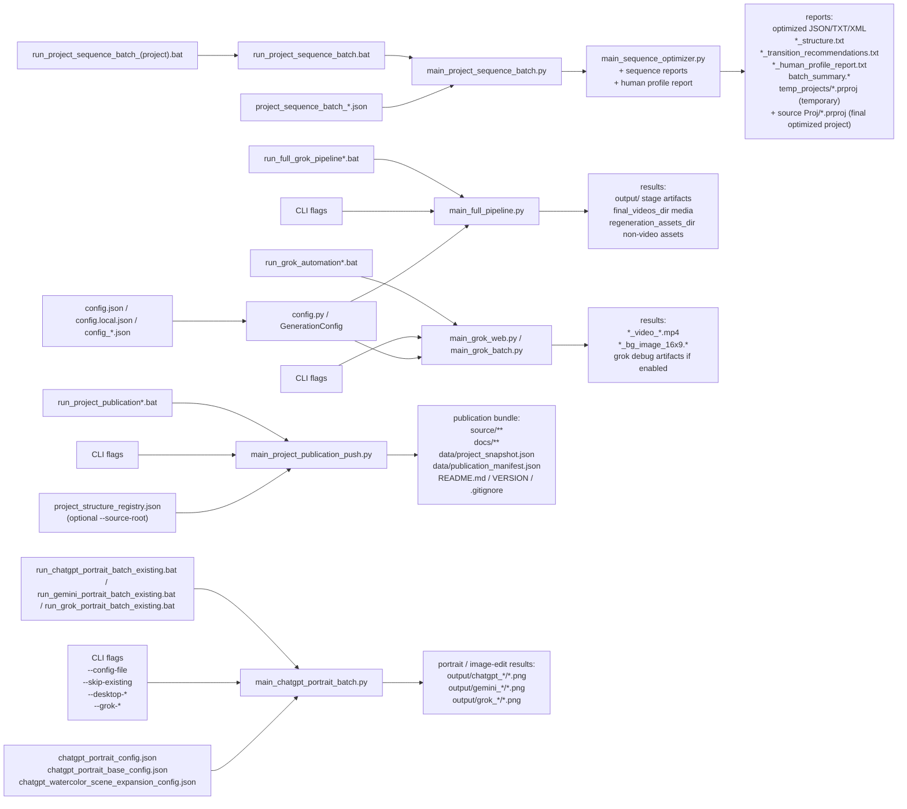

# User Guide

## One-Minute Quick Start

1. Put source images into `input`.
2. If you need to sign in to Grok or refresh the session, run `login_grok_profile.bat`, sign in, open `https://grok.com/imagine` once to verify access, and then fully close that Chrome window.
3. Run the main pipeline:

```bat
run_full_grok_pipeline.bat --upload-timeout 300
```

4. After a successful run:
   - final `mp4` files and background images will be copied to `final_videos_dir`;
   - prompt files, manifests, and other non-video artifacts will be copied to `regeneration_assets_dir`.
5. If a stage fails, the problematic files will be moved to `error\input` and `error\output`.
6. After the video generation phase, build Premiere sequences manually from the generated videos.
7. Run sequence optimization and open the final optimized `.prproj` from the same folder as the source `project_path`; `reports\temp_projects` keeps only the temporary batch working copy.
8. If you manually adjust the optimized sequence, rebuild reports from the current sequence order with `main_sequence_reports.py`.

## Purpose

This project is used to prepare prompt files, generate background images and videos through Grok, optimize Premiere sequence order, and build reports for the final editing phase. The main workflow is: input image -> generate media -> build manual Premiere sequences -> optimize sequence order -> manually refine -> rebuild final recommendations from the approved order.

## Main Directories

- `input` - source images for the current run.
- `output` - temporary prompt files, manifest files, and intermediate results for the current stage.
- `final_videos_dir` - final destination for generated `mp4` files and background images.
- `regeneration_assets_dir` - destination for prompt files, manifests, and other non-video artifacts needed for manual editing and regeneration.
- `reports` - final destination for sequence optimization reports, batch summaries, and temporary batch work files.
- `reports\temp_projects` - temporary `.prproj` files produced inside one sequence optimization batch and removable by cleanup.
- the source Premiere project folder from `project_path` - persistent location for the final optimized `.prproj`.
- `error\input` - source images for stages that failed.
- `error\output` - prompt files, manifests, and error reports for failed stages.
- `.browser-profile\grok-web` - Chrome automation profile used for Grok.
- `styles` - reusable style lists for portrait/style workflows.
- `output\chatgpt_portraits` - generated portrait PNG files from the ChatGPT portrait batch workflow.
- `output\gemini_*` and `output\grok_*` - service-specific mirrors of ChatGPT portrait/image-edit output folders.

Example Windows paths in `config.json`:

```json
{
  "final_videos_dir": "E:\\Git\\P_h_o_t_o\\Dv_Rita_1\\Dv_Rita\\2026\\Gen_Vd_AI",
  "regeneration_assets_dir": "E:\\Git\\P_h_o_t_o\\Dv_Rita_1\\Dv_Rita\\2026\\regeneration_assets",
  "reports_dir": "E:\\Git\\P_h_o_t_o\\Igor_Brams_1\\Igor_Brams\\2026\\reports"
}
```

## BAT Files

### `login_grok_profile.bat`

Purpose:
- open Chrome with the project automation profile;
- sign in to Grok manually;
- verify that `https://grok.com/imagine` opens successfully.

When to use it:
- on the first run;
- if Grok signed out;
- if Grok starts showing `Sign in` or `Sign up`.

Important:
- this bat file is only for manual login;
- after checking access, close that Chrome window completely;
- the main pipeline starts Grok on its own when it runs.

### `run_grok_automation.bat`

Purpose:
- run Grok for one image / one prompt file.

Example:

```bat
run_grok_automation.bat --image .\input\photo.jpg --prompt .\output\photo_20260314_101010_v_prompt_1.txt --upload-timeout 300
```

Useful when you want to:
- re-run one prompt;
- regenerate only one background or one video;
- test a single Grok stage without running the full pipeline.

### `run_grok_automation_all.bat`

Purpose:
- process all `*_v_prompt_*.txt` files already present in `output`.

Examples:

```bat
run_grok_automation_all.bat --upload-timeout 300
run_grok_automation_all.bat --skip-existing --upload-timeout 300
run_grok_automation_all.bat --skip-video --generate-source-background --upload-timeout 300
```

This bat file is useful when prompt files already exist and you only need the Grok part.

### `run_full_grok_pipeline.bat`

This is the main launcher for normal operation.

It does the following:
1. takes one input image from `input`;
2. builds all stage files in `output`;
3. starts Grok for that image;
4. saves the background image and/or video;
5. copies results to `final_videos_dir` and `regeneration_assets_dir`;
6. closes Grok;
7. continues with the next image.

Examples:

```bat
run_full_grok_pipeline.bat --upload-timeout 300
run_full_grok_pipeline.bat --skip-video --generate-source-background --upload-timeout 300
run_full_grok_pipeline.bat --save-grok-debug-artifacts --upload-timeout 300
```

## ChatGPT, Gemini, And Grok Artistic Portrait Batch

This workflow generates finished artistic portraits from every supported image in `input`.
It uses the already-open ChatGPT web UI in Chrome, not the OpenAI API.
The same job builder and JSON config format can also drive a dedicated Gemini
generation window through `--backend gemini-desktop`, or Grok image generation
through `--backend grok`.

Main files:
- `main_chatgpt_portrait_batch.py` - builds portrait jobs from images and styles.
- `api/chatgpt_desktop_v2.py` - desktop automation for the existing ChatGPT window.
- `api/gemini_desktop.py` - desktop automation adapter for an existing Gemini window.
- `api/grok_web.py` - Grok web automation reused from the video pipeline, with image mode enabled.
- `run_chatgpt_portrait_batch_existing.bat` - recommended launcher for an already-open ChatGPT session.
- `login_gemini_profile.bat` - opens a dedicated Gemini Chrome profile at `https://gemini.google.com/app`.
- `run_gemini_portrait_batch_existing.bat` - Gemini launcher that reuses the same portrait JSON configs.
- `login_grok_profile.bat` - signs in the dedicated Grok Chrome profile at `https://grok.com/imagine`.
- `run_grok_portrait_batch_existing.bat` - Grok launcher that reuses the same portrait JSON configs.
- `chatgpt_portrait_config.json` - short working style set, currently watercolor and pastel.
- `chatgpt_portrait_base_config.json` - full base style bank for artistic portraits and image-edit service styles.
- `chatgpt_watercolor_scene_expansion_config.json` - special two-style config for `watercolor` and `scene_expansion`.
- `BATCH_RUN_HISTORY.md` - non-repeating examples for all batch launchers and their parameters.
- `styles\art_styles_Prompt_list.txt` - source human-readable style prompt list.

The base config contains the full portrait/style bank, including Rembrandt, Renaissance, Impressionist, Watercolor, Van Gogh post-impressionism, Klimt art nouveau, Art Deco, Karsh black-and-white studio portrait, Pop Art, Cubist, Chagall poetic modernism, plus service styles such as MODERN_COLOR, COLORIZE, FACE_ENLARGEMENT, and SCENE_EXPANSION.

Output:
- generated PNG files are written to `output\chatgpt_portraits`;
- Gemini writes the same jobs into mirrored `output\gemini_*` folders;
- Grok writes the same jobs into mirrored `output\grok_*` folders;
- file names use `<image_stem>_<style_slug>.png`, for example `IMG-001_rembrandt.png`;
- `--skip-existing` lets the batch restart safely and skip already saved portraits.

Recommended automatic command:

```bat
.\run_chatgpt_portrait_batch_existing.bat --config-file chatgpt_portrait_base_config.json --skip-existing --desktop-reactivate-delay 0 --desktop-click-composer
```

Watercolor + scene expansion command:

```bat
.\run_chatgpt_portrait_batch_existing.bat --config-file chatgpt_watercolor_scene_expansion_config.json --skip-existing --continue-on-error --desktop-reactivate-delay 0 --desktop-click-composer
```

Short working set command:

```bat
.\run_chatgpt_portrait_batch_existing.bat --skip-existing
```

Gemini desktop-flow with the same config files:

```bat
.\login_gemini_profile.bat
.\run_gemini_portrait_batch_existing.bat --config-file chatgpt_portrait_config.json --skip-existing --continue-on-error --desktop-reactivate-delay 0 --desktop-click-composer
```

Gemini uses the same JSON config files as ChatGPT, but automatically mirrors ChatGPT output folders to Gemini folders when `--output-dir` is not explicitly passed. For example, `output\chatgpt_portraits` becomes `output\gemini_portraits`, and `output\chatgpt_watercolor_scene_expansion` becomes `output\gemini_watercolor_scene_expansion`. Pass your own `--output-dir` after the bat command only when a task needs a custom folder.
Gemini saving first tries the generated image button `Download full size` / `Скачать в полном размере`, waits for the browser download to complete, and moves the downloaded image into the configured output path. If that button is unavailable, the older browser context-menu save path is still used as a fallback. The Gemini bat is intentionally quiet by default; add `--desktop-verbose` only when diagnosing UI problems.

Grok web-flow with the same config files:

```bat
.\login_grok_profile.bat
.\run_grok_portrait_batch_existing.bat --config-file chatgpt_portrait_base_config.json --skip-existing --continue-on-error
```

Grok uses `.browser-profile\grok-web`, `https://grok.com/imagine`, and Playwright image-mode automation. When `--output-dir` is not explicitly passed, ChatGPT output folders from the config are mirrored to Grok folders, for example `output\chatgpt_portraits` becomes `output\grok_portraits` and `output\chatgpt_watercolor_on_paper` becomes `output\grok_watercolor_on_paper`. Grok saves through browser download/source capture, so it does not use the Windows `Save As` dialog.

Manual focus fallback:
- keep an already verified ChatGPT window open in Chrome;
- run the bat file without `--desktop-reactivate-delay 0`;
- during each countdown, click inside the ChatGPT message box;
- the script then attaches the source image, pastes the prompt, submits it, waits for a generated result, and saves the image.

Important:
- the automation does not bypass ChatGPT human checks or CAPTCHA prompts; pass them manually in the browser first;
- do not run two portrait batches at the same time;
- keep the generation ChatGPT in a dedicated Chrome window with exactly one visible tab; `run_chatgpt_portrait_batch_existing.bat` now requires this with `--desktop-require-single-tab-window`;
- if Chrome has several ChatGPT windows, the single-tab generation window is the only safe target for the desktop batch;
- desktop input is guarded: before clicks, paste, Enter, and save shortcuts, the script verifies that the foreground window is the selected ChatGPT window or a real `Save As`/`Open` dialog; if another app is foreground, the batch stops instead of sending input there;
- after saving, ChatGPT may leave the last generated image open on screen. This is acceptable if the batch continues;
- if the batch stops, rerun the same command with `--skip-existing`.
- Gemini uses the same foreground-window protection and the same single visible tab rule; keep it in a separate Chrome window opened to `https://gemini.google.com/app`.
- Gemini sign-in, Google checks, and service-side limits are not bypassed; complete them manually in the dedicated Gemini window before starting the batch.
- Grok sign-in and service-side checks are not bypassed; use `login_grok_profile.bat` when the Grok profile needs manual login, then close the login window before the managed portrait batch.

## New Generation Flags

### `generate_video`

Controls video generation. Default: `true`.

In `config.json`:

```json
{
  "generate_video": true
}
```

CLI parameters:

```bat
--generate-video
--skip-video
```

Behavior:
- if `generate_video = true`, the pipeline generates videos in Grok;
- if `generate_video = false` and `generate_source_background = true`, the pipeline generates only background images;
- if `generate_video = false` and `generate_source_background = false`, the stage fails because there is nothing to generate.

When visible people are present, `*_v_prompt_*.(txt|json)` and `*_v_prm_ru_*.(txt|json)` now prefer identity-safe camera language: more distant or medium-wide framing, side / top / low / drone-like angles, and less aggressive facial enlargement. The goal is to reduce face drift in generated videos.

This identity-safe behavior is now the default, but it is configurable through six framing-mode flags plus one ratio key:

```json
{
  "prefer_face_closeups": false,
  "use_ai_optimal_framing": false,
  "use_ai_optimal_then_identity_safe_framing": false,
  "ai_optimal_then_identity_safe_ai_optimal_percent": 70,
  "generate_dual_framing_videos": false,
  "generate_identity_safe_closeup_videos": false,
  "generate_triple_framing_videos": false
}
```

Framing mode rules:
- if all six flags are `false`, the pipeline keeps the default identity-safe framing and tries to avoid aggressive face enlargement;
- if `prefer_face_closeups = true`, close facial framing may be preferred and the video prompt may move into a tighter portrait scale;
- if `use_ai_optimal_framing = true`, the AI chooses the most effective cinematic framing for the source image without letting the face become significantly enlarged or distorted;
- if `use_ai_optimal_then_identity_safe_framing = true`, one video is generated from one source image, but inside that single video the first `ai_optimal_then_identity_safe_ai_optimal_percent` percent uses AI-optimal framing and the remaining percent transitions into identity-safe framing from a safer distance;
- if `ai_optimal_then_identity_safe_ai_optimal_percent` is omitted, the default ratio is `70 / 30`; for example, `50` means `50%` AI-optimal and `50%` identity-safe.
- if `generate_dual_framing_videos = true`, the pipeline builds two branches from the same source frame: one identity-safe branch and one AI-optimal branch.
- if `generate_identity_safe_closeup_videos = true`, the pipeline builds two branches from the same source frame: one identity-safe branch and one face-closeup branch.
- if `generate_triple_framing_videos = true`, the pipeline builds three branches from the same source frame: identity-safe, face-closeup, and AI-optimal.

Dual-mode output count:
- with `video_count = 1`, dual mode produces `2` videos;
- with `video_count = N`, dual mode produces `2 x N` videos.

Only one of these six framing flags can be enabled at a time. The percentage key is not a separate mode flag; it only refines the hybrid mode.

### `generate_grok_multiscene_json_prompt`

Controls a special Grok prompt mode where the usual `*_v_prompt_*.txt` file is replaced by a JSON prompt artifact.

In `config.json`:

```json
{
  "generate_grok_multiscene_json_prompt": true,
  "grok_multiscene_prompt_size": 2000
}
```

Behavior:
- the pipeline writes `*_v_prompt_*.json` in English and `*_v_prm_ru_*.json` in Russian instead of TXT prompt files;
- each JSON file is a one-item array with a `prompt` field, similar in spirit to `Gen_Video_Seedance`;
- Grok reads the English `prompt` text from that JSON automatically, so batch execution still works through the normal Grok runners;
- the prompt is treated as a compact three-shot video plan built from one input image, where `@image1` is the input image itself.

Current fixed layout:
- `Shot 1`, `0-2s`: strongest current AI-optimal cinematic interpretation;
- `Shot 2`, `2-4s`: alternative AI-optimal interpretation with a clearly different camera solution;
- `Shot 3`, `4-6s`: safer distance / angle view with wider spatial reveal.

Current limits:
- total duration is fixed at `6s`;
- aspect ratio is fixed at `16:9`;
- the English prompt is validated against the configured `grok_multiscene_prompt_size` in characters, and the word budget is derived automatically as approximately `size / 5`.

Prompt-size parameter:
- `grok_multiscene_prompt_size` — default `1000`, which gives about `200` words;
- `2000` gives about `400` words and allows a more detailed JSON video prompt for Grok;
- the builder still keeps the prompt concise, but may preserve more scene detail when the size is increased.

When to use `--skip-video`:
- when you only need background images;
- when you want to postpone video generation;
- when you want to prepare backgrounds first and generate videos later.

### `generate_source_background`

Controls background image generation in Grok.

CLI parameters:

```bat
--generate-source-background
--skip-source-background
```

Current behavior:
- background generation uses `*_assoc_bg_prompt.txt`;
- that descriptor describes a realistic associative image suitable as a background;
- Grok builds a new background from that descriptor and uses the source image as visual guidance.

### `save_grok_debug_artifacts`

Controls whether Grok diagnostic files are kept. Default: `false`.

In `config.json`:

```json
{
  "save_grok_debug_artifacts": false
}
```

CLI parameters:

```bat
--save-grok-debug-artifacts
--skip-grok-debug-artifacts
```

Behavior:
- if `false`, candidate/debug files do not remain in `output`, so the working folder stays clean;
- if `true`, Grok diagnostic artifacts are saved in `output`.

Possible files when enabled:
- `*_bg_image_16x9.candidate_*.png`
- `*_bg_image_16x9_candidates.json`
- `*_grok_debug.png`
- `*_grok_debug.html`
- `*_grok_debug.json`

When to enable it:
- if Grok saved the wrong background image;
- if you need to see which candidate was found on the page;
- if you need detailed diagnostics of Grok page results.

When to keep it disabled:
- during normal operation;
- when you want `output` to stay clean.

### `continue_after_failure`

Controls what happens after a failed stage.

Behavior:
- if `false`, the pipeline stops on the first failure;
- if `true`, the failed stage is moved to `error`, and processing continues with the next image.

When to enable it:
- when there are many input images;
- when some of them may be too large or otherwise problematic;
- when it is more convenient to review only failed stages later.

## Full Generation Config Reference

All current `GenerationConfig` fields:

- `generate_video` — default `true`; generate video prompts and run the video stage.
- `generate_grok_multiscene_json_prompt` — default `false`; write Grok-ready EN/RU JSON prompt artifacts instead of TXT video prompt files, using a fixed three-shot `6s` layout built from one input image.
- `grok_multiscene_prompt_size` — default `1000`; maximum prompt size for Grok multiscene JSON mode in approximate characters. The word budget is derived automatically, for example `1000 -> 200 words`, `2000 -> 400 words`.
- `video_count` — default `2`; how many videos to build from one source frame for each active framing mode.
- `camera_segments` — default `1`; how many motion segments are planned inside one video prompt.
- `motion_source` — default `table`; choose camera motions from the local table or from AI (`ai`).
- `motion_model` — default `gpt-4.1`; OpenAI model used for AI motion selection when `motion_source = ai`.
- `generate_source_background` — default `false`; create background prompts and run the background-image stage in Grok.
- `save_grok_debug_artifacts` — default `false`; keep Grok diagnostic candidate/debug artifacts in `output`.
- `final_videos_dir` — default `final_project/videos`; final delivery folder for generated `mp4` files and background images.
- `regeneration_assets_dir` — default `final_project/regeneration_assets`; delivery folder for prompts, manifests, and non-video stage artifacts.
- `continue_after_failure` — default `false`; continue with the next image after moving a failed stage into `error`.
- `write_description` — default `true`; write the stage description / analysis text file.
- `generate_final_frames` — default `false`; generate final-frame images through the image API.
- `read_input_list` — default `true`; read all supported source images from `input`.
- `generate_music` — default `false`; generate a music prompt after the last processed image.
- `prefer_face_closeups` — default `false`; allow and prefer closer facial framing when that matches the source image.
- `use_ai_optimal_framing` — default `false`; let AI choose the strongest cinematic framing, but do not significantly enlarge or distort the face.
- `use_ai_optimal_then_identity_safe_framing` — default `false`; generate one video where the first part uses AI-optimal framing and the remaining part transitions into identity-safe distance / angles.
- `ai_optimal_then_identity_safe_ai_optimal_percent` — default `70`; only for `use_ai_optimal_then_identity_safe_framing = true`; how much of the video duration is reserved for the AI-optimal part. Valid range: `1..99`. The identity-safe remainder is calculated automatically as `100 - value`.
- `generate_dual_framing_videos` — default `false`; generate both identity-safe and AI-optimal framing branches from the same source frame.
- `generate_identity_safe_closeup_videos` — default `false`; generate both identity-safe and face-closeup framing branches from the same source frame.
- `generate_triple_framing_videos` — default `false`; generate identity-safe, face-closeup, and AI-optimal framing branches from the same source frame.
- `hide_phone_in_selfie` — default `true`; if the input looks like a selfie / self-portrait, keep the selfie feel but try not to show the phone, photo camera, video camera, or their reflections when plausible.
- `prefer_loving_kindness_tone` — default `true`; where appropriate for the specific input image, gently bias the prompts toward loving-kindness, friendliness, benevolence, warm goodwill, and gentle mercy through light, color, atmosphere, environment, and background.

Important framing rule:
- Only one of `prefer_face_closeups`, `use_ai_optimal_framing`, `use_ai_optimal_then_identity_safe_framing`, `generate_dual_framing_videos`, `generate_identity_safe_closeup_videos`, or `generate_triple_framing_videos` can be enabled at a time.

## Architecture And Change Control

For a developer-oriented map of the project structure, data flows, invariants, and change-impact checklist, see `PROJECT_STRUCTURE.md`.
For automation and machine-guided change review, see `project_structure_registry.json`.
Use `python .\main_change_impact.py --change-type generation_flag --changed-file config.py` to generate a concrete impact checklist.
Use `python .\main_project_publication.py --target-dir .\project_publication\Memory-to-Video_Agent` to refresh the external project-information repository bundle.
The public bundle now includes a full safe source mirror under `source/`, excluding secrets, media artifacts, and runtime-only folders.
Use `python .\main_project_publication_push.py --repo-dir <path-to-local-Memory-to-Video_Agent-clone> --stage` for the guarded public-repo publish flow.
Use `.\run_project_publication_stage.bat` for the shortest preview/stage-only run without push.
Use `.\run_project_publication_push.bat` for the shortest manual publish command with your current local clone path.

## Batch / Program / Parameter Map

Use this compact map when you need to quickly see which `.bat` launches which Python entry point, and where the main parameters come from.



The left side of the diagram shows launch wrappers and parameter sources, and the right side shows the reports and result artifacts produced by each route.

Parameter precedence is usually:

1. hardcoded arguments in the `.bat` wrapper;
2. extra arguments forwarded through `%*`;
3. JSON config values;
4. defaults in Python code.

## Deploying On Another Machine

For a clean local deployment in another folder or on another machine:

```powershell
powershell -ExecutionPolicy Bypass -File .\setup_project.ps1
```

This script:
- creates `.venv`;
- installs `requirements.txt`;
- creates local runtime folders such as `input`, `output`, `final_project\videos`, and `final_project\regeneration_assets`;
- writes `.env.template`;
- creates `config.local.json` with relative local paths.

Then:
- fill real keys into `.env`;
- place source images into `input\`;
- for a new clone, run `login_grok_profile.bat` once and sign in to Grok inside that clone-specific Chrome profile;
- run `.\run_full_grok_pipeline_local.bat`.

Or use the one-step deploy/check/run helper:

```powershell
powershell -ExecutionPolicy Bypass -File .\deploy_and_run.ps1
```

It runs bootstrap first, then checks:
- `.env` and `OPENAI_API_KEY`;
- local Chrome availability;
- whether the clone-specific Grok profile in `.browser-profile\grok-web` is already authenticated for `https://grok.com/imagine`;
- whether `input\` already contains supported source images.
- Note: each clone uses its own Grok Chrome profile under `.browser-profile\grok-web` unless you explicitly pass another `--profile-dir`.

If the Grok profile is not logged in yet, `deploy_and_run.ps1` now stops before the pipeline and tells you to run `login_grok_profile.bat`.

Use this for a dry readiness check without starting the pipeline:

```powershell
powershell -ExecutionPolicy Bypass -File .\deploy_and_run.ps1 -CheckOnly
```

## Three-Command Working Cheat Sheet

Use this short sequence for day-to-day work in the main project directory:

```powershell
cd E:\Git\AI_PIC_DEF\def_AI\img-style-ag_1
powershell -ExecutionPolicy Bypass -File .\deploy_and_run.ps1 -CheckOnly
python .\main_project_publication_push.py --repo-dir E:\Git\AI_PIC_DEF\Memory-to-Video_Agent --commit-message "Update project publication" --push
```

Meaning:
- `work` — switch to the main working directory;
- `check` — verify the environment, the clone-specific Grok profile, and `input\`;
- `publish` — refresh and push the public project mirror.

## What Gets Copied After a Successful Stage

Into `final_videos_dir`:
- `*.mp4`;
- final background images.

Into `regeneration_assets_dir\<stage_id>`:
- `description`;
- `scene_analysis`;
- `v_prompt`;
- `v_prm_ru`;
- `bg_prompt`;
- `bg_prm_ru`;
- `assoc_bg_prompt`;
- `assoc_bg_prm_ru`;
- `manifest`;
- other non-video stage files.

Not copied to `regeneration_assets_dir`:
- the source image;
- final `mp4` files;
- the final background image.

## What Happens on Failure

If a stage fails:
- stage files from `output` are moved to `error\output\<stage_id>`;
- the source image is moved to `error\input\<stage_id>`;
- a file named `<stage_id>_error.txt` is saved next to them with the error details.

This makes it easier to inspect and re-run only the problematic images.

If Grok closes the current browser tab right after `submit`, the automation now tries to recover from another live Grok tab or from a just-finished download before marking the stage as failed.
For unfinished stages that already have a ready `*_v_prompt_*.txt`, you can safely re-run only the video step and skip repeated background generation.

## Premiere Sequence Workflow

After video generation is finished, the normal process is:

1. Build Premiere sequences manually from the generated `mp4` files.
2. Run the sequence optimization batch to create new `_oNN` sequences from approved `_eNN` sequences.
3. Review the optimized result in Premiere.
4. If needed, manually change clip order again after optimization.
5. Rebuild the reports from the current manual order.
6. Keep the final optimized project beside the source Premiere project and keep the reports in `reports`.

Important location rule:

- `reports` is the final result for sequence optimization reports and batch summaries.
- `reports\temp_projects` is a temporary batch workspace for `.prproj` files and is safe to clean up later.
- the persistent optimized `.prproj` lives beside `project_path`.
- `output` is a temporary workspace area.
- If everything finishes successfully, `output` should ideally end up empty.

## Sequence Optimization Batch

Run the batch optimizer with a JSON config:

```powershell
python .\main_project_sequence_batch.py --config .\project_sequence_batch_igor_26_1A.json
```

Example config fields:

```json
{
  "project_path": "E:\\Git\\video_projects\\Igor\\Proj\\Igor26_1A_w01.prproj",
  "regeneration_assets_dir": "E:\\Git\\P_h_o_t_o\\Igor_Brams_1\\Igor_Brams\\2026\\regeneration_assets",
  "output_project_path": "E:\\Git\\video_projects\\Igor\\Proj\\Igor26_1A_o01.prproj",
  "reports_dir": "E:\\Git\\P_h_o_t_o\\Igor_Brams_1\\Igor_Brams\\2026\\reports",
  "generate_personalized_report": false,
  "human_detail_txt": "E:\\Git\\AI_PIC_DEF\\def\\Detail_1\\Igor\\Igor_detail.txt",
  "sequence_jobs": [
    {
      "source_sequence_name": "Igor26_baby_1_e01",
      "new_sequence_name": "Igor26_baby_1_o01"
    }
  ]
}
```

The final optimized `.prproj` is stored next to the source `project_path`. During the batch, the program also keeps a temporary working `.prproj` inside `reports\temp_projects`, and cleanup may remove that temporary copy later.

If an older config still points `output_project_path` into `reports`, the file name is preserved, but the persistent optimized project is still written next to `project_path`.

In normal work, keep one project-specific batch config next to the template, for example `project_sequence_batch_slava_26_1.json`, and re-run the batch from that file instead of editing the template each time.

After a successful batch run, `reports` typically contains:

- `batch_summary.json`;
- `batch_summary.txt`;
- `batch_transition_recommendations.txt`;
- per-sequence JSON/TXT reports;
- `*_structure.txt`;
- `*_human_profile_report.txt` if personalized reporting was requested;
- `*_transition_recommendations.txt`;
- `temp_projects\*.prproj` temporary working projects, including the last batch working copy.

The persistent final optimized `.prproj` is stored in the same folder as the source Premiere project from `project_path`.

To build personalized reports automatically inside the batch, enable both:

- `"generate_personalized_report": true`
- `"human_detail_txt": "E:\\...\\hero_detail.txt"`

If `generate_personalized_report` stays `false`, the batch works exactly as before and no extra personalized report is created.

## Rebuild Reports After Manual Sequence Changes

If you manually change the optimized sequence after the program finishes, you can rebuild the reports for the current order without running optimization again:

```powershell
python .\main_sequence_reports.py `
  --prproj "E:\Git\video_projects\Igor\Proj\Igor26_1A_o01.prproj" `
  --sequence-name "Igor26_baby_1_o01" `
  --optimization-report-json "E:\Git\P_h_o_t_o\Igor_Brams_1\Igor_Brams\2026\reports\01_Igor26_baby_1_o01.json" `
  --output-dir "E:\Git\P_h_o_t_o\Igor_Brams_1\Igor_Brams\2026\reports"
```

This command rebuilds:

- `<sequence>_manual_order.json`;
- `<sequence>_manual_order_music.txt`;
- `<sequence>_manual_order_structure.txt`;
- `<sequence>_manual_order_transition_recommendations.txt`.

Use this when the user manually improved the sequence after automatic optimization and now wants fresh editing, description, and music recommendations for the approved order.

Music now comes first in this flow: `main_sequence_reports.py` always writes a dedicated music-first report for the current sequence before the structure and transition recommendations.
That music-first report now also starts with one single highest-priority track choice for this video before the broader category lists.

If you only need the music recommendation for the current sequence, use:

```powershell
python .\main_sequence_reports.py `
  --prproj "E:\Git\video_projects\Igor\Proj\Igor26_1A_o01.prproj" `
  --sequence-name "Igor26_baby_1_o01" `
  --optimization-report-json "E:\Git\P_h_o_t_o\Igor_Brams_1\Igor_Brams\2026\reports\01_Igor26_baby_1_o01.json" `
  --output-dir "E:\Git\P_h_o_t_o\Igor_Brams_1\Igor_Brams\2026\reports" `
  --music-only
```

In `--music-only` mode the command still rebuilds the current-order JSON context, but skips the structure and transition text reports.

## Music-First From Project And Sequence Only

If you only have a Premiere project and a sequence, and there is no prior optimization JSON yet, use the direct `project + sequence -> music-first` mode:

```powershell
python .\main_sequence_music_first.py `
  --prproj "E:\Git\video_projects\Igor\Proj\Igor26_2w_v01.prproj" `
  --sequence-name "Igor26_2w_e05" `
  --max-sampled-clips 12
```

This mode:

- parses the current Premiere sequence directly from `.prproj`;
- selects representative clips across the current order;
- extracts still frames from those clips;
- runs scene analysis on the sampled frames;
- writes a JSON context plus a music-first recommendation report.
- that music-first report begins with one highest-priority track choice for the sequence, followed by the broader category lists.

Use this mode for a completely new sequence that has never gone through the older stage-based optimization pipeline.

If you also want the second queue of recommendations for the same brand-new sequence, use:

```powershell
python .\main_sequence_music_first.py `
  --prproj "E:\Git\video_projects\Igor\Proj\Igor26_2w_v01.prproj" `
  --sequence-name "Igor26_2w_e05" `
  --full-recommendations
```

In `--full-recommendations` mode the command keeps the music report as the primary output, and then also:

- analyzes the current sequence clips for a recommended order without requiring the old `optimization-report-json`;
- writes `*_music_first_structure.txt` as the recommended sequence/order report;
- writes `*_music_first_transition_recommendations.txt` as the transition guidance between the recommended neighboring clips.

If the sequence is very long, you can cap the deeper second-queue analysis with `--max-analyzed-clips`, but omitting that flag gives the best full-order recommendation because all current clips are analyzed.

The structure report now separates adult travel/leisure sequences from family portraits more conservatively. Older adults, large groups, or generic portrait/group cues alone should not force the report into a family theme if the sequence is clearly built around travel, rest, and locations.

Repeated pets are also surfaced more explicitly now. If dogs, cats, or other домашние животные appear through multiple clips, `*_structure.txt` should mention that motif in the main theme or the brief description instead of dropping it.

Adult family portrait wording is now gender-neutral by default. The report should not describe a sequence as centered on women or on men unless repeated frame evidence clearly justifies that emphasis.

Short English pet words are matched more carefully now. Words like `capturing` should no longer create a false `cat` motif, while repeated wedding/bride-groom or fishing/fish-fisherman motifs should now surface in `*_structure.txt` when they repeat through the sequence.

When such motifs are present only in part of the sequence, the report should describe them as a noticeable line or accent inside the larger story instead of turning the whole video into only “wedding” or only “fishing”.

Wedding wording is now stricter too: the report should switch to a wedding motif only when explicit bride/groom/wedding cues are present. Generic romantic scenes, couple portraits, or kisses alone should not relabel the whole sequence as a wedding. Travel-dominant family sequences should stay travel-centered.

## Add Human Detail To The Report

Keep the regular `*_structure.txt` as a video-only report.

If you also have a human-written hero description, build one more separate report that overlays:

- what is visible in the video;
- what the human description says about the hero;
- how the music recommendations should be corrected for this person.

Command:

```powershell
python .\main_human_sequence_report.py `
  --optimization-report-json "E:\Git\P_h_o_t_o\Dv_Maya\2026\reports\01_Maya26_o03.json" `
  --human-detail-txt "E:\Git\AI_PIC_DEF\def\Detail_1\Maya\Maya_detail_260328_2.txt"
```

This creates:

- `01_Maya26_o03_human_profile_report.txt`

The same logic can now run automatically inside `main_project_sequence_batch.py` when the batch config contains:

```json
{
  "generate_personalized_report": true,
  "human_detail_txt": "E:\\Git\\AI_PIC_DEF\\def\\Detail_1\\Maya\\Maya_detail_260328_2.txt"
}
```

Important rule:

- the main theme, story, and factual structure must stay video-based;
- the human text should adjust hero portrait, wording tone, and music preferences;
- professions, biography facts, diet, education, and other non-visible details should not be turned into direct video facts unless they are visible in the sequence.

## Cleanup Of Old And Temporary Files

Preview cleanup only:

```powershell
python .\main_cleanup_artifacts.py `
  --reports-dir "E:\Git\P_h_o_t_o\Igor_Brams_1\Igor_Brams\2026\reports" `
  --older-than-days 7 `
  --include-output-build-dirs `
  --include-test-runtime-items
```

Safe cleanup with archive:

```powershell
python .\main_cleanup_artifacts.py `
  --reports-dir "E:\Git\P_h_o_t_o\Igor_Brams_1\Igor_Brams\2026\reports" `
  --older-than-days 7 `
  --include-output-build-dirs `
  --include-test-runtime-items `
  --archive-dir "E:\Git\P_h_o_t_o\Igor_Brams_1\Igor_Brams\2026\cleanup_archive\20260326" `
  --execute
```

Notes:

- without `--execute`, the command is a dry run only;
- cleanup reports are written into `output\cleanup_reports`;
- `--include-test-runtime-items` adds top-level `test_runtime` artifacts to the cleanup scan;
- use `--archive-dir` when you want to keep a recoverable copy before deletion.

Recommended one-line workspace cleanup:

```powershell
python .\main_cleanup_artifacts.py --include-output-build-dirs --include-output-files --include-test-runtime-items --archive-dir ".\cleanup_archive\workspace_$(Get-Date -Format yyyyMMdd_HHmmss)" --execute
```

Recommended one-line preview:

```powershell
python .\main_cleanup_artifacts.py --include-output-build-dirs --include-output-files --include-test-runtime-items --archive-dir ".\cleanup_archive\workspace_$(Get-Date -Format yyyyMMdd_HHmmss)"
```

## Final Naming Standard

Use this short naming standard for new projects and new batch configs:

- project in approved manual work: `Igor26_1A_w01.prproj`
- project produced by optimization batch: `Igor26_1A_o01.prproj`
- approved manual sequence: `Igor26_baby_1_e01`
- optimized sequence proposal: `Igor26_baby_1_o01`

Meaning:

- `w` = working project
- `e` = editable and approved manual sequence
- `o` = optimized result from the program
- `01`, `02`, `03` = version number

Recommended cycle:

1. Work manually in `Igor26_1A_w01.prproj`.
2. Keep the approved source sequence as `Igor26_baby_1_e01`.
3. Run optimization and create `Igor26_1A_o01.prproj` with sequence `Igor26_baby_1_o01`.
4. Review and manually refine that optimized sequence.
5. If it becomes the new approved base, save the next manual project as `Igor26_1A_w02.prproj`.
6. Rename the accepted sequence to `Igor26_baby_1_e02`.
7. If another cycle is needed, create `Igor26_1A_o02.prproj` and `Igor26_baby_1_o02`.
8. When the sequence is final, rebuild reports from the final current order and keep them in `reports`.

## Typical Commands

Full cycle:

```bat
run_full_grok_pipeline.bat --upload-timeout 300
```

Background images only:

```bat
run_full_grok_pipeline.bat --skip-video --generate-source-background --upload-timeout 300
```

Full cycle with Grok debug artifacts:

```bat
run_full_grok_pipeline.bat --save-grok-debug-artifacts --upload-timeout 300
```

Grok batch only for already prepared prompt files:

```bat
run_grok_automation_all.bat --upload-timeout 300
```

ChatGPT artistic portrait batch from all images in `input` using the full base style bank:

```bat
.\run_chatgpt_portrait_batch_existing.bat --config-file chatgpt_portrait_base_config.json --skip-existing --desktop-reactivate-delay 0 --desktop-click-composer
```

ChatGPT watercolor portrait + scene expansion batch:

```bat
.\run_chatgpt_portrait_batch_existing.bat --config-file chatgpt_watercolor_scene_expansion_config.json --skip-existing --continue-on-error --desktop-reactivate-delay 0 --desktop-click-composer
```

ChatGPT short watercolor/pastel portrait batch:

```bat
.\run_chatgpt_portrait_batch_existing.bat --skip-existing
```

Gemini portrait batch using the same JSON config format and a dedicated one-tab Gemini Chrome window:

```bat
.\login_gemini_profile.bat
.\run_gemini_portrait_batch_existing.bat --config-file chatgpt_portrait_config.json --skip-existing --continue-on-error --desktop-reactivate-delay 0 --desktop-click-composer
```

Grok portrait batch using the same JSON config format and the Grok automation profile:

```bat
.\login_grok_profile.bat
.\run_grok_portrait_batch_existing.bat --config-file chatgpt_portrait_base_config.json --skip-existing --continue-on-error
```

Premiere sequence optimization batch:

```powershell
python .\main_project_sequence_batch.py --config .\project_sequence_batch_igor_26_1A.json
```

Rebuild reports from current manual order:

```powershell
python .\main_sequence_reports.py --prproj "<project.prproj>" --sequence-name "<sequence>" --optimization-report-json "<report.json>" --output-dir "<reports-dir>"
```

Cleanup preview:

```powershell
python .\main_cleanup_artifacts.py --reports-dir "<reports-dir>" --older-than-days 7 --include-output-build-dirs --include-test-runtime-items
```

One-line workspace safe cleanup:

```powershell
python .\main_cleanup_artifacts.py --include-output-build-dirs --include-output-files --include-test-runtime-items --archive-dir ".\cleanup_archive\workspace_$(Get-Date -Format yyyyMMdd_HHmmss)" --execute
```

One prompt manually:

```bat
run_grok_automation.bat --image .\input\photo.jpg --prompt .\output\photo_20260314_101010_v_prompt_1.txt --upload-timeout 300
```

## Short Operator Recommendations

- Use `login_grok_profile.bat` only when manual Grok login is needed.
- For normal work, run `run_full_grok_pipeline.bat`.
- If you only need backgrounds, use `--skip-video` together with `--generate-source-background`.
- If something goes wrong with Grok result saving, temporarily enable `--save-grok-debug-artifacts`.
- If a stage failed, first check `error\output\<stage_id>\<stage_id>_error.txt`.
- Open final optimized `.prproj` files from the same folder as the source `project_path`; `reports\temp_projects` only holds the temporary batch working copy.
- If you changed an optimized sequence manually, rebuild reports with `main_sequence_reports.py`.
- Before deleting old artifacts, run cleanup in dry-run mode first and preferably keep an archive copy.
- For ChatGPT portrait batches, keep only one automation run active and always use `--skip-existing` when resuming after a UI failure.

## Multi-Scene Video Prompt Composer

Use `main_video_prompt_composer.py` when you already have `regeneration_assets` for a set of source images and want one combined multi-scene prompt from ordered scene notes and `@imageN` references.

Mandatory bilingual rule for video-generation tasks:

- Any task that produces final video-generation prompt artifacts through `main_video_prompt_composer.py` must emit both English and Russian outputs in the same run.
- This rule applies to combined TXT prompts and to Seedance JSON generation tasks, including every item produced through `scenario_variants`.
- The English artifact is the production prompt, and the Russian artifact is the required control/review companion.
- A video-generation task is considered incomplete if the matching RU output file is missing.

Input contract:

- JSON request with `technical_preamble`, `total_duration_seconds`, `aspect_ratio`, `regeneration_assets_dir`, `references`, and ordered `scenes`.
- Alternatively, you can use `--config-file` with one full JSON/JSONC config that contains both the scenario payload and the Seedance/TXT generation settings.
- Optional `max_prompt_chars` controls the prompt length limit; default is `2000`.
- Optional `scenario_variants` lets one scenario produce multiple alternative JSON generation tasks from the same scene list.
- Each reference item maps a source file to a stable `@imageN` tag.
- Each scene contains `duration_seconds` and a short scene description that may reference one or more `@imageN` tags.

Outputs in `regeneration_assets_dir`:

- `Gen_Video_<timestamp>.txt` - English prompt.
- `Gen_Video_RU_<timestamp>.txt` - Russian translation.
- `Gen_Video_Seedance_<timestamp>.json` - Seedance 2.0 JSON prompt when `--seedance-json` is enabled.
- `Gen_Video_Seedance_RU_<timestamp>.json` - Russian control JSON for manual review of the same Seedance prompt.
- `Gen_Video_Seedance_<VariantId>_<timestamp>.json` and `Gen_Video_Seedance_RU_<VariantId>_<timestamp>.json` - per-variant outputs when `scenario_variants` contains more than one scenario branch.

Typical command:

```powershell
.\.venv\Scripts\python.exe -u .\main_video_prompt_composer.py --request-file .\video_prompt_request_slava_volga_example.json --seedance-json
```

Config-file command:

```powershell
.\.venv\Scripts\python.exe -u .\main_video_prompt_composer.py --config-file .\video_prompt_config_maya_africa_home_two_variants.json
```

Seedance JSON only:

```powershell
.\.venv\Scripts\python.exe -u .\main_video_prompt_composer.py --request-file .\video_prompt_request_slava_volga_example.json --seedance-json --seedance-json-only
```

Variant rule:

- `Variant_1` should be the most likely, most suitable, and most coherent interpretation.
- `Variant_2` should be a fully distinct alternative interpretation based on the same scenario facts.

Seedance notes:

- Requirements are loaded from `services\Seedance_2.0_Director.md`.
- The English Seedance JSON output is a strict one-item array: `[{"lang":"en","prompt":"..."}]`.
- The paired Russian control JSON output is a strict one-item array: `[{"lang":"ru","prompt":"..."}]`.
- The generated prompt is validated for `Shot N:` labels, `Total:` footer, aspect ratio, required `@imageN` tags, and 2000-character limit.
- The generator must avoid extreme remote aerial/drone/bird's-eye framing that turns characters into tiny figures; wide shots are allowed only when people remain clearly legible and consistent with the reference-image scale.
- Full reusable config examples live in `video_prompt_composer_config_example.jsonc` and `video_prompt_config_*.json`.
- `seedance_json_only: true` automatically implies `seedance_json: true`.

## Documentation Sync Rule

Whenever workflow, file locations, naming, cleanup rules, or report outputs change, update both guide files together:

- `USER_GUIDE.md`
- `Руководство_пользователя.md`
