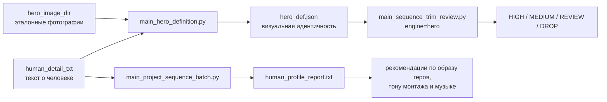

# Матрица Parameter → Program → Batch

Этот справочник связывает параметры конфигурации с программами, batch-файлами и результатами. Он охватывает полную цепочку работы с героем и Premiere:

1. создание визуального определения героя;
2. KEEP/DROP-анализ исходной sequence;
3. повторный экспорт из готового отчёта без OpenAI;
4. применение ручного KEEP JSON к копии Premiere-проекта или KEEP только на копии sequence в том же `.prproj`;
5. импорт списка файлов в существующую sequence или в новую sequence того же проекта;
6. оптимизацию sequence;
7. персонализированные и музыкальные отчёты.

## Главное различие между описаниями героя

`human_detail_txt` и `hero_def.json` нельзя считать взаимозаменяемыми:



- `human_detail_txt` содержит биографический и характерологический контекст. В `main_project_sequence_batch.py` он используется при `generate_personalized_report=true` для корректировки образа героя и музыкальных рекомендаций.
- `hero_def.json` создаётся из `human_detail_txt` и эталонных изображений. В `main_sequence_trim_review.py` он используется движком `hero` для визуального поиска героя в грязном видеоматериале.
- Музыкальный отчёт использует `hero_def.json` для проверки источника и SHA256 human-detail текста, но не использует визуальные признаки как музыкальные предпочтения. KEEP/DROP-анализ не должен использовать невидимые биографические факты как доказательство личности.

### Общие project metadata в `config_*.json`

Эти пути разрешены в `GenerationConfig`, поэтому один project config можно использовать одновременно для generation, portrait delivery, Hero Definition и музыкальных отчётов:

| Параметр | Default | Назначение | Программы / batch |
|---|---|---|---|
| `hero_image_dir` | `null` | Каталог эталонных изображений героя | `main_hero_definition.py`, project metadata |
| `human_detail_txt` | `null` | Текстовое описание героя | Hero Definition, personalized music report |
| `reports_dir` | `null` | Общий каталог project reports | music/report workflows |

При `--delivery-config-file config_Alice.json` portrait batch использует `final_output_dir`; дополнительные project metadata сохраняются и больше не считаются неизвестными ключами.

## Карта запуска

| Задача | Python-программа | Batch-файл | Основной конфиг | Главный результат |
|---|---|---|---|---|
| Создать визуальное описание героя | `main_hero_definition.py` | `run_hero_definition.bat` | `hero_definition_*.json` | `hero_def.json` |
| Разбить sequence на KEEP/DROP | `main_sequence_trim_review.py` | `run_sequence_trim_review.bat` | `sequence_trim_review_*.json` | review `.prproj` + JSON/TXT |
| Переэкспортировать уровни без OpenAI | `main_sequence_trim_review.py`, режим `report_replay` | `run_sequence_trim_review.bat` | `sequence_trim_review_*_replay_levels.json` | одна sequence, V1–V4 |
| Оставить только указанные куски медиа | `main_sequence_trim_review.py`, режим `apply_keep_ranges` | `run_sequence_keep_apply.bat`; тот же JSON принимает `run_sequence_trim_review.bat` | `sequence_keep_apply_*.json` + KEEP JSON | новый `.prproj` без лишних кусков |
| Скопировать sequence и KEEP-обрезать копию | `main_sequence_trim_review.py`, режим `keep_to_new_sequence` | `run_sequence_keep_apply.bat` | `sequence_keep_to_new_sequence_template.json`, `sequence_keep_apply_yotam26_macro_styles.json` | та же `.prproj`, новая sequence |
| Импортировать список файлов в sequence | `main_sequence_trim_review.py`, режим `import_media` | `run_sequence_media_import.bat` | `sequence_media_import_*.json` + import JSON | новый `.prproj` с файлами на sequence |
| Импортировать файлы в новую sequence того же проекта | `main_sequence_trim_review.py`, режим `import_to_new_sequence` | `run_sequence_media_import.bat` | `sequence_media_import_to_new_sequence_template.json`, `sequence_media_import_yotam26_macro_styles.json` | та же `.prproj`, новая sequence |
| Импортировать файлы и сразу обрезать KEEP | `main_sequence_trim_review.py`, режим `import_and_keep` | `run_sequence_import_and_keep.bat` | `sequence_import_and_keep_*.json` + import JSON + KEEP JSON | `*_import.prproj` и укороченный `*_keep.prproj` |
| Оптимизировать sequence и построить bundle отчётов | `main_project_sequence_batch.py` | `run_project_sequence_batch.bat`; проектные `run_project_sequence_batch_*.bat` | `project_sequence_batch_*.json` | оптимизированный `.prproj`, отчёты, JSX |
| Построить персонализированный отчёт отдельно | `main_human_sequence_report.py` | нет, прямой Python-запуск | CLI | `*_human_profile_report.txt` |
| Перестроить отчёты после ручного монтажа | `main_sequence_reports.py` | нет, прямой Python-запуск | CLI | current-order JSON, music/structure/transition TXT |
| Построить music-first отчёт напрямую из Premiere | `main_sequence_music_first.py` | `run_sequence_music_recommendation.bat` или прямой Python-запуск | CLI / `sequence_music_recommendation_*.json` | JSON + video-only/personalized music TXT |

## 1. Hero Definition

Пример запуска:

```bat
run_hero_definition.bat hero_definition_Alice.json
```

| Параметр | Обязательность / default | Назначение | Программа | Batch |
|---|---|---|---|---|
| `hero_name` | обязательный | Имя героя в `hero_def.json` и prompt анализа | `main_hero_definition.py` → `utils/hero_definition.py` | `run_hero_definition.bat` |
| `hero_image_dir` | обязательный | Каталог эталонных фотографий героя | `main_hero_definition.py` | `run_hero_definition.bat` |
| `human_detail_txt` | обязательный | Текстовый контекст о герое; поддерживает, но не заменяет визуальные признаки | `main_hero_definition.py` | `run_hero_definition.bat` |
| `reports_dir` | обязательный | Каталог отчётов; используется для default `hero_def.json` | `main_hero_definition.py` | `run_hero_definition.bat` |
| `output_path` | `reports_dir/hero_def.json` | Явный путь итогового JSON | `main_hero_definition.py` | `run_hero_definition.bat` |
| `model` | `gpt-4.1` или `OPENAI_HERO_DEFINITION_MODEL` | OpenAI vision-модель | `api/openai_hero_definition.py` | `run_hero_definition.bat` |
| `language` | `ru` | Язык значений в определении героя | `api/openai_hero_definition.py` | `run_hero_definition.bat` |
| `max_image_edge` | `1024`, минимум `256` | Максимальная сторона изображения перед отправкой | `api/openai_hero_definition.py` | `run_hero_definition.bat` |
| `image_extensions` | `.jpg`, `.jpeg`, `.png`, `.webp` | Допустимые форматы эталонов | `utils/hero_definition.py` | `run_hero_definition.bat` |

## 2. Sequence Trim Review: общие параметры

Пример запуска:

```bat
.\run_sequence_trim_review.bat .\sequence_trim_review_01.json
.\run_sequence_trim_review.bat .\sequence_trim_review_Alice_1.json
```

| Параметр | Обязательность / default | Назначение | Программа | Batch |
|---|---|---|---|---|
| `project_path` | обязательный | Исходный Premiere `.prproj` | `main_sequence_trim_review.py` | `run_sequence_trim_review.bat` |
| `source_sequence_name` | auto-select, если пусто | Исходная sequence | `main_sequence_trim_review.py` → `utils/premiere_project.py` | `run_sequence_trim_review.bat` |
| `new_sequence_name` | `<source>_trim_review` | Базовое имя review sequence и bundle | `utils/sequence_trim_review.py` | `run_sequence_trim_review.bat` |
| `new_sequence_name_heuristic` | `<base>_heuristic` | Имя результата heuristic | `utils/sequence_trim_review.py` | `run_sequence_trim_review.bat` |
| `new_sequence_name_semantic` | `<base>_semantic` | Имя результата semantic | `utils/sequence_trim_review.py` | `run_sequence_trim_review.bat` |
| `new_sequence_name_hero` | `<base>_hero` | Имя hero-aware результата | `utils/sequence_trim_review.py` | `run_sequence_trim_review.bat` |
| `output_project_path` | `<project>_trim_review.prproj` | Итоговый review-проект | `utils/sequence_trim_review.py` | `run_sequence_trim_review.bat` |
| `reports_dir` | `<project_dir>/trim_review_reports` | JSON/TXT, кадры, кэш и progress log | `utils/sequence_trim_review.py` | `run_sequence_trim_review.bat` |
| `engines` | `["heuristic","semantic"]` | Один или несколько движков: `heuristic`, `semantic`, `hero` | `utils/sequence_trim_review.py` | `run_sequence_trim_review.bat` |
| `compact_keep` | `true` | Ограничивает KEEP короткими читаемыми островами | `utils/sequence_trim_classifier.py`, `utils/sequence_trim_semantic.py` | `run_sequence_trim_review.bat` |
| `photo_keep_min_seconds` | `1.5` | Минимальный KEEP для фото | `utils/sequence_trim_classifier.py` | `run_sequence_trim_review.bat` |
| `photo_keep_max_seconds` | `3.0` | Максимальный KEEP для фото | `utils/sequence_trim_classifier.py` | `run_sequence_trim_review.bat` |
| `video_keep_min_seconds` | `2.0` | Минимальный generic KEEP для видео | `utils/sequence_trim_classifier.py` | `run_sequence_trim_review.bat` |
| `video_keep_max_seconds` | `8.0` | Максимальный generic KEEP для видео | `utils/sequence_trim_classifier.py` | `run_sequence_trim_review.bat` |
| `target_keep_seconds` | код `300`, template `180` | Целевая общая длительность generic KEEP; hero engine не использует бюджет | `utils/sequence_trim_classifier.py`, `utils/sequence_trim_semantic.py` | `run_sequence_trim_review.bat` |
| `min_keep_seconds` | код `180`, template `120` | Нижняя граница generic KEEP | те же | `run_sequence_trim_review.bat` |
| `max_keep_seconds` | target, template `240` | Верхняя граница generic KEEP | те же | `run_sequence_trim_review.bat` |
| `context_notes` | пустая строка | Сюжетный контекст для semantic и отчёта | `api/openai_trim_semantic.py` | `run_sequence_trim_review.bat` |
| `force_keep_names` | `[]` | Подстроки имён клипов, которые нужно сохранить | `utils/sequence_trim_classifier.py` | `run_sequence_trim_review.bat` |
| `force_drop_names` | `[]` | Подстроки имён клипов, которые нужно удалить | `utils/sequence_trim_classifier.py` | `run_sequence_trim_review.bat` |
| `split_tracks` | `true` | Разнести generic KEEP/DROP по разным tracks | `utils/premiere_trim_review_export.py` | `run_sequence_trim_review.bat` |
| `keep_track_index` | `0` = V1 | Track для KEEP | `utils/premiere_trim_review_export.py` | `run_sequence_trim_review.bat` |
| `drop_track_index` | `1` = V2 | Track для DROP | `utils/premiere_trim_review_export.py` | `run_sequence_trim_review.bat` |
| `write_project` | `true` | Записывать итоговый `.prproj` | `utils/sequence_trim_review.py` | `run_sequence_trim_review.bat` |

### 2.1. Semantic engine

| Параметр | Обязательность / default | Назначение | Программа | Batch |
|---|---|---|---|---|
| `semantic_frames_per_clip` | код `5`, template `4` | Число кадров для анализа одного видео | `utils/sequence_trim_semantic.py` | `run_sequence_trim_review.bat` |
| `semantic_model` | `gpt-4.1-mini` | OpenAI vision-модель generic semantic анализа | `api/openai_trim_semantic.py` | `run_sequence_trim_review.bat` |
| `semantic_frames_dir` | `reports_dir/semantic_frames` | Каталог извлечённых кадров | `utils/sequence_trim_review.py` | `run_sequence_trim_review.bat` |
| `semantic_request_timeout_seconds` | `180` | Тайм-аут одного OpenAI-запроса | `api/openai_trim_semantic.py` | `run_sequence_trim_review.bat` |

### 2.2. Hero engine

| Параметр | Обязательность / default | Назначение | Программа | Batch |
|---|---|---|---|---|
| `hero_definition_path` | обязательный для `hero` | Путь к ранее проверенному `hero_def.json` | `utils/sequence_trim_hero.py` | `run_sequence_trim_review.bat` |
| `hero_match_model` | `gpt-4.1` или `OPENAI_HERO_MATCH_MODEL` | Модель сравнения героя с кадрами | `api/openai_hero_match.py` | `run_sequence_trim_review.bat` |
| `hero_frame_interval_seconds` | `5.0` | Интервал семплирования видео | `utils/sequence_trim_hero.py` | `run_sequence_trim_review.bat` |
| `hero_max_frames_per_clip` | `48` | Верхний предел кадров одного клипа | `utils/sequence_trim_hero.py` | `run_sequence_trim_review.bat` |
| `hero_frames_per_request` | `10` | Кадров клипа в одном OpenAI-запросе | `utils/sequence_trim_hero.py` | `run_sequence_trim_review.bat` |
| `hero_reference_image_limit` | `6` | Число эталонных фотографий в запросе | `utils/sequence_trim_hero.py` | `run_sequence_trim_review.bat` |
| `hero_pre_roll_seconds` | `10.0` | Контекст до обнаружения героя | `utils/sequence_trim_hero.py` | `run_sequence_trim_review.bat` |
| `hero_post_roll_seconds` | `10.0` | Контекст после обнаружения героя | `utils/sequence_trim_hero.py` | `run_sequence_trim_review.bat` |
| `hero_keep_medium_matches` | `true` | Оставлять MEDIUM для ручной проверки | `utils/sequence_trim_hero.py` | `run_sequence_trim_review.bat` |
| `hero_keep_clip_on_analysis_error` | `true` | При ошибке API не удалять клип, а отправлять в REVIEW | `utils/sequence_trim_hero.py` | `run_sequence_trim_review.bat` |
| `hero_high_confidence_threshold` | `0.85` | Минимальная confidence для HIGH | `api/openai_hero_match.py` | `run_sequence_trim_review.bat` |
| `hero_medium_confidence_threshold` | код `0.55`, Alice `0.60` | Минимальная confidence для MEDIUM | `api/openai_hero_match.py` | `run_sequence_trim_review.bat` |
| `hero_max_image_edge` | `1024` | Размер эталонов и кадров перед API | `api/openai_hero_match.py` | `run_sequence_trim_review.bat` |
| `hero_request_timeout_seconds` | `180` | Тайм-аут одного hero OpenAI-запроса | `api/openai_hero_match.py` | `run_sequence_trim_review.bat` |
| `hero_frames_dir` | `reports_dir/hero_frames` | Каталог кадров для hero-анализа | `utils/sequence_trim_review.py` | `run_sequence_trim_review.bat` |
| `hero_cache_dir` | `reports_dir/hero_match_cache` | Поклиповый кэш решений | `utils/sequence_trim_hero.py` | `run_sequence_trim_review.bat` |
| `hero_resume_from_cache` | `true` | Продолжать повторный запуск без оплаты уже готовых клипов | `utils/sequence_trim_hero.py` | `run_sequence_trim_review.bat` |

## 3. Report Replay без OpenAI

Пример запуска:

```bat
.\run_sequence_trim_review.bat .\sequence_trim_review_Alice_replay_levels.json
```

| Параметр | Обязательность / default | Назначение | Программа | Batch |
|---|---|---|---|---|
| `mode` | обязательное значение `report_replay` | Переключает CLI с анализа на чтение готового отчёта | `main_sequence_trim_review.py` | `run_sequence_trim_review.bat` |
| `review_json_path` | обязательный | Per-engine JSON с готовыми segment decisions; TXT не используется как машинный источник | `utils/sequence_trim_report_replay.py` | `run_sequence_trim_review.bat` |
| `project_path` | из отчёта | Исходный Premiere-проект | `utils/sequence_trim_report_replay.py` | `run_sequence_trim_review.bat` |
| `output_project_path` | `<source>_hero_levels.prproj` | Проект с общей level-sequence | `utils/sequence_trim_report_replay.py` | `run_sequence_trim_review.bat` |
| `reports_dir` | `<report_dir>/hero_level_replay` | Replay summary и progress log | `utils/sequence_trim_report_replay.py` | `run_sequence_trim_review.bat` |
| `sequence_name` | `<review_name>_LEVEL_TRACKS` | Имя одной итоговой sequence | `utils/sequence_trim_report_replay.py` | `run_sequence_trim_review.bat` |
| `track_indexes.high` | `0` = V1 | Track уровня HIGH | `utils/premiere_trim_review_export.py` | `run_sequence_trim_review.bat` |
| `track_indexes.medium` | `1` = V2 | Track уровня MEDIUM | `utils/premiere_trim_review_export.py` | `run_sequence_trim_review.bat` |
| `track_indexes.review` | `2` = V3 | Track уровня REVIEW | `utils/premiere_trim_review_export.py` | `run_sequence_trim_review.bat` |
| `track_indexes.drop` | `3` = V4 | Track уровня DROP | `utils/premiere_trim_review_export.py` | `run_sequence_trim_review.bat` |

## 4. Apply Keep Ranges

Примеры запуска:

```bat
.\run_sequence_keep_apply.bat .\sequence_keep_apply_yotam26_2_min.json
.\run_sequence_keep_apply.bat .\sequence_keep_apply_yotam26_2_min_vtr_2.json
.\run_sequence_keep_apply.bat .\sequence_keep_apply_template.json
.\run_sequence_keep_apply.bat .\sequence_keep_to_new_sequence_template.json
.\run_sequence_keep_apply.bat .\sequence_keep_apply_yotam26_macro_styles.json
.\run_sequence_trim_review.bat .\sequence_keep_apply_yotam26_2_min.json
```

```powershell
python .\main_sequence_trim_review.py --config .\sequence_keep_apply_yotam26_2_min.json
```

Исходный `.prproj` не меняется. Новый проект сохраняет bins, sequence names и все неперечисленные клипы. Для файлов из KEEP JSON на timeline остаются только указанные source-диапазоны; связанное аудио режется так же. `.prin` в конфиге только справочный и не парсится.

Режим `keep_to_new_sequence` пишет в тот же `.prproj`: копирует `source_sequence_name` в `output_sequence_name` и обрезает только копию. Исходная sequence не меняется. Перед in-place записью закройте Premiere. Matching KEEP идёт по полному `source_path`, поэтому одно имя из двух папок — два клипа.

| Параметр | Обязательность / default | Назначение | Программа | Batch |
|---|---|---|---|---|
| `mode` | обязательное значение `apply_keep_ranges` или `keep_to_new_sequence` | Переключает CLI на применение ручного KEEP JSON | `main_sequence_trim_review.py` | `run_sequence_keep_apply.bat`, `run_sequence_trim_review.bat` |
| `project_path` | обязательный | Исходный Premiere `.prproj` | `utils/sequence_keep_apply.py` | `run_sequence_keep_apply.bat` |
| `prin_path` | необязательный | Справочный путь к `.prin`; не читается | `utils/sequence_keep_apply.py` | `run_sequence_keep_apply.bat` |
| `keep_ranges_path` | обязательный, если нет `operations`/`clips` | JSON со списком файлов и KEEP-диапазонов; может сам содержать `project_path` и `sequence_name` | `utils/sequence_keep_apply.py` | `run_sequence_keep_apply.bat` |
| `operations` | обязательный в новом KEEP JSON, если нет `clips` | Список файлов и `keep_ranges`; тот же смысл, что `clips` | `utils/sequence_keep_apply.py` | `run_sequence_keep_apply.bat` |
| `operations[].order` | необязательный | Порядок операции; полезен, когда одно имя встречается больше одного раза | `utils/sequence_keep_apply.py` | `run_sequence_keep_apply.bat` |
| `operations[].file` | обязательный, если нет `source_path` | Имя медиафайла на timeline | `utils/sequence_keep_apply.py` | `run_sequence_keep_apply.bat` |
| `operations[].source_path` | альтернатива `file` | Абсолютный путь; matching по полному пути, поэтому одинаковые имена из разных папок допустимы | `utils/sequence_keep_apply.py` | `run_sequence_keep_apply.bat` |
| `operations[].keep_ranges` | обязательный для видео, если нет `duration` | Source-диапазоны файла; можно несколько островов | `utils/sequence_keep_apply.py` | `run_sequence_keep_apply.bat` |
| `operations[].duration` | для фото вместо `keep_ranges` | Новая длительность клипа от текущего InPoint | `utils/sequence_keep_apply.py` | `run_sequence_keep_apply.bat` |
| `operations[].keep_ranges[].in` | обязательный | Начало KEEP в source-timecode | `utils/sequence_keep_apply.py` | `run_sequence_keep_apply.bat` |
| `operations[].keep_ranges[].out` | обязательный | Конец KEEP в source-timecode | `utils/sequence_keep_apply.py` | `run_sequence_keep_apply.bat` |
| `clips` | обязательный, если нет `keep_ranges_path`/`operations` | Старый inline-список файлов и KEEP-диапазонов | `utils/sequence_keep_apply.py` | `run_sequence_keep_apply.bat` |
| `sequence_name` | из KEEP JSON или все sequence | Предпочтительное имя sequence; алиас `source_sequence_name` | `utils/premiere_keep_apply_export.py` | `run_sequence_keep_apply.bat` |
| `source_sequence_name` | все именованные sequence | Старое имя того же поля; обязательно для `keep_to_new_sequence` | `utils/premiere_keep_apply_export.py` | `run_sequence_keep_apply.bat` |
| `output_sequence_name` | обязательно в `keep_to_new_sequence` | Новая sequence, куда копируется source и применяется KEEP | `utils/premiere_keep_apply_export.py` | `run_sequence_keep_apply.bat` |
| `create_output_sequence_from_source` | `true` в `keep_to_new_sequence` | Скопировать source-sequence вместе с клипами | `utils/premiere_keep_apply_export.py` | `run_sequence_keep_apply.bat` |
| `preserve_source_sequence` | `true` в `keep_to_new_sequence` | Не менять исходную sequence | `utils/premiere_keep_apply_export.py` | `run_sequence_keep_apply.bat` |
| `fail_if_output_sequence_exists` | `true` в `keep_to_new_sequence` | Остановиться, если output-sequence уже есть | `utils/premiere_keep_apply_export.py` | `run_sequence_keep_apply.bat` |
| `output_project_path` | `<project>_keep.prproj`; тот же `project_path` в `keep_to_new_sequence` | Куда писать `.prproj` | `utils/premiere_keep_apply_export.py` | `run_sequence_keep_apply.bat` |
| `reports_dir` | `<project_dir>/keep_apply_reports` | JSON/TXT отчёт и progress log | `utils/sequence_keep_apply.py` | `run_sequence_keep_apply.bat` |
| `ripple_compact` | `true` | Сдвинуть следующие клипы влево после удаления кусков | `utils/premiere_keep_apply_export.py` | `run_sequence_keep_apply.bat` |
| `write_project` | `true` | Записывать итоговый `.prproj` | `utils/sequence_keep_apply.py` | `run_sequence_keep_apply.bat` |

KEEP JSON использует source-время медиафайла, не позицию на timeline. Новый формат может сам указать Adobe-проект и sequence; wrapper-конфиг тогда задаёт только `keep_ranges_path` и `output_project_path`. Поля wrapper имеют приоритет над KEEP JSON.

```json
{
  "project_path": "<LOCAL_PATH>",
  "sequence_name": "Yotam26_2_min_vtr_2",
  "operations": [
    {
      "file": "IMG_5104_3.mp4",
      "keep_ranges": [
        {"in": "00:00:00.350", "out": "00:00:02.300"},
        {"in": "00:00:10.000", "out": "00:00:12.000"}
      ]
    }
  ]
}
```

Старый формат `clips` / `keep` по-прежнему принимается. Несколько `keep_ranges` дают несколько клипов на timeline. Диапазон вне текущего In/Out восстанавливается из исходного медиафайла.

Пример `keep_to_new_sequence` (compact Yotam, дубль имени через полный путь):

```json
{
  "mode": "keep_to_new_sequence",
  "project_path": "<LOCAL_PATH>",
  "source_sequence_name": "Yt_macro_styles_IMPORT_v01",
  "output_sequence_name": "Yt_macro_styles_KEEP_v01",
  "create_output_sequence_from_source": true,
  "preserve_source_sequence": true,
  "fail_if_output_sequence_exists": true,
  "ripple_compact": true,
  "write_project": true,
  "operations": [
    {
      "order": 1,
      "source_path": "<LOCAL_PATH>",
      "duration": "00:00:0.800"
    },
    {
      "order": 2,
      "source_path": "<LOCAL_PATH>",
      "duration": "00:00:1.100"
    }
  ]
}
```

## 5. Media Import

Примеры запуска:

```bat
.\run_sequence_media_import.bat .\sequence_media_import_yotam26_part2.json
.\run_sequence_media_import.bat .\sequence_media_import_template.json
.\run_sequence_media_import.bat .\sequence_media_import_to_new_sequence_template.json
.\run_sequence_media_import.bat .\sequence_media_import_yotam26_macro_styles.json
.\run_sequence_media_import.bat <LOCAL_PATH>
```

Программа ищет имена из `files` внутри `root_directory` только по полному имени файла с расширением. Prefix/substring и выбор «первого похожего» запрещены: если файла нет или одно имя встречается больше одного раза, импорт останавливается и сообщает все пути. Исходный `.prproj` не меняется в режиме `import_media`. Если sequence нет и `create_sequence_if_missing=true`, она создаётся клонированием существующей (`lib`, если есть). Media переиспользуется только если совпадает полный путь; то же имя в другой папке получает свой `MasterClip`. Новые файлы копируются в проект как новые Media, отдельный `MasterClip` и отдельные `VideoStream`/`AudioStream` на каждый файл. Если в исходном проекте нет клипов на timeline, за основу берётся `template_project_path` или соседний `.prproj` в той же папке, а новая sequence клонируется из этого файла. `SecondaryContentItem` с ссылками только донора отбрасывается. Если `source_path` нет на диске, импорт пробует `__`↔`_` в той же папке, затем уникальный `rglob` под ближайшим существующим родителем.

Режим `import_to_new_sequence` создаёт новую sequence в существующем `.prproj` и не размножает файлы проекта. Остальные sequence не меняются. Перед in-place записью закройте Premiere. Одинаковое имя в двух папках — два клипа: каждый со своим `source_path`.

| Параметр | Обязательность / default | Назначение | Программа | Batch |
|---|---|---|---|---|
| `mode` | `import_media` / `import_to_new_sequence` или авто по `files`+`root_directory` | Переключает CLI на импорт медиа | `main_sequence_trim_review.py` | `run_sequence_media_import.bat` |
| `import_path` | необязательный | Отдельный import JSON; из него берутся проект, sequence, root и files | `utils/sequence_media_import.py` | `run_sequence_media_import.bat` |
| `project_path` | обязательный, если нет в import JSON | Исходный Premiere `.prproj` | `utils/sequence_media_import.py` | `run_sequence_media_import.bat` |
| `sequence_name` | обязательный, если нет `output_sequence_name` | Sequence, куда класть файлы | `utils/premiere_media_import_export.py` | `run_sequence_media_import.bat` |
| `output_sequence_name` | обязательно в `import_to_new_sequence` | Новая sequence в существующем проекте | `utils/premiere_media_import_export.py` | `run_sequence_media_import.bat` |
| `create_sequence_if_missing` | `true` | Создать sequence, если её нет | `utils/premiere_media_import_export.py` | `run_sequence_media_import.bat` |
| `fail_if_sequence_exists` | `true` в `import_to_new_sequence` | Остановиться, если sequence уже есть | `utils/premiere_media_import_export.py` | `run_sequence_media_import.bat` |
| `root_directory` | обязательный, если нет `items[].source_path` | Корень поиска файлов из списка | `utils/sequence_media_import.py` | `run_sequence_media_import.bat` |
| `files` | обязательный, если нет `items` | Точное имя или объект `{file, relative_path}`; 0 или >1 совпадений без пути — стоп | `utils/sequence_media_import.py` | `run_sequence_media_import.bat` |
| `files[].relative_path` | для дублей | Путь от `root_directory`; basename должен совпасть с `file` | `utils/sequence_media_import.py` | `run_sequence_media_import.bat` |
| `items` | альтернатива `files` | Список `{order, source_path}` с абсолютными путями | `utils/sequence_media_import.py` | `run_sequence_media_import.bat` |
| `items[].order` | обязательный в новом формате | Порядок клипов на sequence | `utils/sequence_media_import.py` | `run_sequence_media_import.bat` |
| `items[].source_path` | обязательный в новом формате | Абсолютный путь к файлу; поиск по имени не выполняется | `utils/sequence_media_import.py` | `run_sequence_media_import.bat` |
| `still_duration_seconds` | `5` | Длительность импортированных фото | `utils/premiere_media_import_export.py` | `run_sequence_media_import.bat` |
| `template_project_path` | необязательный | `.prproj` с клипами-шаблонами, если исходный проект пустой | `utils/premiere_media_import_export.py` | `run_sequence_media_import.bat` |
| `output_project_path` | `<project>_import.prproj`; тот же `project_path` в `import_to_new_sequence` | Куда писать `.prproj` | `utils/premiere_media_import_export.py` | `run_sequence_media_import.bat` |
| `reports_dir` | `<project_dir>/media_import_reports` | JSON/TXT отчёт и progress log | `utils/sequence_media_import.py` | `run_sequence_media_import.bat` |
| `write_project` | `true` | Записывать итоговый `.prproj` | `utils/sequence_media_import.py` | `run_sequence_media_import.bat` |

Пример `import_to_new_sequence` (compact Yotam, дубль имени через полный путь):

```json
{
  "mode": "import_to_new_sequence",
  "project_path": "<LOCAL_PATH>",
  "output_sequence_name": "Yt_macro_styles_IMPORT_v01",
  "create_sequence_if_missing": true,
  "fail_if_sequence_exists": true,
  "write_project": true,
  "items": [
    {
      "order": 1,
      "source_path": "<LOCAL_PATH>"
    },
    {
      "order": 2,
      "source_path": "<LOCAL_PATH>"
    }
  ]
}
```

## 5.1. Import and Keep

Один проход: сначала `import_media`, затем `apply_keep_ranges` по получившемуся проекту. `project_path` из KEEP JSON игнорируется — keep всегда идёт от промежуточного `*_import.prproj`. Исходный `.prproj` не меняется.

```bat
.\run_sequence_import_and_keep.bat .\sequence_import_and_keep_template.json
.\run_sequence_import_and_keep.bat <LOCAL_PATH>
.\run_sequence_trim_review.bat <LOCAL_PATH>
```

| Параметр | Обязательность / default | Назначение | Программа | Batch |
|---|---|---|---|---|
| `mode` | `import_and_keep` или авто при паре import+keep | Переключает CLI на импорт и keep в одном проходе | `main_sequence_trim_review.py` | `run_sequence_import_and_keep.bat` |
| `import_path` | обязательный, если нет inline `items`/`files` | Import JSON (`16_*.json`) | `utils/sequence_import_and_keep.py` | `run_sequence_import_and_keep.bat` |
| `keep_ranges_path` | обязательный, если нет inline `operations` | KEEP JSON (`17_*.json`) | `utils/sequence_import_and_keep.py` | `run_sequence_import_and_keep.bat` |
| `import_output_project_path` | `<project>_import.prproj` | Промежуточный проект после импорта | `utils/sequence_import_and_keep.py` | `run_sequence_import_and_keep.bat` |
| `output_project_path` | из KEEP JSON или `<project>_keep.prproj` | Итоговый укороченный проект | `utils/sequence_import_and_keep.py` | `run_sequence_import_and_keep.bat` |
| `reports_dir` | `<project_dir>/import_keep_reports` | Сводный отчёт и step JSON | `utils/sequence_import_and_keep.py` | `run_sequence_import_and_keep.bat` |
| `ripple_compact` | `true` | Сдвигать клипы после keep | `utils/sequence_keep_apply.py` | `run_sequence_import_and_keep.bat` |
| `write_project` | `true` | Записывать итоговый keep `.prproj` | `utils/sequence_import_and_keep.py` | `run_sequence_import_and_keep.bat` |

## 6. Project Sequence Batch

Пример запуска:

```bat
run_project_sequence_batch.bat project_sequence_batch_Alice.json
```

| Параметр | Обязательность / default | Назначение | Программа | Batch |
|---|---|---|---|---|
| `project_path` | обязательный | Исходный Premiere-проект | `main_project_sequence_batch.py` | `run_project_sequence_batch.bat`, проектные wrappers |
| `regeneration_assets_dir` | обязательный | Метаданные/ассеты кандидатов sequence | `main_project_sequence_batch.py` | те же |
| `output_project_path` | обязательный | Имя итогового оптимизированного `.prproj` | `main_project_sequence_batch.py` | те же |
| `reports_dir` | вычисляется из assets | Финальный каталог отчётов; старый универсальный ключ | `utils/project_sequence_batch.py` | те же |
| `staging_reports_dir` | auto hidden sibling | Временная staging-папка | `utils/project_sequence_batch.py` | те же |
| `final_reports_dir` | из `regeneration_assets_dir` | Явный финальный каталог отчётов | `utils/project_sequence_batch.py` | те же |
| `engine` | `heuristic` | Движок оптимизации порядка | `main_sequence_optimizer.py` через batch | те же |
| `translation_results_path` | `null` | FCP Translation Results для диагностики/контекста | `utils/project_sequence_batch.py` | те же |
| `prin_path` | legacy alias | Старое имя `translation_results_path` | `utils/project_sequence_batch.py` | те же |
| `transition_mode` | `disabled` | `disabled`, `recommend_only`, `apply` | `utils/project_sequence_batch.py` | те же |
| `enable_auto_transitions` | `false` | Legacy-включение переходов; нормализуется через `transition_mode` | `utils/project_sequence_batch.py` | те же |
| `enable_visual_transitions` | `false` | Разрешает переходы также для mixed photo/video | `main_sequence_optimizer.py` | те же |
| `enable_auto_durations` | `false` | Автоматически меняет длительности visual clips | `main_sequence_optimizer.py` | те же |
| `enable_auto_transforms` | `false` | Планирует Transform для still images | `main_sequence_optimizer.py` | те же |
| `include_visual_media` | `false` | Включает фото вместе с видео | `main_sequence_optimizer.py` | те же |
| `enable_subject_series_grouping` | `false` | Группирует серии одного сюжета/объекта | `main_sequence_optimizer.py` | те же |
| `allow_transition_handle_trimming` | `false` | Разрешает подрезать handles ради перехода | `main_sequence_optimizer.py` | те же |
| `transition_template_project_path` | `null` | `.prproj`-источник шаблонов переходов | `main_sequence_optimizer.py` | те же |
| `generate_premiere_transition_script` | `transition_mode=="apply"` | Создаёт JSX применения переходов | `utils/project_sequence_batch.py` | те же |
| `premiere_transition_script_name` | `Cross Dissolve` | Имя эффекта перехода для JSX | `utils/premiere_transition_script.py` | те же |
| `premiere_transition_script_duration_seconds` | `1.0` | Длительность перехода | `utils/premiere_transition_script.py` | те же |
| `premiere_transition_script_track_index` | `0` | Video track для JSX переходов | `utils/premiere_transition_script.py` | те же |
| `premiere_transition_script_save_project` | `true` | Сохранять проект после JSX | `utils/premiere_transition_script.py` | те же |
| `generate_premiere_transform_script` | значение `enable_auto_transforms` | Создаёт JSX Transform | `utils/premiere_transform_script.py` | те же |
| `premiere_transform_script_track_index` | `0` | Video track для Transform JSX | `utils/premiere_transform_script.py` | те же |
| `premiere_transform_script_save_project` | `true` | Сохранять проект после Transform JSX | `utils/premiere_transform_script.py` | те же |
| `premiere_transform_script_default_effect_name` | `Transform` | Fallback-эффект | `utils/premiere_transform_script.py` | те же |
| `premiere_transform_script_add_video_effects` | код `false`, template `true` | Добавлять именованные Premiere Transform effects | `utils/premiere_transform_script.py` | те же |
| `premiere_transform_script_apply_safe_effect` | код `true`, template `false` | Применять безопасный fallback | `utils/premiere_transform_script.py` | те же |
| `generate_personalized_report` | `false` | Создать персонализированный отчёт героя и музыки | `utils/project_sequence_batch.py` | те же |
| `human_detail_txt` | обязателен при personalized | Текстовый профиль героя для human/music overlay | `utils/human_profile_sequence_report.py` | те же |
| `sequence_jobs` | обязательный непустой список | Набор sequence для последовательной обработки | `utils/project_sequence_batch.py` | те же |
| `sequence_jobs[].source_sequence_name` | обязательный | Исходная sequence конкретного job | `utils/project_sequence_batch.py` | те же |
| `sequence_jobs[].new_sequence_name` | `<source>__optimized` | Имя оптимизированной sequence | `utils/project_sequence_batch.py` | те же |

## 7. Прямые CLI-программы отчётов

Эти программы пока не имеют `.bat`; в колонке Batch это указано явно.

### `main_human_sequence_report.py`

| Параметр CLI | Обязательность / default | Назначение | Программа | Batch |
|---|---|---|---|---|
| `--optimization-report-json` | обязательный | Готовый optimization/manual-order JSON | `main_human_sequence_report.py` | нет |
| `--human-detail-txt` | обязательный | Текстовый профиль героя | `main_human_sequence_report.py` | нет |
| `--output-report-txt` | рядом с JSON | Путь персонализированного отчёта | `main_human_sequence_report.py` | нет |

### `main_sequence_reports.py`

| Параметр CLI | Обязательность / default | Назначение | Программа | Batch |
|---|---|---|---|---|
| `--prproj` | обязательный | Проект после ручного монтажа | `main_sequence_reports.py` | нет |
| `--sequence-name` | обязательный | Текущая sequence | `main_sequence_reports.py` | нет |
| `--optimization-report-json` | обязательный | Исходные candidate metadata | `main_sequence_reports.py` | нет |
| `--output-dir` | каталог optimization JSON | Общая выходная папка | `main_sequence_reports.py` | нет |
| `--output-json` | auto | Current-order JSON | `main_sequence_reports.py` | нет |
| `--output-music-txt` | auto | Music-first TXT | `main_sequence_reports.py` | нет |
| `--output-structure-txt` | auto | Structure TXT | `main_sequence_reports.py` | нет |
| `--output-transition-txt` | auto | Transition TXT | `main_sequence_reports.py` | нет |
| `--music-only` | `false` | Не создавать structure/transition | `main_sequence_reports.py` | нет |

### `main_sequence_music_first.py`

| Параметр CLI | Обязательность / default | Назначение | Программа | Batch |
|---|---|---|---|---|
| `--config` | нет | Объединить project config, sequence config и `hero_def.json` | `main_sequence_music_first.py` | `run_sequence_music_recommendation.bat` |
| `--prproj` | обязателен без `--config` | Premiere-проект | `main_sequence_music_first.py` | нет |
| `--sequence-name` | обязателен без `--config` | Анализируемая sequence | `main_sequence_music_first.py` | нет |
| `--output-dir` | `Settings.output_dir` | Выходная папка | `main_sequence_music_first.py` | нет |
| `--output-json` | auto | Scene/profile JSON | `main_sequence_music_first.py` | нет |
| `--output-music-txt` | auto | Music-first TXT | `main_sequence_music_first.py` | нет |
| `--output-structure-txt` | auto | Structure TXT | `main_sequence_music_first.py` | нет |
| `--output-transition-txt` | auto | Transition TXT | `main_sequence_music_first.py` | нет |
| `--max-sampled-clips` | `12` | Число representative clips | `main_sequence_music_first.py` | нет |
| `--max-analyzed-clips` | без ограничения | Верхний предел полного анализа | `main_sequence_music_first.py` | нет |
| `--full-recommendations` | `false` | Добавить structure и transitions | `main_sequence_music_first.py` | нет |
| `--scene-model` | default scene model | OpenAI model override | `main_sequence_music_first.py` | нет |

### `sequence_music_recommendation_*.json`

| Параметр JSON | Обязательность / default | Назначение | Программа | Batch |
|---|---|---|---|---|
| `project_config_path` | обязательный | Project config с `human_detail_txt` и `reports_dir` | `utils/project_sequence_music_recommendation.py` | `run_sequence_music_recommendation.bat` |
| `sequence_config_path` | обязательный | Sequence config с Premiere project/sequence | то же | то же |
| `hero_definition_path` | обязательный или из sequence config | Проверенный `hero_def.json` и SHA256 human-detail | то же | то же |
| `reports_dir` | обязательный или из project config | Каталог JSON/TXT-отчётов; это не путь к `hero_def.json` | то же | то же |
| `project_path` | optional consistency check | Явный Premiere `.prproj`; должен совпадать с sequence config | то же | то же |
| `source_sequence_name` | optional consistency check | Явное имя sequence; должно совпадать с sequence config | то же | то же |
| `human_detail_txt` | project config / `hero_def.json` | Явный override текста героя; все указанные источники должны совпасть | то же | то же |
| `output_json` | auto | JSON анализа sequence и provenance персонализации | то же | то же |
| `output_music_txt` | auto | Video-only music report | то же | то же |
| `output_personalized_music_txt` | auto | Итоговый human-aware music report | то же | то же |
| `output_structure_txt` | auto | Structure report при `full_recommendations=true` | то же | то же |
| `output_transition_txt` | auto | Transition report при `full_recommendations=true` | то же | то же |
| `max_sampled_clips` | `12` | Representative clips для быстрого music-only анализа | то же | то же |
| `max_analyzed_clips` | `null` | Лимит анализа в full mode | то же | то же |
| `full_recommendations` | `false` | Дополнительно создать structure и transitions | то же | то же |
| `scene_model` | `gpt-4.1-mini` из environment/default | OpenAI vision-модель scene analysis | то же | то же |

## Правила сопровождения

При добавлении или переименовании параметра необходимо одновременно обновить:

1. Python consumer;
2. template JSON;
3. строку в этой матрице;
4. пример запуска в пользовательском руководстве;
5. тест, подтверждающий default и передачу параметра;
6. project-specific config только при необходимости.

Batch-файл не должен скрыто менять смысл JSON-параметра. Если `.bat` задаёт default или добавляет CLI-флаг, это должно быть указано в матрице.
