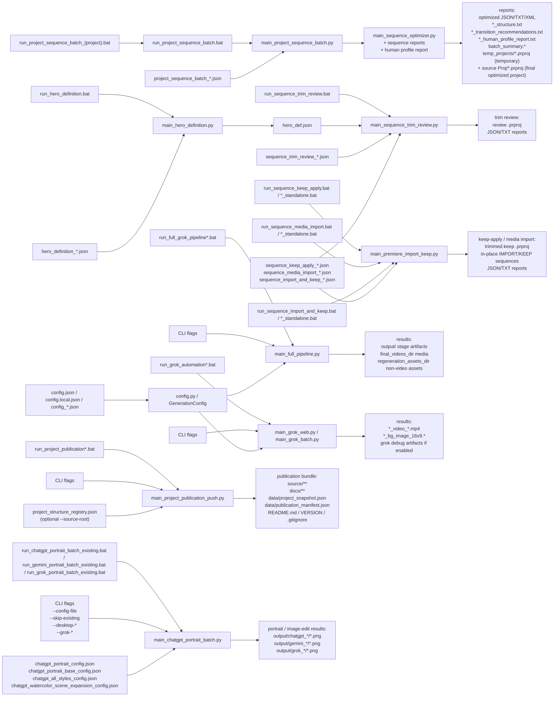

# User Guide

## Latest workspace changes: Premiere and external API images

As of 2026-08-30, task-specific executors cover TASK_019–025, TASK_028–030 and
Alla: timeline assembly, delete/insert/replace, SHORT edits, dual refinement,
adaptive still Motion and Lumetri finishing. The detailed command/contract map
and JSON examples are in [PREMIERE_TASK_WORKFLOWS_RU.md](PREMIERE_TASK_WORKFLOWS_RU.md).
These scripts are not additional `mode` values for the import/KEEP entry point.
TASK executors can update the input `.prproj` after backup; portable Motion
modes use Save As. TASK_028–030 preserve music, while portable Motion requires
`OUTPUT_SILENT`. TASK_029/030 and Alla accept neither `--dry-run` nor `--config`;
029/030 provide `--audit-only`, which writes reports but does not edit the project.
Their paths and sequence versions are fixed in Python. There are manual stages
between the documented versions; do not run them as one automatic chain.

### API: a single image outside input

`main_full_pipeline_api.py` now passes the actual `image_path.parent` to the
Grok batch, allowing `--image` outside `input/` to resolve correctly. Specify
`--single-image` to override a config that enables `read_input_list`.
Copy [config_api_single_image.example.json](../source/examples/config_api_single_image.example.json),
replace its delivery paths, then run:

```powershell
.\run_full_grok_pipeline_api.bat --config-file .\examples\config_api_single_image.example.json --image "<LOCAL_PATH>" --single-image --result-timeout 900
```

Prompt/scene preparation needs `OPENAI_API_KEY`; generation needs `XAI_API_KEY`.
Keep secrets in the environment or `.env`, never in example JSON.
`config_alla_15_humor_api.json` is a project-specific preset: one six-second
video, four camera segments, no background/final-frame/music generation and
local delivery paths. It does not configure the Alla Premiere scripts.

`--no-submit` skips xAI generation only. OpenAI preparation, manifest writes,
`output/` cleanup and input-queue handling can still happen. Successful queue
inputs are deleted; an external image is preserved by success cleanup. On
failure with `continue_after_failure=true`, even an external image can move to
`error/input`; with `false`, the handler moves queued `input/` files and stops.
Use copies and keep unrelated files out of runtime folders. This flag is not
a side-effect-free dry run.

Preview arguments without calling the pipeline:

```powershell
.\examples\scripts\api_single_image.ps1 -Image "<LOCAL_PATH>" -Config .\examples\config_api_single_image.example.json
```

Only `-Run` starts generation from this PowerShell example. Browser-only
arguments such as `--profile-dir`, `--chrome-debug-port` and
`--reuse-existing-grok-page` are ignored by the API CLI. `--result-timeout`
controls the result wait. Structural tests and FFmpeg previews do not replace
opening the saved project in Premiere and reviewing picture/audio; `WAITING_*`
artifacts do not imply completion or an upload.

## One-Minute Quick Start

1. Put source images into `input`.
2. Pick one of two Grok backends:
   - Web automation (default): if you need to sign in to Grok or refresh the session, run `login_grok_profile.bat`, sign in, open `https://grok.com/imagine` once to verify access, and then fully close that Chrome window.
   - Direct API: copy `.env.template` to `.env`, fill `XAI_API_KEY=...`, and skip the Chrome login step entirely. Use `python .\scripts\xai_ping.py` to confirm the key works.
3. Run the main pipeline:

```bat
run_full_grok_pipeline.bat --upload-timeout 300
```

Or the API equivalent (no Chrome required):

```bat
run_full_grok_pipeline_api.bat
```

4. After a successful run:
   - final `mp4` files and background images will be copied to `final_videos_dir`;
   - prompt files, manifests, and other non-video artifacts will be copied to `regeneration_assets_dir`.
5. If a stage fails, the problematic files will be moved to `error\input` and `error\output`.
6. After the video generation phase, build Premiere sequences manually from the generated videos.
7. Run sequence optimization and open the final optimized `.prproj` from the same folder as the source `project_path`; `reports\temp_projects` keeps only the temporary batch working copy.
8. If you manually adjust the optimized sequence, rebuild reports from the current sequence order with `main_sequence_reports.py`.

## Purpose

This project is used to prepare prompt files, generate background images and videos through Grok, optimize Premiere sequence order, and build reports for the final editing phase. The main workflow is: input image -> generate media -> build manual Premiere sequences -> optimize sequence order -> manually refine -> rebuild final recommendations from the approved order.

## Main Directories

- `input` - source images for the current run.
- `output` - temporary prompt files, manifest files, and intermediate results for the current stage.
- `final_videos_dir` - final destination for generated `mp4` files and background images.
- `final_output_dir` - persistent destination for generated portrait/image-edit PNG files copied out of the project runtime `output` while preserving the same subfolder layout.
- `regeneration_assets_dir` - destination for prompt files, manifests, and other non-video artifacts needed for manual editing and regeneration.
- `reports` - final destination for sequence optimization reports, batch summaries, and temporary batch work files.
- `reports\temp_projects` - temporary `.prproj` files produced inside one sequence optimization batch and removable by cleanup.
- the source Premiere project folder from `project_path` - persistent location for the final optimized `.prproj`.
- `error\input` - source images for stages that failed.
- `error\output` - prompt files, manifests, and error reports for failed stages.
- `.browser-profile\grok-web` - Chrome automation profile used for Grok.
- `styles` - reusable style lists for portrait/style workflows.
- `output\chatgpt_portraits` - generated portrait PNG files from the ChatGPT portrait batch workflow.
- `output\gemini_*` and `output\grok_*` - service-specific mirrors of ChatGPT portrait/image-edit output folders.

Example Windows paths in `config.json`:

```json
{
  "final_videos_dir": "<LOCAL_PATH>",
  "final_output_dir": "<LOCAL_PATH>",
  "regeneration_assets_dir": "<LOCAL_PATH>",
  "reports_dir": "<LOCAL_PATH>"
}
```

## BAT Files

- `install_project.bat` — Установка зафиксированного окружения / install locked environment
- `run_verify_installation.bat` — Проверка выпуска, Git, Python, пакетов, FFmpeg / verify release
- `run_premiere_art_task.bat` — TASK_031–034: конфиг и явная стадия / configured ART launcher

[Installation / установка](INSTALL_ON_NEW_COMPUTER_RU.md); [ART 031–034](PREMIERE_ART_TASKS_031_034_RU.md).


Complete inventory of every root `.bat`. Unique extra-parameter examples live in [`BATCH_RUN_HISTORY.md`](BATCH_RUN_HISTORY.md). Detailed notes follow for the main launchers.

| Launcher | Purpose | Example |
| --- | --- | --- |
| `copy_sequence_images_sveta_igr_26_2.bat` | Sveta images-only copy from a named sequence | `.\copy_sequence_images_sveta_igr_26_2.bat` |
| `copy_sequence_media_sveta_igr_26_2.bat` | Sveta config wrapper for sequence media copy | `.\copy_sequence_media_sveta_igr_26_2.bat` |
| `install_premiere_transition_panel.bat` | Install the Premiere transition CEP panel | `.\install_premiere_transition_panel.bat` |
| `login_chatgpt_debug_profile.bat` | Open ChatGPT debug Chrome on port 9333 | `.\login_chatgpt_debug_profile.bat` |
| `login_chatgpt_profile.bat` | Open ChatGPT web automation profile | `.\login_chatgpt_profile.bat` |
| `login_gemini_profile.bat` | Open a dedicated Gemini Chrome profile | `.\login_gemini_profile.bat` |
| `login_grok_profile.bat` | Open the Grok automation profile and verify Imagine | `.\login_grok_profile.bat` |
| `open_ai_work_window.bat` | Open one reusable Grok/ChatGPT Chrome debug window on 9222 | `.\open_ai_work_window.bat` |
| `open_ai_work_window_bookmarks_profile.bat` | Same reusable window using the bookmarks Chrome profile | `.\open_ai_work_window_bookmarks_profile.bat` |
| `open_ai_work_window_user_chrome.bat` | Same reusable window using the normal user Chrome profile | `.\open_ai_work_window_user_chrome.bat` |
| `run_chatgpt_artistic_photo_portret_existing.bat` | Laptop artistic photo-portrait style batch | `.\run_chatgpt_artistic_photo_portret_existing.bat --delivery-config-file config_Ziggi.json` |
| `run_chatgpt_pair_batch_existing.bat` | Pair portraits from input_pair folders | `.\run_chatgpt_pair_batch_existing.bat --delivery-config-file .\config_SF.json --skip-existing --continue-on-error` |
| `run_chatgpt_pair_batch_work_window.bat` | Pair portraits attached to the reusable work window | `.\run_chatgpt_pair_batch_work_window.bat --delivery-config-file .\config_SF.json --skip-existing --continue-on-error` |
| `run_chatgpt_portrait_batch.bat` | ChatGPT portrait batch via standard Python backend | `.\run_chatgpt_portrait_batch.bat --config-file chatgpt_portrait_config.json --skip-existing` |
| `run_chatgpt_portrait_batch_debug.bat` | ChatGPT portrait batch via debug Chrome 9333 | `.\run_chatgpt_portrait_batch_debug.bat --config-file chatgpt_portrait_config.json --skip-existing` |
| `run_chatgpt_portrait_batch_existing.bat` | Recommended ChatGPT desktop portrait batch | `.\run_chatgpt_portrait_batch_existing.bat --config-file chatgpt_portrait_base_config.json --skip-existing --desktop-reactivate-delay 0 --desktop-click-composer` |
| `run_chatgpt_portrait_batch_work_window.bat` | ChatGPT portrait batch attached to the reusable work window | `.\run_chatgpt_portrait_batch_work_window.bat --config-file chatgpt_portrait_base_config.json --skip-existing` |
| `run_chatgpt_style_batch_existing.bat` | Generic style-batch launcher for chatgpt_*_config.json | `run_chatgpt_style_batch_existing.bat chatgpt_all_styles_config.json --skip-existing --continue-on-error` |
| `run_chatgpt_style_menu_existing.bat` | Interactive menu of chatgpt_*_config.json style banks | `.\run_chatgpt_style_menu_existing.bat` |
| `run_chatgpt_watercolor_on_paper_existing.bat` | Laptop watercolor-on-paper style batch | `.\run_chatgpt_watercolor_on_paper_existing.bat --delivery-config-file config_Ziggi.json` |
| `run_copy_minimal_to_laptop_dir.bat` | Copy the minimal laptop watercolor bundle | `.\run_copy_minimal_to_laptop_dir.bat` |
| `run_copy_sequence_images.bat` | Copy images used by one Premiere sequence (CLI) | `.\run_copy_sequence_images.bat --project <prproj> --sequence <sequence> --dest <image_dir>` |
| `run_copy_sequence_media_batch.bat` | Copy sequence images/videos from a JSON config | `.\run_copy_sequence_media_batch.bat .\copy_sequence_media_sveta_igr_26_2.json` |
| `run_full_grok_pipeline.bat` | Full Grok web video pipeline from input/ | `.\run_full_grok_pipeline.bat --upload-timeout 300` |
| `run_full_grok_pipeline_api.bat` | Full Grok video pipeline via xAI API | `.\run_full_grok_pipeline_api.bat --config-file .\config_SF.json` |
| `run_full_grok_pipeline_local.bat` | Full Grok pipeline via .venv and config.local.json | `.\run_full_grok_pipeline_local.bat --skip-existing --upload-timeout 300` |
| `run_full_grok_pipeline_work_window.bat` | Full Grok pipeline attached to the reusable debug window | `.\run_full_grok_pipeline_work_window.bat --upload-timeout 300` |
| `run_gemini_portrait_batch_existing.bat` | Gemini desktop portrait batch, same JSON configs | `.\run_gemini_portrait_batch_existing.bat --config-file chatgpt_portrait_config.json --skip-existing --continue-on-error --desktop-reactivate-delay 0 --desktop-click-composer` |
| `run_grok_automation.bat` | One Grok job for one image and prompt file | `.\run_grok_automation.bat --image .\input\photo.jpg --prompt .\output\photo_20260314_101010_v_prompt_1.txt --upload-timeout 300` |
| `run_grok_automation_all.bat` | Grok batch over existing *_v_prompt_*.txt files | `.\run_grok_automation_all.bat --skip-existing --upload-timeout 300` |
| `run_grok_portrait_batch_existing.bat` | Grok web portrait batch, same JSON configs | `.\run_grok_portrait_batch_existing.bat --config-file chatgpt_portrait_base_config.json --skip-existing --continue-on-error` |
| `run_hero_definition.bat` | Build hero_def.json from reference photos | `.\run_hero_definition.bat .\hero_definition_Alice.json` |
| `run_laptop_env_compare.bat` | Compare laptop env against the watercolor baseline | `.\run_laptop_env_compare.bat` |
| `run_laptop_env_snapshot.bat` | Snapshot the laptop watercolor environment | `.\run_laptop_env_snapshot.bat` |
| `run_local_portrait_batch.bat` | Local stylizer portrait batch without ChatGPT UI | `.\run_local_portrait_batch.bat --config-file chatgpt_portrait_config.json --skip-existing` |
| `run_openai_portrait_batch.bat` | Portrait batch through OpenAI Images API | `.\run_openai_portrait_batch.bat --config-file chatgpt_portrait_config.json --skip-existing --api-model gpt-image-1.5` |
| `run_premiere_sequence_motion.bat` | Duplicate a Premiere sequence, add intrinsic Motion, and render a silent review | `.\run_premiere_sequence_motion.bat .\premiere_sequence_motion_template.json --dry-run` |
| `run_premiere_transform_script.bat` | Generate Premiere transform JSX from a sequence batch config | `.\run_premiere_transform_script.bat .\project_sequence_batch_igor_26_1A.json` |
| `run_premiere_transition_script.bat` | Generate Premiere transition JSX from a sequence batch config | `.\run_premiere_transition_script.bat .\project_sequence_batch_igor_26_1A.json` |
| `run_project_publication_push.bat` | Refresh, commit, tag, and push the public bundle | `.\run_project_publication_push.bat --source-root .` |
| `run_project_publication_stage.bat` | Refresh the public bundle without commit/push | `.\run_project_publication_stage.bat --source-root . --dry-run` |
| `run_project_sequence_batch.bat` | Optimize a Premiere sequence from a JSON config | `.\run_project_sequence_batch.bat .\project_sequence_batch_igor_26_1A.json` |
| `run_project_sequence_batch_igor_26_1A.bat` | Igor sequence-batch wrapper | `.\run_project_sequence_batch_igor_26_1A.bat` |
| `run_project_sequence_batch_nicol_26_T2.bat` | Nicol sequence-batch wrapper | `.\run_project_sequence_batch_nicol_26_T2.bat` |
| `run_project_sequence_batch_vika_26_1A.bat` | Vika sequence-batch wrapper | `.\run_project_sequence_batch_vika_26_1A.bat` |
| `run_sequence_import_and_keep.bat` | Import listed files then KEEP-trim in one pass | `.\run_sequence_import_and_keep.bat .\sequence_import_and_keep_template.json` |
| `run_sequence_import_and_keep_standalone.bat` | Same import-and-keep via `main_premiere_import_keep.py` | `.\run_sequence_import_and_keep_standalone.bat .\sequence_import_and_keep_template.json` |
| `run_sequence_keep_apply.bat` | Apply KEEP JSON: project copy or in-place new sequence | `.\run_sequence_keep_apply.bat .\sequence_keep_apply_template.json` |
| `run_sequence_keep_apply_standalone.bat` | Same KEEP/apply via `main_premiere_import_keep.py` | `.\run_sequence_keep_apply_standalone.bat .\sequence_keep_apply_template.json` |
| `run_sequence_media_import.bat` | Import listed files onto a sequence or a new sequence | `.\run_sequence_media_import.bat .\sequence_media_import_template.json` |
| `run_sequence_media_import_standalone.bat` | Same media import via `main_premiere_import_keep.py` | `.\run_sequence_media_import_standalone.bat .\sequence_media_import_template.json` |
| `run_sequence_music_recommendation.bat` | Video-only plus personalized music report | `.\run_sequence_music_recommendation.bat .\sequence_music_recommendation_Alice.json` |
| `run_sequence_trim_review.bat` | KEEP/DROP review, replay, keep, import, or import-and-keep | `.\run_sequence_trim_review.bat .\sequence_trim_review_01.json` |
| `run_video_prompt_story_export.bat` | Export composer JSON after HTML story review | `.\run_video_prompt_story_export.bat <LOCAL_PATH>` |
| `run_video_prompt_story_generate.bat` | Generate a reviewable HTML/JSON video story | `.\run_video_prompt_story_generate.bat` |

### `login_grok_profile.bat`

Purpose:
- open Chrome with the project automation profile;
- sign in to Grok manually;
- verify that `https://grok.com/imagine` opens successfully.

When to use it:
- on the first run;
- if Grok signed out;
- if Grok starts showing `Sign in` or `Sign up`.

Important:
- this bat file is only for manual login;
- after checking access, close that Chrome window completely;
- the main pipeline starts Grok on its own when it runs.

### `run_grok_automation.bat`

Purpose:
- run Grok for one image / one prompt file.

Example:

```bat
run_grok_automation.bat --image .\input\photo.jpg --prompt .\output\photo_20260314_101010_v_prompt_1.txt --upload-timeout 300
```

Useful when you want to:
- re-run one prompt;
- regenerate only one background or one video;
- test a single Grok stage without running the full pipeline.

### `run_grok_automation_all.bat`

Purpose:
- process all `*_v_prompt_*.txt` files already present in `output`.

Examples:

```bat
run_grok_automation_all.bat --upload-timeout 300
run_grok_automation_all.bat --skip-existing --upload-timeout 300
run_grok_automation_all.bat --skip-video --generate-source-background --upload-timeout 300
```

This bat file is useful when prompt files already exist and you only need the Grok part.

### `run_full_grok_pipeline.bat`

This is the main launcher for normal operation.

It does the following:
1. takes one input image from `input`;
2. builds all stage files in `output`;
3. starts Grok for that image;
4. saves the background image and/or video;
5. copies results to `final_videos_dir` and `regeneration_assets_dir`;
6. closes Grok;
7. continues with the next image.

Examples:

```bat
run_full_grok_pipeline.bat --upload-timeout 300
run_full_grok_pipeline.bat --skip-video --generate-source-background --upload-timeout 300
run_full_grok_pipeline.bat --save-grok-debug-artifacts --upload-timeout 300
```

Duration selection fix:
- The launcher now reads `video_duration_seconds` from the active config and forces the matching duration button in the Grok UI before uploading the image and prompt.
- The selection logic prefers the requested duration over an already highlighted button with a different value, so a config requesting 10 seconds no longer falls back to whatever default Grok had pre-selected (for example 6 seconds).
- Override the value with `--video-duration-seconds N`. Acceptable Grok values are `6`, `10`, and `15` seconds.

### `run_full_grok_pipeline_api.bat`

Direct xAI API alternative to `run_full_grok_pipeline.bat`. Same input/output layout, but instead of driving Chrome through Playwright the pipeline calls the xAI `grok-imagine-video` model through the official `xai-sdk` Python client. There is no Chrome session, no `login_grok_profile.bat` step, and no debug profile to manage.

Prerequisites:
- A valid `XAI_API_KEY` in `.env`. Use `.env.template` as a reference.
- Optional sanity check: `python .\scripts\xai_ping.py` performs a cheap chat call and prints `pong` when the key is healthy.

Examples:

```bat
run_full_grok_pipeline_api.bat
run_full_grok_pipeline_api.bat --config-file .\config_SF.json
run_full_grok_pipeline_api.bat --skip-video --generate-source-background
```

What it does:
1. Reads images from `input` exactly like the web launcher.
2. Builds video/background prompts the same way as `run_full_grok_pipeline.bat`.
3. Submits each prompt + input image to the xAI Video API through `api/grok_video.py`.
4. Downloads the resulting `mp4` to the project `output/` folder, then delivers it to `final_videos_dir` / `regeneration_assets_dir` through the existing delivery code.
5. Honors `video_duration_seconds`, `video_aspect_ratio`, and `video_resolution` from the config.

When to choose the API launcher:
- Headless / CI environments where Chrome cannot run.
- When you want determinism and no UI state to maintain.
- Cost-controlled batches where per-second pricing is acceptable.

When to keep the web launcher:
- When you need the Grok web-only UI features (chat-style refinements, manual variants).
- When the xAI Video API quota is exhausted or temporarily unavailable.

Related files:
- `main_full_pipeline_api.py` - entry point that wires the API runner into the existing pipeline.
- `api/grok_video.py` - low-level xAI Video API client (image_url + prompt + duration).
- `api/grok_video_runner.py` - adapter that implements the same `AgentRunner` interface as `GrokWebSessionRunner` so the rest of the pipeline does not change.
- `scripts/xai_ping.py` - cheap chat-mode test for `XAI_API_KEY`.

### `run_sequence_trim_review.bat`

Purpose:
- split a Premiere sequence into KEEP/DROP segments (`heuristic`, `semantic`, or `hero`);
- replay a saved hero report onto four tracks without OpenAI;
- apply a manual KEEP JSON when the config uses `"mode": "apply_keep_ranges"`;
- copy a source sequence and KEEP-trim the copy when `"mode": "keep_to_new_sequence"`;
- import files onto a new sequence in the same `.prproj` when `"mode": "import_to_new_sequence"`;
- import files and immediately keep-trim them when the config uses `"mode": "import_and_keep"`.

Examples:

```bat
.\run_sequence_trim_review.bat .\sequence_trim_review_01.json
.\run_sequence_trim_review.bat .\sequence_trim_review_Alice_1.json
.\run_sequence_trim_review.bat .\sequence_trim_review_Alice_replay_levels.json
.\run_sequence_trim_review.bat .\sequence_keep_apply_yotam26_2_min.json
```

### `run_premiere_sequence_motion.bat`

The `"mode": "premiere_sequence_motion_animation"` workflow:
- validates `schema_version: "1.0"`, source/output sequence names, fps, frame size, duration, and online media;
- writes a detailed project-safe plan first when launched with `--dry-run`;
- performs Save As, duplicates the source sequence, and edits only the duplicate;
- adds two frame-exact intrinsic Motion Scale/Position keyframes relative to each existing baseline;
- leaves protected ranges unchanged, removes only output audio clips, and preserves empty audio tracks;
- performs structural QA and renders a silent review MP4.

```bat
.\run_premiere_sequence_motion.bat .\premiere_sequence_motion_template.json --dry-run
.\run_premiere_sequence_motion.bat .\premiere_sequence_motion_template.json
```

The same launcher supports
`"mode": "premiere_sequence_insert_from_sequence_and_motion_animation"`:

- resolve a frame-exact video-only range from another named sequence in the project;
- insert it into a duplicate of the approved main sequence and shift later picture items exactly;
- keep both source sequences unchanged;
- exclude the inserted live range and other natural-motion video from Motion;
- apply JSON-driven intrinsic Motion only to eligible static images;
- remove output audio non-ripple and render a silent review.

```bat
.\run_premiere_sequence_motion.bat .\premiere_sequence_insert_motion_template.json --dry-run
.\run_premiere_sequence_motion.bat .\premiere_sequence_insert_motion_template.json
```

Use `resolved_source_range_frames: [IN, OUT_EXCLUSIVE]` and
`resolved_destination_frame` for explicit frame-exact decisions. The
`correction_source_sequence_name` value is always an in-project sequence, not
an external media filename. A complete Russian reference with both JSON
examples is available in `docs/PREMIERE_JSON_EDIT_AND_MOTION_RU.md`.

The same JSON can be run directly:

```powershell
python .\main_premiere_import_keep.py --config .\premiere_sequence_motion_template.json --dry-run
```

### `run_sequence_keep_apply.bat`

Purpose:
- copy a Premiere `.prproj` and keep only the source ranges listed in a KEEP JSON;
- copy a source sequence to a new output sequence in the same `.prproj` (`keep_to_new_sequence`) without multiplying project files;
- leave unlisted clips, bins, and sequence names unchanged;
- trim linked audio with the listed video and ripple the following clips.

This is the dedicated launcher for `"mode": "apply_keep_ranges"` and `"mode": "keep_to_new_sequence"`. It calls `main_premiere_import_keep.py`. The same config also works with `run_sequence_keep_apply_standalone.bat` and `run_sequence_trim_review.bat`.

Examples:

```bat
.\run_sequence_keep_apply.bat .\sequence_keep_apply_yotam26_2_min.json
.\run_sequence_keep_apply.bat .\sequence_keep_apply_template.json
.\run_sequence_keep_apply.bat .\sequence_keep_to_new_sequence_template.json
.\run_sequence_keep_apply.bat .\sequence_keep_apply_yotam26_macro_styles.json
```

Template: `sequence_keep_apply_template.json`. In-place copy+KEEP template: `sequence_keep_to_new_sequence_template.json`. Working Yotam configs: `sequence_keep_apply_yotam26_2_min.json` and `sequence_keep_apply_yotam26_macro_styles.json`. KEEP windows come from `keep_ranges_path` or inline `clips` / `operations`.

### `run_sequence_media_import.bat`

Purpose:
- append listed files onto an existing sequence and write a sibling `*_import.prproj` (`import_media`);
- create `output_sequence_name` inside the existing `.prproj` and import there (`import_to_new_sequence`);
- reuse Media only when the full path already exists in the project; same filename in another folder gets its own `MasterClip`.

This is the dedicated launcher for `"mode": "import_media"` and `"mode": "import_to_new_sequence"`. It calls `main_premiere_import_keep.py`. The same config also works with `run_sequence_media_import_standalone.bat` and `run_sequence_trim_review.bat`.

Examples:

```bat
.\run_sequence_media_import.bat .\sequence_media_import_yotam26_part2.json
.\run_sequence_media_import.bat .\sequence_media_import_template.json
.\run_sequence_media_import.bat .\sequence_media_import_to_new_sequence_template.json
.\run_sequence_media_import.bat .\sequence_media_import_yotam26_macro_styles.json
```

### `run_sequence_import_and_keep.bat`

Purpose:
- import listed files onto a sequence and immediately trim them with a KEEP JSON in one pass;
- keep the intermediate `*_import.prproj` and write the final trimmed `*_keep.prproj`;
- ignore `project_path` from the KEEP JSON and always apply keep to the import result.

This is the dedicated launcher for `"mode": "import_and_keep"`. It calls `main_premiere_import_keep.py`. The same config also works with `run_sequence_import_and_keep_standalone.bat` and `run_sequence_trim_review.bat`.

Examples:

```bat
.\run_sequence_import_and_keep.bat .\sequence_import_and_keep_template.json
.\run_sequence_import_and_keep.bat <LOCAL_PATH>
```

Template: `sequence_import_and_keep_template.json`. Point `import_path` and `keep_ranges_path` at the two job JSON files.

## ChatGPT, Gemini, And Grok Artistic Portrait Batch

This workflow generates finished artistic portraits from every supported image in `input`.
It uses the already-open ChatGPT web UI in Chrome, not the OpenAI API.
The same job builder and JSON config format can also drive a dedicated Gemini
generation window through `--backend gemini-desktop`, or Grok image generation
through `--backend grok`.

Main files:
- `main_chatgpt_portrait_batch.py` - builds portrait jobs from images and styles.
- `api/chatgpt_desktop_v2.py` - desktop automation for the existing ChatGPT window.
- `api/gemini_desktop.py` - desktop automation adapter for an existing Gemini window.
- `api/grok_web.py` - Grok web automation reused from the video pipeline, with image mode enabled.
- `run_chatgpt_portrait_batch_existing.bat` - recommended launcher for an already-open ChatGPT session.
- `run_chatgpt_pair_batch_existing.bat` - ChatGPT launcher for two-photo pair portraits from `input_pair\01`, `input_pair\02`, and so on.
- `login_gemini_profile.bat` - opens a dedicated Gemini Chrome profile at `https://gemini.google.com/app`.
- `run_gemini_portrait_batch_existing.bat` - Gemini launcher that reuses the same portrait JSON configs.
- `login_grok_profile.bat` - signs in the dedicated Grok Chrome profile at `https://grok.com/imagine`.
- `run_grok_portrait_batch_existing.bat` - Grok launcher that reuses the same portrait JSON configs.
- `chatgpt_portrait_config.json` - short working style set, currently watercolor and pastel.
- `chatgpt_portrait_base_config.json` - full base style bank for artistic portraits and image-edit service styles.
- `chatgpt_all_styles_config.json` - batch config for the full base style list with a dedicated output folder `output\chatgpt_all_styles`. Trim `portrait_styles` to run a subset.
- `chatgpt_pair_base_config.json` - pair portrait prompt bank for constructing one cinematic artistic couple image from two source photos.
- `chatgpt_watercolor_scene_expansion_config.json` - special two-style config for `watercolor` and `scene_expansion`.
- `BATCH_RUN_HISTORY.md` - non-repeating examples for all batch launchers and their parameters.
- `styles\art_styles_Prompt_list.txt` - source human-readable style prompt list.

The base config contains the full portrait/style bank, including Rembrandt, Renaissance, Impressionist, Renoir, Andrei Rublev, Watercolor, Van Gogh post-impressionism, Klimt art nouveau, Art Deco, Karsh black-and-white studio portrait, Pop Art, Cubist, Picasso graphic, Chagall poetic modernism, PHOTO_PORTRET, ARTISTIC_PORTRAIT, plus service styles such as MODERN_COLOR, COLORIZE, FACE_ENLARGEMENT, and SCENE_EXPANSION.

`chatgpt_all_styles_config.json` mirrors the full bank for mass batch runs: for each image in `input\`, the batch applies every style and writes `<image_stem>_<slug>.png` to `output\chatgpt_all_styles`.

Output:
- generated PNG files are written to `output\chatgpt_portraits`;
- Gemini writes the same jobs into mirrored `output\gemini_*` folders;
- Grok writes the same jobs into mirrored `output\grok_*` folders;
- when `--delivery-config-file .\config_Yakov.json` or another user config is supplied, every newly saved PNG is also copied to that config's `final_output_dir` with the same relative structure as the project `output\...` tree, while the project copy stays in place for `--skip-existing`;
- for example, project output `output\grok_portraits\portrait.png` is copied to `<LOCAL_PATH>`;
- file names use `<image_stem>_<style_slug>.png`, for example `IMG-001_rembrandt.png`;
- `--skip-existing` lets the batch restart safely and skip already saved portraits.

Pair portrait output:
- put two source photos into each numbered folder under `input_pair`, for example `input_pair\01\person_a.jpg` and `input_pair\01\person_b.jpg`;
- before sending to ChatGPT, the batch creates one temporary side-by-side reference image in `output\pair\_pair_references`, so the desktop composer only has to accept one attachment;
- the pair batch writes one generated image per numbered folder into `output\pair`;
- file names use `<pair_id>_art_pair_<YYYYMMDD_HHMMSS>.png`, for example `01_art_pair_20260522_153000.png`, so the same numbered folder can be reused later with different photos;
- with `--delivery-config-file .\config_SF.json`, the result is also copied to that config's `final_output_dir\pair`.

Recommended automatic command:

```bat
.\run_chatgpt_portrait_batch_existing.bat --config-file chatgpt_portrait_base_config.json --skip-existing --desktop-reactivate-delay 0 --desktop-click-composer
```

All base styles command (separate output folder):

```bat
.\run_chatgpt_portrait_batch_existing.bat --config-file chatgpt_all_styles_config.json --skip-existing --continue-on-error --desktop-reactivate-delay 0 --desktop-click-composer
```

On the laptop bundle, the same config can be launched via the generic style launcher:

```bat
run_chatgpt_style_batch_existing.bat chatgpt_all_styles_config.json --delivery-config-file config_Ziggi.json --skip-existing
```

Watercolor + scene expansion command:

```bat
.\run_chatgpt_portrait_batch_existing.bat --config-file chatgpt_watercolor_scene_expansion_config.json --skip-existing --continue-on-error --desktop-reactivate-delay 0 --desktop-click-composer
```

Ilya Repin-inspired Russian realist psychological portrait only:

```bat
.\run_chatgpt_portrait_batch_existing.bat --config-file chatgpt_ilya_repin_config.json --skip-existing --continue-on-error --desktop-reactivate-delay 0 --desktop-click-composer
```

The `ILYA_REPIN` style is also included in the complete `chatgpt_portrait_base_config.json` and `chatgpt_all_styles_config.json` banks. The special config writes results to `output\chatgpt_ilya_repin`.

Short working set command:

```bat
.\run_chatgpt_portrait_batch_existing.bat --skip-existing
```

Pair portrait command:

```bat
.\run_chatgpt_pair_batch_existing.bat --delivery-config-file .\config_SF.json --skip-existing --continue-on-error
```

Gemini desktop-flow with the same config files:

```bat
.\login_gemini_profile.bat
.\run_gemini_portrait_batch_existing.bat --config-file chatgpt_portrait_config.json --skip-existing --continue-on-error --desktop-reactivate-delay 0 --desktop-click-composer
```

Gemini uses the same JSON config files as ChatGPT, but automatically mirrors ChatGPT output folders to Gemini folders when `--output-dir` is not explicitly passed. For example, `output\chatgpt_portraits` becomes `output\gemini_portraits`, and `output\chatgpt_watercolor_scene_expansion` becomes `output\gemini_watercolor_scene_expansion`. Pass your own `--output-dir` after the bat command only when a task needs a custom folder.
Gemini saving first tries the generated image button `Download full size` / `Скачать в полном размере`, waits for the browser download to complete, and moves the downloaded image into the configured output path. If that button is unavailable, the older browser context-menu save path is still used as a fallback. The Gemini bat is intentionally quiet by default; add `--desktop-verbose` only when diagnosing UI problems.

Grok web-flow with the same config files:

```bat
.\login_grok_profile.bat
.\run_grok_portrait_batch_existing.bat --config-file chatgpt_portrait_base_config.json --skip-existing --continue-on-error
```

Grok uses `.browser-profile\grok-web`, `https://grok.com/imagine`, and Playwright image-mode automation. When `--output-dir` is not explicitly passed, ChatGPT output folders from the config are mirrored to Grok folders, for example `output\chatgpt_portraits` becomes `output\grok_portraits` and `output\chatgpt_watercolor_on_paper` becomes `output\grok_watercolor_on_paper`. Grok saves through browser download/source capture, so it does not use the Windows `Save As` dialog.

Persistent portrait delivery to a user project:

```bat
.\run_chatgpt_portrait_batch_existing.bat --config-file chatgpt_portrait_config.json --delivery-config-file .\config_Yakov.json --skip-existing --desktop-reactivate-delay 0 --desktop-click-composer
.\run_gemini_portrait_batch_existing.bat --config-file chatgpt_portrait_config.json --delivery-config-file .\config_Yakov.json --skip-existing --continue-on-error --desktop-reactivate-delay 0 --desktop-click-composer
.\run_grok_portrait_batch_existing.bat --config-file chatgpt_portrait_config.json --delivery-config-file .\config_Yakov.json --skip-existing --continue-on-error
```

The portrait style config still controls styles and the project-side output folder. The delivery config is separate and controls the persistent mirror root through `final_output_dir`; the service/style subfolders from project `output` are preserved below it. The same project config may also contain `hero_image_dir`, `human_detail_txt`, and `reports_dir`; these metadata paths do not alter PNG delivery and allow one `config_Alice.json` to be shared safely across project workflows.

Manual focus fallback:
- keep an already verified ChatGPT window open in Chrome;
- run the bat file without `--desktop-reactivate-delay 0`;
- during each countdown, click inside the ChatGPT message box;
- the script then attaches the source image, pastes the prompt, submits it, waits for a generated result, and saves the image.

Important:
- the automation does not bypass ChatGPT human checks or CAPTCHA prompts; pass them manually in the browser first;
- do not run two portrait batches at the same time;
- keep the generation ChatGPT in a dedicated Chrome window with exactly one visible tab; `run_chatgpt_portrait_batch_existing.bat` now requires this with `--desktop-require-single-tab-window`;
- if Chrome has several ChatGPT windows, the single-tab generation window is the only safe target for the desktop batch;
- desktop input is guarded: before clicks, paste, Enter, and save shortcuts, the script verifies that the foreground window is the selected ChatGPT window or a real `Save As`/`Open` dialog; if another app is foreground, the batch stops instead of sending input there;
- after saving, ChatGPT may leave the last generated image open on screen. This is acceptable if the batch continues;
- if the batch stops, rerun the same command with `--skip-existing`.
- Gemini uses the same foreground-window protection and the same single visible tab rule; keep it in a separate Chrome window opened to `https://gemini.google.com/app`.
- Gemini sign-in, Google checks, and service-side limits are not bypassed; complete them manually in the dedicated Gemini window before starting the batch.
- Grok sign-in and service-side checks are not bypassed; use `login_grok_profile.bat` when the Grok profile needs manual login, then close the login window before the managed portrait batch.

## New Generation Flags

### `generate_video`

Controls video generation. Default: `true`.

In `config.json`:

```json
{
  "generate_video": true
}
```

CLI parameters:

```bat
--generate-video
--skip-video
```

Behavior:
- if `generate_video = true`, the pipeline generates videos in Grok;
- if `generate_video = false` and `generate_source_background = true`, the pipeline generates only background images;
- if `generate_video = false` and `generate_source_background = false`, the stage fails because there is nothing to generate.

When visible people are present, `*_v_prompt_*.(txt|json)` and `*_v_prm_ru_*.(txt|json)` now prefer identity-safe camera language: more distant or medium-wide framing, side / top / low / drone-like angles, and less aggressive facial enlargement. The goal is to reduce face drift in generated videos.

This identity-safe behavior is now the default, but it is configurable through six framing-mode flags plus one ratio key:

```json
{
  "prefer_face_closeups": false,
  "use_ai_optimal_framing": false,
  "use_ai_optimal_then_identity_safe_framing": false,
  "ai_optimal_then_identity_safe_ai_optimal_percent": 70,
  "generate_dual_framing_videos": false,
  "generate_identity_safe_closeup_videos": false,
  "generate_triple_framing_videos": false
}
```

Framing mode rules:
- if all six flags are `false`, the pipeline keeps the default identity-safe framing and tries to avoid aggressive face enlargement;
- if `prefer_face_closeups = true`, close facial framing may be preferred and the video prompt may move into a tighter portrait scale;
- if `use_ai_optimal_framing = true`, the AI chooses the most effective cinematic framing for the source image without letting the face become significantly enlarged or distorted;
- if `use_ai_optimal_then_identity_safe_framing = true`, one video is generated from one source image, but inside that single video the first `ai_optimal_then_identity_safe_ai_optimal_percent` percent uses AI-optimal framing and the remaining percent transitions into identity-safe framing from a safer distance;
- if `ai_optimal_then_identity_safe_ai_optimal_percent` is omitted, the default ratio is `70 / 30`; for example, `50` means `50%` AI-optimal and `50%` identity-safe.
- if `generate_dual_framing_videos = true`, the pipeline builds two branches from the same source frame: one identity-safe branch and one AI-optimal branch.
- if `generate_identity_safe_closeup_videos = true`, the pipeline builds two branches from the same source frame: one identity-safe branch and one face-closeup branch.
- if `generate_triple_framing_videos = true`, the pipeline builds three branches from the same source frame: identity-safe, face-closeup, and AI-optimal.

Dual-mode output count:
- with `video_count = 1`, dual mode produces `2` videos;
- with `video_count = N`, dual mode produces `2 x N` videos.

Only one of these six framing flags can be enabled at a time. The percentage key is not a separate mode flag; it only refines the hybrid mode.

### `generate_grok_multiscene_json_prompt`

Controls a special Grok prompt mode where the usual `*_v_prompt_*.txt` file is replaced by a JSON prompt artifact.

In `config.json`:

```json
{
  "generate_grok_multiscene_json_prompt": true,
  "grok_multiscene_prompt_size": 2000
}
```

Behavior:
- the pipeline writes `*_v_prompt_*.json` in English and `*_v_prm_ru_*.json` in Russian instead of TXT prompt files;
- each JSON file is a one-item array with a `prompt` field, similar in spirit to `Gen_Video_Seedance`;
- Grok reads the English `prompt` text from that JSON automatically, so batch execution still works through the normal Grok runners;
- the prompt is treated as a compact three-shot video plan built from one input image, where `@image1` is the input image itself.

Current fixed layout:
- `Shot 1`, `0-2s`: strongest current AI-optimal cinematic interpretation;
- `Shot 2`, `2-4s`: alternative AI-optimal interpretation with a clearly different camera solution;
- `Shot 3`, `4-6s`: safer distance / angle view with wider spatial reveal.

Current limits:
- total duration is fixed at `6s`;
- aspect ratio is fixed at `16:9`;
- the English prompt is validated against the configured `grok_multiscene_prompt_size` in characters, and the word budget is derived automatically as approximately `size / 5`.

Prompt-size parameter:
- `grok_multiscene_prompt_size` — default `1000`, which gives about `200` words;
- `2000` gives about `400` words and allows a more detailed JSON video prompt for Grok;
- the builder still keeps the prompt concise, but may preserve more scene detail when the size is increased.

When to use `--skip-video`:
- when you only need background images;
- when you want to postpone video generation;
- when you want to prepare backgrounds first and generate videos later.

### `generate_source_background`

Controls background image generation in Grok.

CLI parameters:

```bat
--generate-source-background
--skip-source-background
```

Current behavior:
- background generation uses `*_assoc_bg_prompt.txt`;
- that descriptor describes a realistic associative image suitable as a background;
- Grok builds a new background from that descriptor and uses the source image as visual guidance.

### `save_grok_debug_artifacts`

Controls whether Grok diagnostic files are kept. Default: `false`.

In `config.json`:

```json
{
  "save_grok_debug_artifacts": false
}
```

CLI parameters:

```bat
--save-grok-debug-artifacts
--skip-grok-debug-artifacts
```

Behavior:
- if `false`, candidate/debug files do not remain in `output`, so the working folder stays clean;
- if `true`, Grok diagnostic artifacts are saved in `output`.

Possible files when enabled:
- `*_bg_image_16x9.candidate_*.png`
- `*_bg_image_16x9_candidates.json`
- `*_grok_debug.png`
- `*_grok_debug.html`
- `*_grok_debug.json`

When to enable it:
- if Grok saved the wrong background image;
- if you need to see which candidate was found on the page;
- if you need detailed diagnostics of Grok page results.

When to keep it disabled:
- during normal operation;
- when you want `output` to stay clean.

### `continue_after_failure`

Controls what happens after a failed stage.

Behavior:
- if `false`, the pipeline stops on the first failure;
- if `true`, the failed stage is moved to `error`, and processing continues with the next image.

When to enable it:
- when there are many input images;
- when some of them may be too large or otherwise problematic;
- when it is more convenient to review only failed stages later.

## Full Generation Config Reference

All current `GenerationConfig` fields:

- `generate_video` — default `true`; generate video prompts and run the video stage.
- `generate_grok_multiscene_json_prompt` — default `false`; write Grok-ready EN/RU JSON prompt artifacts instead of TXT video prompt files, using a fixed three-shot `6s` layout built from one input image.
- `grok_multiscene_prompt_size` — default `1000`; maximum prompt size for Grok multiscene JSON mode in approximate characters. The word budget is derived automatically, for example `1000 -> 200 words`, `2000 -> 400 words`.
- `video_count` — default `2`; how many videos to build from one source frame for each active framing mode.
- `camera_segments` — default `1`; how many motion segments are planned inside one video prompt.
- `motion_source` — default `table`; choose camera motions from the local table or from AI (`ai`).
- `motion_model` — default `gpt-4.1`; OpenAI model used for AI motion selection when `motion_source = ai`.
- `generate_source_background` — default `false`; create background prompts and run the background-image stage in Grok.
- `save_grok_debug_artifacts` — default `false`; keep Grok diagnostic candidate/debug artifacts in `output`.
- `final_videos_dir` — default `final_project/videos`; final delivery folder for generated `mp4` files and background images.
- `final_output_dir` — default `final_project/output`; final delivery root for portrait/image-edit PNG copies produced by ChatGPT, Gemini, Grok, API, or local portrait batch flows when `--delivery-config-file` is provided. Project `output/...` subfolders are mirrored below this root.
- `regeneration_assets_dir` — default `final_project/regeneration_assets`; delivery folder for prompts, manifests, and non-video stage artifacts.
- `hero_image_dir` — optional project metadata path to hero reference images.
- `human_detail_txt` — optional project metadata path to the human-written hero profile.
- `reports_dir` — optional shared project reports directory.
- `continue_after_failure` — default `false`; continue with the next image after moving a failed stage into `error`.
- `write_description` — default `true`; write the stage description / analysis text file.
- `generate_final_frames` — default `false`; generate final-frame images through the image API.
- `read_input_list` — default `true`; read all supported source images from `input`.
- `generate_music` — default `false`; generate a music prompt after the last processed image.
- `prefer_face_closeups` — default `false`; allow and prefer closer facial framing when that matches the source image.
- `use_ai_optimal_framing` — default `false`; let AI choose the strongest cinematic framing, but do not significantly enlarge or distort the face.
- `use_ai_optimal_then_identity_safe_framing` — default `false`; generate one video where the first part uses AI-optimal framing and the remaining part transitions into identity-safe distance / angles.
- `ai_optimal_then_identity_safe_ai_optimal_percent` — default `70`; only for `use_ai_optimal_then_identity_safe_framing = true`; how much of the video duration is reserved for the AI-optimal part. Valid range: `1..99`. The identity-safe remainder is calculated automatically as `100 - value`.
- `generate_dual_framing_videos` — default `false`; generate both identity-safe and AI-optimal framing branches from the same source frame.
- `generate_identity_safe_closeup_videos` — default `false`; generate both identity-safe and face-closeup framing branches from the same source frame.
- `generate_triple_framing_videos` — default `false`; generate identity-safe, face-closeup, and AI-optimal framing branches from the same source frame.
- `hide_phone_in_selfie` — default `true`; if the input looks like a selfie / self-portrait, keep the selfie feel but try not to show the phone, photo camera, video camera, or their reflections when plausible.
- `prefer_loving_kindness_tone` — default `true`; where appropriate for the specific input image, gently bias the prompts toward loving-kindness, friendliness, benevolence, warm goodwill, and gentle mercy through light, color, atmosphere, environment, and background.

Important framing rule:
- Only one of `prefer_face_closeups`, `use_ai_optimal_framing`, `use_ai_optimal_then_identity_safe_framing`, `generate_dual_framing_videos`, `generate_identity_safe_closeup_videos`, or `generate_triple_framing_videos` can be enabled at a time.

## Architecture And Change Control

For a developer-oriented map of the project structure, data flows, invariants, and change-impact checklist, see `PROJECT_STRUCTURE.md`.
For automation and machine-guided change review, see `project_structure_registry.json`.
Use `python .\main_change_impact.py --change-type generation_flag --changed-file config.py` to generate a concrete impact checklist.
Use `python .\main_project_publication.py --target-dir .\project_publication\Memory-to-Video_Agent` to refresh the external project-information repository bundle.
The public bundle now includes a full safe source mirror under `source/`, excluding secrets, media artifacts, and runtime-only folders.
Use `python .\main_project_publication_push.py --repo-dir <path-to-local-Memory-to-Video_Agent-clone> --stage` for the guarded public-repo publish flow.
Use `.\run_project_publication_stage.bat` for the shortest preview/stage-only run without push.
Use `.\run_project_publication_push.bat` for the shortest manual publish command with your current local clone path.

## Batch / Program / Parameter Map

Use this compact map when you need to quickly see which `.bat` launches which Python entry point, and where the main parameters come from.



The left side of the diagram shows launch wrappers and parameter sources, and the right side shows the reports and result artifacts produced by each route.

Parameter precedence is usually:

1. hardcoded arguments in the `.bat` wrapper;
2. extra arguments forwarded through `%*`;
3. JSON config values;
4. defaults in Python code.

## Deploying On Another Machine

For a clean local deployment in another folder or on another machine:

```powershell
powershell -ExecutionPolicy Bypass -File .\setup_project.ps1
```

This script:
- creates `.venv`;
- installs `requirements.txt`;
- creates local runtime folders such as `input`, `output`, `final_project\videos`, and `final_project\regeneration_assets`;
- writes `.env.template`;
- creates `config.local.json` with relative local paths.

Then:
- fill real keys into `.env`;
- place source images into `input\`;
- for a new clone, run `login_grok_profile.bat` once and sign in to Grok inside that clone-specific Chrome profile;
- run `.\run_full_grok_pipeline_local.bat`.

Or use the one-step deploy/check/run helper:

```powershell
powershell -ExecutionPolicy Bypass -File .\deploy_and_run.ps1
```

It runs bootstrap first, then checks:
- `.env` and `OPENAI_API_KEY`;
- local Chrome availability;
- whether the clone-specific Grok profile in `.browser-profile\grok-web` is already authenticated for `https://grok.com/imagine`;
- whether `input\` already contains supported source images.
- Note: each clone uses its own Grok Chrome profile under `.browser-profile\grok-web` unless you explicitly pass another `--profile-dir`.

If the Grok profile is not logged in yet, `deploy_and_run.ps1` now stops before the pipeline and tells you to run `login_grok_profile.bat`.

Use this for a dry readiness check without starting the pipeline:

```powershell
powershell -ExecutionPolicy Bypass -File .\deploy_and_run.ps1 -CheckOnly
```

## Three-Command Working Cheat Sheet

Use this short sequence for day-to-day work in the main project directory:

```powershell
cd <LOCAL_PATH>
powershell -ExecutionPolicy Bypass -File .\deploy_and_run.ps1 -CheckOnly
python .\main_project_publication_push.py --repo-dir <LOCAL_PATH> --commit-message "Update project publication" --push
```

Meaning:
- `work` — switch to the main working directory;
- `check` — verify the environment, the clone-specific Grok profile, and `input\`;
- `publish` — refresh and push the public project mirror.

## What Gets Copied After a Successful Stage

Into `final_videos_dir`:
- `*.mp4`;
- final background images.

Into `regeneration_assets_dir\<stage_id>`:
- `description`;
- `scene_analysis`;
- `v_prompt`;
- `v_prm_ru`;
- `bg_prompt`;
- `bg_prm_ru`;
- `assoc_bg_prompt`;
- `assoc_bg_prm_ru`;
- `manifest`;
- other non-video stage files.

Not copied to `regeneration_assets_dir`:
- the source image;
- final `mp4` files;
- the final background image.

## What Happens on Failure

If a stage fails:
- stage files from `output` are moved to `error\output\<stage_id>`;
- the source image is moved to `error\input\<stage_id>`;
- a file named `<stage_id>_error.txt` is saved next to them with the error details.

This makes it easier to inspect and re-run only the problematic images.

If Grok closes the current browser tab right after `submit`, the automation now tries to recover from another live Grok tab or from a just-finished download before marking the stage as failed.
For unfinished stages that already have a ready `*_v_prompt_*.txt`, you can safely re-run only the video step and skip repeated background generation.

## Premiere Sequence Workflow

After video generation is finished, the normal process is:

1. Build Premiere sequences manually from the generated `mp4` files.
2. If a raw sequence already has a KEEP JSON, run `run_sequence_keep_apply.bat` to write a trimmed project copy before optimization.
3. Run the sequence optimization batch to create new `_oNN` sequences from approved `_eNN` sequences.
4. Review the optimized result in Premiere.
5. If needed, manually change clip order again after optimization.
6. Rebuild the reports from the current manual order.
7. Keep the final optimized project beside the source Premiere project and keep the reports in `reports`.

Important location rule:

- `reports` is the final result for sequence optimization reports and batch summaries.
- `reports\temp_projects` is a temporary batch workspace for `.prproj` files and is safe to clean up later.
- the persistent optimized `.prproj` lives beside `project_path`.
- `output` is a temporary workspace area.
- If everything finishes successfully, `output` should ideally end up empty.

The optimizer can now work not only with `mp4` clips, but also with visual timelines that mix photos and videos. When enabled in the batch config, it writes an edit plan into the JSON/TXT report and can apply the plan during `.prproj` export:

- recommended still-image duration on the timeline;
- gentle video-fragment duration adjustment;
- transition recommendation for `image -> image`;
- transition recommendation for `image -> video`;
- transition recommendation for `video -> image`;
- transition recommendation for `video -> video`.

## Sequence Optimization Batch

Run the batch optimizer with a JSON config:

```bat
.\run_project_sequence_batch.bat .\project_sequence_batch_igor_26_1A.json
```

```powershell
python .\main_project_sequence_batch.py --config .\project_sequence_batch_igor_26_1A.json
```

Example config fields:

```json
{
  "project_path": "<LOCAL_PATH>",
  "regeneration_assets_dir": "<LOCAL_PATH>",
  "output_project_path": "<LOCAL_PATH>",
  "reports_dir": "<LOCAL_PATH>",
  "transition_mode": "apply",
  "enable_auto_transitions": true,
  "enable_visual_transitions": true,
  "enable_auto_durations": true,
  "enable_auto_transforms": true,
  "generate_premiere_transform_script": true,
  "premiere_transform_script_add_video_effects": true,
  "include_visual_media": true,
  "generate_personalized_report": false,
  "human_detail_txt": "<LOCAL_PATH>",
  "sequence_jobs": [
    {
      "source_sequence_name": "Igor26_baby_1_e01",
      "new_sequence_name": "Igor26_baby_1_o01"
    }
  ]
}
```

## Parameter / Program / Batch Reference

The complete row-by-row mapping for the hero and Premiere workflows is maintained in `docs/PARAMETER_PROGRAM_BATCH_MATRIX_RU.md`. For every JSON/CLI parameter it records the default, purpose, Python consumer, batch launcher, config family, and output.

The central data-flow rule is:

- `human_detail_txt` feeds personalized hero/music reporting in `main_project_sequence_batch.py`;
- `human_detail_txt` plus `hero_image_dir` produces `hero_def.json` through `main_hero_definition.py`;
- `hero_def.json` feeds visual identity matching in `main_sequence_trim_review.py`;
- a saved trim-review JSON feeds `report_replay` without additional OpenAI calls;
- a manual keep-range JSON feeds `apply_keep_ranges` and writes a trimmed copy of the Premiere project;
- `keep_to_new_sequence` copies a source sequence to a new sequence in the same `.prproj` and KEEP-trims only the copy;
- `import_to_new_sequence` creates a new sequence in the existing `.prproj` and imports the listed files there.

## Hero Definition

Create a reusable visual identity profile before running hero-aware sequence trimming:

```bat
.\run_hero_definition.bat .\hero_definition_Alice.json
```

```powershell
python .\main_hero_definition.py --config .\hero_definition_Alice.json
```

The config points to `hero_image_dir`, `human_detail_txt`, and `reports_dir`. The command compares all supported reference images with OpenAI vision and writes `hero_def.json` by default. The output records source file hashes, stable visual features, appearance variations, and separate rules for high-confidence vs medium-confidence identity matches. Clothing, background, companions, activities, and unrelated biography are explicitly excluded as identity evidence.

`OPENAI_API_KEY` is required. Use `model` to select the vision model and `max_image_edge` to control the uploaded reference-image size. Review `hero_def.json` before using it for KEEP/DROP classification.

## Sequence Trim Review

Use this when the source sequence is long raw footage and you need recommendations for what to keep vs drop **inside each clip**, not only a full-clip reorder.

```bat
.\run_sequence_trim_review.bat .\sequence_trim_review_01.json
```

```powershell
python .\main_sequence_trim_review.py --config .\sequence_trim_review_template.json
```

What it produces:

- one review `.prproj` with two sequences by default: `*_trim_heuristic` and `*_trim_semantic`
- each source clip split into `[KEEP]` / `[DROP]` segments
- KEEP on V1, DROP on V2 (mute V2 to preview the compact cut)
- reports under `reports_dir` (bundle + per-engine JSON/TXT)

Engines:

- `heuristic` — length/position budget rules
- `semantic` — frame sampling + OpenAI vision (`OPENAI_API_KEY`, `semantic_model`)
- `hero` — compares sampled frames with `hero_def.json`, keeps hero appearances with configurable context, and marks review clips as `[KEEP-HIGH]`, `[KEEP-MEDIUM]`, or `[KEEP-REVIEW]`

All engines print timestamped progress and append it to `reports_dir/sequence_trim_review_progress.log`. The semantic engine reports every clip, frame extraction, OpenAI request, response time, and fallback. Use `semantic_request_timeout_seconds` to limit one request (180 seconds by default).

Hero-aware KEEP/DROP:

1. Generate and review `hero_def.json` with `run_hero_definition.bat`.
2. Set `"engines": ["hero"]` and `"hero_definition_path": "<LOCAL_PATH>"`.
3. Use `hero_frame_interval_seconds` to control sampling density.
4. `hero_pre_roll_seconds` and `hero_post_roll_seconds` preserve context around every detected appearance (10 seconds by default).
5. `hero_keep_medium_matches: true` keeps plausible matches for manual review; set it to `false` for strict HIGH-only selection.
6. `hero_keep_clip_on_analysis_error: true` prevents API/extraction failures from being silently placed in DROP.
7. Progress is printed before frame extraction and every OpenAI request, and is appended to `reports_dir/sequence_trim_review_progress.log`.
8. `hero_resume_from_cache: true` stores every completed clip under `reports_dir/hero_match_cache`; after `Ctrl+C`, run the same command again to resume.
9. `hero_request_timeout_seconds` limits how long one OpenAI request may wait (180 seconds by default).

The hero report stores every sampled-frame decision with `high`, `medium`, `absent`, or `uncertain` confidence. The hero engine is presence-based and does not apply the generic duration budget.

### Replay hero report into four tracks

Use `mode: "report_replay"` to rebuild the Premiere review project from an existing per-engine JSON report without extracting frames or calling OpenAI again:

```bat
.\run_sequence_trim_review.bat .\sequence_trim_review_Alice_replay_levels.json
```

```powershell
python .\main_sequence_trim_review.py --config .\sequence_trim_review_Alice_replay_levels.json
```

Required config field: `review_json_path`. `sequence_name` sets the output sequence name, while `track_indexes` assigns the four levels to video tracks. The output project contains one sequence with four timeline-aligned tracks:

- V1 HIGH — `[KEEP-HIGH]` segments;
- V2 MEDIUM — `[KEEP-MEDIUM]` segments;
- V3 REVIEW — `[KEEP-REVIEW]` segments;
- V4 DROP — `[DROP]` segments.

Timeline gaps are preserved so all levels can be compared at the same source positions inside one sequence. The replay summary explicitly records `"openai_requests": 0`.

### Apply a manual keep-range JSON

Use `mode: "apply_keep_ranges"` when the keep windows are already known as **source timecode** of the media file (`in`/`out`), not as a position on the timeline. The program copies the whole Premiere project and removes unused pieces of the listed files. Unlisted clips, bins, and sequence names stay. Linked audio is trimmed with the video. `ripple_compact: true` closes the gaps. The source `.prproj` is not modified. The optional `prin_path` is stored in the report only and is not parsed.

Preferred launcher:

```bat
.\run_sequence_keep_apply.bat .\sequence_keep_apply_yotam26_2_min.json
```

The same config also works through the shared trim-review launcher:

```bat
.\run_sequence_trim_review.bat .\sequence_keep_apply_yotam26_2_min.json
```

Start from the template for a new project:

```bat
.\run_sequence_keep_apply.bat .\sequence_keep_apply_template.json
```

Direct Python call:

```powershell
python .\main_sequence_trim_review.py --config .\sequence_keep_apply_yotam26_2_min.json
```

Working Yotam config (`sequence_keep_apply_yotam26_2_min.json`):

```json
{
  "mode": "apply_keep_ranges",
  "project_path": "<LOCAL_PATH>",
  "prin_path": "<LOCAL_PATH>",
  "keep_ranges_path": "<LOCAL_PATH>",
  "source_sequence_name": "Yotam26_2_min_v1",
  "output_project_path": "<LOCAL_PATH>",
  "reports_dir": "<LOCAL_PATH>",
  "ripple_compact": true,
  "write_project": true
}
```

KEEP JSON can be the old `clips` / `keep` list, or the newer self-describing format with `project_path`, `sequence_name`, and `operations`:

```json
{
  "project_path": "<LOCAL_PATH>",
  "sequence_name": "Yotam26_2_min_vtr_2",
  "operations": [
    {
      "file": "IMG_5104_3.mp4",
      "keep_ranges": [
        {"in": "00:00:00.350", "out": "00:00:02.300"},
        {"in": "00:00:10.000", "out": "00:00:12.000"}
      ]
    }
  ]
}
```

The wrapper config may omit `project_path` and `sequence_name` when the KEEP JSON already has them. Wrapper fields win if both are set. Several `keep_ranges` become several timeline clips. A range outside the current In/Out is restored from the original media file. Stills can use `"duration"` instead of `keep_ranges`. If the named `.prproj` has no visual clips, keep-apply uses a sibling `*_import.prproj`.

Second Yotam pass:

```bat
.\run_sequence_keep_apply.bat .\sequence_keep_apply_yotam26_2_min_vtr_2.json
```

The operations JSON can also be passed directly:

```bat
.\run_sequence_keep_apply.bat <LOCAL_PATH>
```

### Copy a source sequence and KEEP-trim the copy

Use `mode: "keep_to_new_sequence"` when KEEP should land on a **new sequence** inside the existing `.prproj`. The program copies `source_sequence_name` to `output_sequence_name` and trims only the copy. The source sequence is not modified. No extra `.prproj` is written unless `output_project_path` is set. Close Premiere before the in-place write. `fail_if_output_sequence_exists` (default `true` in this mode) refuses to overwrite an existing output name. Operations may use `file` (basename) or `source_path` (full path; required when the same filename appears more than once). Stills may use `"duration"`. Matching uses the full media path, so `chatgpt_watercolor_on_paper\260806_01__wcp.png` and `chatgpt_all_styles\1\260806_01__wcp.png` stay two clips.

Start from the template, then the compact repo example, then the full workspace job:

```bat
.\run_sequence_keep_apply.bat .\sequence_keep_to_new_sequence_template.json
.\run_sequence_keep_apply.bat .\sequence_keep_apply_yotam26_macro_styles.json
.\run_sequence_keep_apply.bat <LOCAL_PATH>
```

```json
{
  "mode": "keep_to_new_sequence",
  "project_path": "<LOCAL_PATH>",
  "source_sequence_name": "Yt_macro_styles_IMPORT_v01",
  "output_sequence_name": "Yt_macro_styles_KEEP_v01",
  "create_output_sequence_from_source": true,
  "preserve_source_sequence": true,
  "fail_if_output_sequence_exists": true,
  "ripple_compact": true,
  "write_project": true,
  "operations": [
    {
      "order": 1,
      "source_path": "<LOCAL_PATH>",
      "duration": "00:00:0.800"
    },
    {
      "order": 2,
      "source_path": "<LOCAL_PATH>",
      "duration": "00:00:1.100"
    }
  ]
}
```

### Import listed files from a root directory

Use `mode: "import_media"` with `files` (exact name under `root_directory`, optional `relative_path`) or `items` (`order` + absolute `source_path`, no name search). An empty `sequence_name` uses the first sequence other than `lib`. The source `.prproj` is not modified. If the sequence does not exist and `create_sequence_if_missing` is true, it is created. If the source project has no timeline clips, the importer uses `template_project_path` or a sibling `.prproj` as the project base and clones the new sequence from that file. Donor-only `SecondaryContentItem` refs are dropped. Each imported file gets its own `MasterClip` and its own `VideoStream`/`AudioStream`, so timeline thumbnails do not repeat the template clip. Media already in the project is reused only when the full path matches. Extra template effects such as Lumetri or Gaussian Blur are not copied; Motion is reset to a centered 100% still.

```bat
.\run_sequence_media_import.bat .\sequence_media_import_yotam26_part2.json
```

```bat
.\run_sequence_media_import.bat <LOCAL_PATH>
```

Yotam example (`11_Yotam_minimal_part2_import.json`):

```json
{
  "project_path": "<LOCAL_PATH>",
  "sequence_name": "Yotam26_20_v01",
  "create_sequence_if_missing": true,
  "root_directory": "<LOCAL_PATH>",
  "files": ["IMG_4531.MP4", "IMG_4588_4.mp4", "IMG_4793.jpg"]
}
```

### Import listed files onto a new sequence in the same project

Use `mode: "import_to_new_sequence"` to create `output_sequence_name` inside the existing `.prproj` and import there. Other sequences stay unchanged. No extra `.prproj` is written unless `output_project_path` is set. `fail_if_sequence_exists` (default `true` in this mode) stops if that sequence name already exists. Close Premiere before the in-place write. The same filename in two folders is two clips: list each with its own `source_path`. If a `source_path` is missing on disk, import tries `__`↔`_` in the same folder, then a unique search under the nearest existing parent. Items may use `source_name` plus `root_search_paths` (or `root_directory`) instead of an absolute `source_path`; lookup is the exact filename with extension. The same `source_name` may be listed more than once to place several clips from one file.

Start from the template, then the compact repo example, then the full workspace job:

```bat
.\run_sequence_media_import.bat .\sequence_media_import_to_new_sequence_template.json
.\run_sequence_media_import.bat .\sequence_media_import_yotam26_macro_styles.json
.\run_sequence_media_import.bat <LOCAL_PATH>
```

```json
{
  "mode": "import_to_new_sequence",
  "project_path": "<LOCAL_PATH>",
  "output_sequence_name": "Yt_macro_styles_IMPORT_v01",
  "create_sequence_if_missing": true,
  "fail_if_sequence_exists": true,
  "write_project": true,
  "items": [
    {
      "order": 1,
      "source_path": "<LOCAL_PATH>"
    },
    {
      "order": 2,
      "source_path": "<LOCAL_PATH>"
    }
  ]
}
```

### Import and keep in one pass

Use `mode: "import_and_keep"` to import files and then apply a KEEP JSON in one pass. The KEEP JSON `project_path` is ignored; keep always runs on the intermediate `*_import.prproj`. The source project is not modified.

```bat
.\run_sequence_import_and_keep.bat <LOCAL_PATH>
```

Open the final `Yotam26_1min_keep_v01.prproj`. The untrimmed import copy stays beside it as `*_import.prproj`.

Files already in the project reuse the existing media object only when the full path matches. New files are imported from `items[].source_path` or from the first exact-name match under the root directory. Stills use `still_duration_seconds` (5 by default). Videos use the probed file duration.

After a successful run:

1. Open the new project, for the Yotam example `Yotam26_2_min_keep.prproj`, not the source file.
2. Sequence names stay the same; listed videos are shorter; photos and unlisted clips stay.
3. Reports land in `reports_dir` as `<project>_keep_apply.json`, `<project>_keep_apply.txt`, and `sequence_keep_apply_progress.log`.
4. The launcher prints `Keep apply completed successfully.`

Compact keep (`compact_keep: true`):

- still/photo holds aim for about **1.5–3.0s**
- video keep islands aim for about **2.0–8.0s** so the moment is readable without inflating total runtime

Key config fields: `engines`, `context_notes`, `compact_keep`, `photo_keep_*`, `video_keep_*`, `semantic_frames_per_clip`, `new_sequence_name_heuristic`, `new_sequence_name_semantic`, `hero_definition_path`, `new_sequence_name_hero`, and `hero_*`.

Requires two video tracks in the source sequence so DROP can land on V2. Empty Premiere tracks often omit `TrackItems`; the exporter creates that container automatically.
Use `include_visual_media` when the source sequence contains photos and videos on the same visual track. Use `enable_auto_durations` to let the optimizer adjust timeline durations. Use `transition_mode: "apply"` together with `enable_auto_transitions` and `enable_visual_transitions` when the exported `.prproj` should receive transitions for mixed visual pairs, not only pure mp4 pairs. Automatic transition selection now uses a broad safe template pool: dissolve/fade, dip, wipe/iris, slide/push/zoom, and light/stylized transitions. `Morph Cut` is intentionally excluded from automatic application because Premiere can fail with `Can't apply to a single clip`; keep it for manual use only after checking handles and clip conditions. Use `enable_auto_transforms` and `generate_premiere_transform_script` to create a companion `<sequence>_apply_transforms.jsx` file for still-image Transform effects such as `Grow`, `Shrink`, `Move`, and fallback `Transform`. `Offset` is intentionally manual-only because it needs careful composition tuning in Premiere. Transform choice is content- and neighbor-aware: portraits tend toward `Grow`, groups and wide/context frames toward `Shrink`, action frames toward `Move`, and adjacent similar frames are varied to avoid repeated zooms.

The generated transform JSX is run from the same Premiere panel as transition scripts. Open the optimized sequence first, then run the `<sequence>_apply_transforms.jsx` script. With `premiere_transform_script_add_video_effects: true`, the script applies the named Premiere Transform effects (`Grow`, `Shrink`, `Move`) to the planned still images and skips intrinsic `Motion > Scale` keyframes. Set it to `false` only when you intentionally want the fallback scale-keyframe workflow. The transform effect list/template is documented in `styles\List of Video transform effects.txt`.

The final optimized `.prproj` is stored next to the source `project_path`. During the batch, the program also keeps a temporary working `.prproj` inside `reports\temp_projects`, and cleanup may remove that temporary copy later.

If an older config still points `output_project_path` into `reports`, the file name is preserved, but the persistent optimized project is still written next to `project_path`.

In normal work, keep one project-specific batch config next to the template, for example `project_sequence_batch_slava_26_1.json`, and re-run the batch from that file instead of editing the template each time.

After a successful batch run, `reports` typically contains:

- `batch_summary.json`;
- `batch_summary.txt`;
- `batch_transition_recommendations.txt`;
- per-sequence JSON/TXT reports;
- `*_structure.txt`;
- `*_human_profile_report.txt` if personalized reporting was requested;
- `*_transition_recommendations.txt`;
- `temp_projects\*.prproj` temporary working projects, including the last batch working copy.

The persistent final optimized `.prproj` is stored in the same folder as the source Premiere project from `project_path`.

To build personalized reports automatically inside the batch, enable both:

- `"generate_personalized_report": true`
- `"human_detail_txt": "<LOCAL_PATH>"`

If `generate_personalized_report` stays `false`, the batch works exactly as before and no extra personalized report is created.

## Rebuild Reports After Manual Sequence Changes

If you manually change the optimized sequence after the program finishes, you can rebuild the reports for the current order without running optimization again:

```powershell
python .\main_sequence_reports.py `
  --prproj "<LOCAL_PATH>" `
  --sequence-name "Igor26_baby_1_o01" `
  --optimization-report-json "<LOCAL_PATH>" `
  --output-dir "<LOCAL_PATH>"
```

This command rebuilds:

- `<sequence>_manual_order.json`;
- `<sequence>_manual_order_music.txt`;
- `<sequence>_manual_order_structure.txt`;
- `<sequence>_manual_order_transition_recommendations.txt`.

Use this when the user manually improved the sequence after automatic optimization and now wants fresh editing, description, and music recommendations for the approved order.

Music now comes first in this flow: `main_sequence_reports.py` always writes a dedicated music-first report for the current sequence before the structure and transition recommendations.
That music-first report now also starts with one single highest-priority track choice for this video before the broader category lists.

If you only need the music recommendation for the current sequence, use:

```powershell
python .\main_sequence_reports.py `
  --prproj "<LOCAL_PATH>" `
  --sequence-name "Igor26_baby_1_o01" `
  --optimization-report-json "<LOCAL_PATH>" `
  --output-dir "<LOCAL_PATH>" `
  --music-only
```

In `--music-only` mode the command still rebuilds the current-order JSON context, but skips the structure and transition text reports.

## Music-First From Project And Sequence Only

If you only have a Premiere project and a sequence, and there is no prior optimization JSON yet, use the direct `project + sequence -> music-first` mode:

```powershell
python .\main_sequence_music_first.py `
  --prproj "<LOCAL_PATH>" `
  --sequence-name "Igor26_2w_e05" `
  --max-sampled-clips 12
```

This mode:

- parses the current Premiere sequence directly from `.prproj`;
- selects representative clips across the current order;
- extracts still frames from those clips;
- runs scene analysis on the sampled frames;
- writes a JSON context plus a music-first recommendation report.
- that music-first report begins with one highest-priority track choice for the sequence, followed by the broader category lists.

Use this mode for a completely new sequence that has never gone through the older stage-based optimization pipeline.

If you also want the second queue of recommendations for the same brand-new sequence, use:

```powershell
python .\main_sequence_music_first.py `
  --prproj "<LOCAL_PATH>" `
  --sequence-name "Igor26_2w_e05" `
  --full-recommendations
```

In `--full-recommendations` mode the command keeps the music report as the primary output, and then also:

- analyzes the current sequence clips for a recommended order without requiring the old `optimization-report-json`;
- writes `*_music_first_structure.txt` as the recommended sequence/order report;
- writes `*_music_first_transition_recommendations.txt` as the transition guidance between the recommended neighboring clips.

If the sequence is very long, you can cap the deeper second-queue analysis with `--max-analyzed-clips`, but omitting that flag gives the best full-order recommendation because all current clips are analyzed.

The structure report now separates adult travel/leisure sequences from family portraits more conservatively. Older adults, large groups, or generic portrait/group cues alone should not force the report into a family theme if the sequence is clearly built around travel, rest, and locations.

Repeated pets are also surfaced more explicitly now. If dogs, cats, or other домашние животные appear through multiple clips, `*_structure.txt` should mention that motif in the main theme or the brief description instead of dropping it.

Adult family portrait wording is now gender-neutral by default. The report should not describe a sequence as centered on women or on men unless repeated frame evidence clearly justifies that emphasis.

Short English pet words are matched more carefully now. Words like `capturing` should no longer create a false `cat` motif, while repeated wedding/bride-groom or fishing/fish-fisherman motifs should now surface in `*_structure.txt` when they repeat through the sequence.

When such motifs are present only in part of the sequence, the report should describe them as a noticeable line or accent inside the larger story instead of turning the whole video into only “wedding” or only “fishing”.

Wedding wording is now stricter too: the report should switch to a wedding motif only when explicit bride/groom/wedding cues are present. Generic romantic scenes, couple portraits, or kisses alone should not relabel the whole sequence as a wedding. Travel-dominant family sequences should stay travel-centered.

## Add Human Detail To The Report

Keep the regular `*_structure.txt` as a video-only report.

If you also have a human-written hero description, build one more separate report that overlays:

- what is visible in the video;
- what the human description says about the hero;
- how the music recommendations should be corrected for this person.

Command:

```powershell
python .\main_human_sequence_report.py `
  --optimization-report-json "<LOCAL_PATH>" `
  --human-detail-txt "<LOCAL_PATH>"
```

This creates:

- `01_Maya26_o03_human_profile_report.txt`

The same logic can now run automatically inside `main_project_sequence_batch.py` when the batch config contains:

```json
{
  "generate_personalized_report": true,
  "human_detail_txt": "<LOCAL_PATH>"
}
```

Important rule:

- the main theme, story, and factual structure must stay video-based;
- the human text should adjust hero portrait, wording tone, and music preferences;
- professions, biography facts, diet, education, and other non-visible details should not be turned into direct video facts unless they are visible in the sequence.

### Personalized music from project + sequence + hero_def

`main_sequence_music_first.py --config` combines the project config, sequence config, and `hero_def.json`. The ready Alice launch is:

```powershell
.\run_sequence_music_recommendation.bat
```

Or:

```powershell
python -u .\main_sequence_music_first.py --config .\sequence_music_recommendation_Alice.json
```

It writes a video-only report, a personalized music report, and the analyzed sequence JSON into the configured `reports_dir`. `reports_dir` must be a directory; `hero_definition_path` identifies the `hero_def.json` file. The run verifies that `human_detail_txt` still matches the SHA256 recorded in the hero definition.

Within the world-classical category, canonical composers are prioritized: Bach, Mozart, Beethoven, Tchaikovsky, Vivaldi, Chopin, Schubert, Handel, Brahms, Rachmaninoff, Mendelssohn, Johann Strauss II, Verdi, and Puccini. The specific work is still selected by its fit with the video's theme, mood, and rhythm.

## Cleanup Of Old And Temporary Files

Preview cleanup only:

```powershell
python .\main_cleanup_artifacts.py `
  --reports-dir "<LOCAL_PATH>" `
  --older-than-days 7 `
  --include-output-build-dirs `
  --include-test-runtime-items
```

Safe cleanup with archive:

```powershell
python .\main_cleanup_artifacts.py `
  --reports-dir "<LOCAL_PATH>" `
  --older-than-days 7 `
  --include-output-build-dirs `
  --include-test-runtime-items `
  --archive-dir "<LOCAL_PATH>" `
  --execute
```

Notes:

- without `--execute`, the command is a dry run only;
- cleanup reports are written into `output\cleanup_reports`;
- `--include-test-runtime-items` adds top-level `test_runtime` artifacts to the cleanup scan;
- use `--archive-dir` when you want to keep a recoverable copy before deletion.

Recommended one-line workspace cleanup:

```powershell
python .\main_cleanup_artifacts.py --include-output-build-dirs --include-output-files --include-test-runtime-items --archive-dir ".\cleanup_archive\workspace_$(Get-Date -Format yyyyMMdd_HHmmss)" --execute
```

Recommended one-line preview:

```powershell
python .\main_cleanup_artifacts.py --include-output-build-dirs --include-output-files --include-test-runtime-items --archive-dir ".\cleanup_archive\workspace_$(Get-Date -Format yyyyMMdd_HHmmss)"
```

## Final Naming Standard

Use this short naming standard for new projects and new batch configs:

- project in approved manual work: `Igor26_1A_w01.prproj`
- project produced by optimization batch: `Igor26_1A_o01.prproj`
- approved manual sequence: `Igor26_baby_1_e01`
- optimized sequence proposal: `Igor26_baby_1_o01`

Meaning:

- `w` = working project
- `e` = editable and approved manual sequence
- `o` = optimized result from the program
- `01`, `02`, `03` = version number

Recommended cycle:

1. Work manually in `Igor26_1A_w01.prproj`.
2. Keep the approved source sequence as `Igor26_baby_1_e01`.
3. Run optimization and create `Igor26_1A_o01.prproj` with sequence `Igor26_baby_1_o01`.
4. Review and manually refine that optimized sequence.
5. If it becomes the new approved base, save the next manual project as `Igor26_1A_w02.prproj`.
6. Rename the accepted sequence to `Igor26_baby_1_e02`.
7. If another cycle is needed, create `Igor26_1A_o02.prproj` and `Igor26_baby_1_o02`.
8. When the sequence is final, rebuild reports from the final current order and keep them in `reports`.

## Typical Commands

```powershell
.\install_project.bat
.\run_verify_installation.bat --require-tag
.\run_premiere_art_task.bat --help
```


New API/TASK examples (adapt paths/configs first):

```powershell
.\examples\scripts\api_single_image.ps1 -Image "<LOCAL_PATH>"
.\examples\scripts\premiere_task_dry_run.ps1 -Task TASK_021 -Config .\examples\premiere\task_021_ripple_delete.example.json
python .\main_premiere_task_029_adaptive_animation.py --audit-only
python .\main_premiere_task_030_color_finish.py --audit-only
```


Full cycle:

```bat
run_full_grok_pipeline.bat --upload-timeout 300
```

Background images only:

```bat
run_full_grok_pipeline.bat --skip-video --generate-source-background --upload-timeout 300
```

Full cycle with Grok debug artifacts:

```bat
run_full_grok_pipeline.bat --save-grok-debug-artifacts --upload-timeout 300
```

Grok batch only for already prepared prompt files:

```bat
run_grok_automation_all.bat --upload-timeout 300
```

ChatGPT artistic portrait batch from all images in `input` using the full base style bank:

```bat
.\run_chatgpt_portrait_batch_existing.bat --config-file chatgpt_portrait_base_config.json --skip-existing --desktop-reactivate-delay 0 --desktop-click-composer
```

ChatGPT watercolor portrait + scene expansion batch:

```bat
.\run_chatgpt_portrait_batch_existing.bat --config-file chatgpt_watercolor_scene_expansion_config.json --skip-existing --continue-on-error --desktop-reactivate-delay 0 --desktop-click-composer
```

ChatGPT short watercolor/pastel portrait batch:

```bat
.\run_chatgpt_portrait_batch_existing.bat --skip-existing
```

Gemini portrait batch using the same JSON config format and a dedicated one-tab Gemini Chrome window:

```bat
.\login_gemini_profile.bat
.\run_gemini_portrait_batch_existing.bat --config-file chatgpt_portrait_config.json --skip-existing --continue-on-error --desktop-reactivate-delay 0 --desktop-click-composer
```

Grok portrait batch using the same JSON config format and the Grok automation profile:

```bat
.\login_grok_profile.bat
.\run_grok_portrait_batch_existing.bat --config-file chatgpt_portrait_base_config.json --skip-existing --continue-on-error
```

Premiere Sequence Trim Review:

```bat
.\run_sequence_trim_review.bat .\sequence_trim_review_01.json
.\run_sequence_trim_review.bat .\sequence_trim_review_Alice_1.json
.\run_sequence_trim_review.bat .\sequence_trim_review_Alice_replay_levels.json
```

Premiere intrinsic Motion or sequence-range insert plus Motion:

```bat
.\run_premiere_sequence_motion.bat .\premiere_sequence_motion_template.json --dry-run
.\run_premiere_sequence_motion.bat .\premiere_sequence_insert_motion_template.json --dry-run
```

Apply a manual KEEP JSON to a Premiere project copy:

```bat
.\run_sequence_keep_apply.bat .\sequence_keep_apply_yotam26_2_min.json
.\run_sequence_keep_apply.bat .\sequence_keep_apply_yotam26_2_min_vtr_2.json
.\run_sequence_keep_apply.bat .\sequence_keep_apply_template.json
.\run_sequence_keep_apply.bat .\sequence_keep_to_new_sequence_template.json
.\run_sequence_keep_apply.bat .\sequence_keep_apply_yotam26_macro_styles.json
.\run_sequence_keep_apply_standalone.bat .\sequence_keep_apply_template.json
.\run_sequence_trim_review.bat .\sequence_keep_apply_yotam26_2_min.json
.\run_sequence_media_import.bat .\sequence_media_import_yotam26_part2.json
.\run_sequence_media_import.bat .\sequence_media_import_to_new_sequence_template.json
.\run_sequence_media_import.bat .\sequence_media_import_yotam26_macro_styles.json
.\run_sequence_media_import_standalone.bat .\sequence_media_import_template.json
.\run_sequence_import_and_keep.bat <LOCAL_PATH>
.\run_sequence_import_and_keep_standalone.bat .\sequence_import_and_keep_template.json
```

Premiere sequence optimization batch:

```bat
.\run_project_sequence_batch.bat .\project_sequence_batch_igor_26_1A.json
```

```powershell
python .\main_project_sequence_batch.py --config .\project_sequence_batch_igor_26_1A.json
```

Rebuild reports from current manual order:

```powershell
python .\main_sequence_reports.py --prproj "<project.prproj>" --sequence-name "<sequence>" --optimization-report-json "<report.json>" --output-dir "<reports-dir>"
```

Cleanup preview:

```powershell
python .\main_cleanup_artifacts.py --reports-dir "<reports-dir>" --older-than-days 7 --include-output-build-dirs --include-test-runtime-items
```

One-line workspace safe cleanup:

```powershell
python .\main_cleanup_artifacts.py --include-output-build-dirs --include-output-files --include-test-runtime-items --archive-dir ".\cleanup_archive\workspace_$(Get-Date -Format yyyyMMdd_HHmmss)" --execute
```

One prompt manually:

```bat
run_grok_automation.bat --image .\input\photo.jpg --prompt .\output\photo_20260314_101010_v_prompt_1.txt --upload-timeout 300
```

### Complete launcher set

Every root `.bat` has one canonical example here. Prefer [`BATCH_RUN_HISTORY.md`](BATCH_RUN_HISTORY.md) when you need a unique parameter combination.

```bat
.\copy_sequence_images_sveta_igr_26_2.bat
.\copy_sequence_media_sveta_igr_26_2.bat
.\install_premiere_transition_panel.bat
.\login_chatgpt_debug_profile.bat
.\login_chatgpt_profile.bat
.\login_gemini_profile.bat
.\login_grok_profile.bat
.\open_ai_work_window.bat
.\open_ai_work_window_bookmarks_profile.bat
.\open_ai_work_window_user_chrome.bat
.\run_chatgpt_artistic_photo_portret_existing.bat --delivery-config-file config_Ziggi.json
.\run_chatgpt_pair_batch_existing.bat --delivery-config-file .\config_SF.json --skip-existing --continue-on-error
.\run_chatgpt_pair_batch_work_window.bat --delivery-config-file .\config_SF.json --skip-existing --continue-on-error
.\run_chatgpt_portrait_batch.bat --config-file chatgpt_portrait_config.json --skip-existing
.\run_chatgpt_portrait_batch_debug.bat --config-file chatgpt_portrait_config.json --skip-existing
.\run_chatgpt_portrait_batch_existing.bat --config-file chatgpt_portrait_base_config.json --skip-existing --desktop-reactivate-delay 0 --desktop-click-composer
.\run_chatgpt_portrait_batch_work_window.bat --config-file chatgpt_portrait_base_config.json --skip-existing
run_chatgpt_style_batch_existing.bat chatgpt_all_styles_config.json --skip-existing --continue-on-error
.\run_chatgpt_style_menu_existing.bat
.\run_chatgpt_watercolor_on_paper_existing.bat --delivery-config-file config_Ziggi.json
.\run_copy_minimal_to_laptop_dir.bat
.\run_copy_sequence_images.bat --project <prproj> --sequence <sequence> --dest <image_dir>
.\run_copy_sequence_media_batch.bat .\copy_sequence_media_sveta_igr_26_2.json
.\run_full_grok_pipeline.bat --upload-timeout 300
.\run_full_grok_pipeline_api.bat --config-file .\config_SF.json
.\run_full_grok_pipeline_local.bat --skip-existing --upload-timeout 300
.\run_full_grok_pipeline_work_window.bat --upload-timeout 300
.\run_gemini_portrait_batch_existing.bat --config-file chatgpt_portrait_config.json --skip-existing --continue-on-error --desktop-reactivate-delay 0 --desktop-click-composer
.\run_grok_automation.bat --image .\input\photo.jpg --prompt .\output\photo_20260314_101010_v_prompt_1.txt --upload-timeout 300
.\run_grok_automation_all.bat --skip-existing --upload-timeout 300
.\run_grok_portrait_batch_existing.bat --config-file chatgpt_portrait_base_config.json --skip-existing --continue-on-error
.\run_hero_definition.bat .\hero_definition_Alice.json
.\run_laptop_env_compare.bat
.\run_laptop_env_snapshot.bat
.\run_local_portrait_batch.bat --config-file chatgpt_portrait_config.json --skip-existing
.\run_openai_portrait_batch.bat --config-file chatgpt_portrait_config.json --skip-existing --api-model gpt-image-1.5
.\run_premiere_transform_script.bat .\project_sequence_batch_igor_26_1A.json
.\run_premiere_transition_script.bat .\project_sequence_batch_igor_26_1A.json
.\run_project_publication_push.bat --source-root .
.\run_project_publication_stage.bat --source-root . --dry-run
.\run_project_sequence_batch.bat .\project_sequence_batch_igor_26_1A.json
.\run_project_sequence_batch_igor_26_1A.bat
.\run_project_sequence_batch_nicol_26_T2.bat
.\run_project_sequence_batch_vika_26_1A.bat
.\run_sequence_import_and_keep.bat .\sequence_import_and_keep_template.json
.\run_sequence_import_and_keep_standalone.bat .\sequence_import_and_keep_template.json
.\run_sequence_keep_apply.bat .\sequence_keep_apply_template.json
.\run_sequence_keep_apply_standalone.bat .\sequence_keep_apply_template.json
.\run_sequence_media_import.bat .\sequence_media_import_template.json
.\run_sequence_media_import_standalone.bat .\sequence_media_import_template.json
.\run_sequence_music_recommendation.bat .\sequence_music_recommendation_Alice.json
.\run_sequence_trim_review.bat .\sequence_trim_review_01.json
.\run_video_prompt_story_export.bat <LOCAL_PATH>
.\run_video_prompt_story_generate.bat
```

## Short Operator Recommendations

- Use `login_grok_profile.bat` only when manual Grok login is needed.
- For normal work, run `run_full_grok_pipeline.bat`.
- If you only need backgrounds, use `--skip-video` together with `--generate-source-background`.
- If something goes wrong with Grok result saving, temporarily enable `--save-grok-debug-artifacts`.
- If a stage failed, first check `error\output\<stage_id>\<stage_id>_error.txt`.
- Open final optimized `.prproj` files from the same folder as the source `project_path`; `reports\temp_projects` only holds the temporary batch working copy.
- To apply a finished KEEP JSON onto a project copy, run `.\run_sequence_keep_apply.bat .\sequence_keep_apply_yotam26_2_min.json` and open the new `*_keep.prproj`, not the source project.
- To import styles onto a new sequence in the same `.prproj`, run `.\run_sequence_media_import.bat .\sequence_media_import_yotam26_macro_styles.json`, then KEEP with `.\run_sequence_keep_apply.bat .\sequence_keep_apply_yotam26_macro_styles.json`. Close Premiere before those in-place writes.
- If you changed an optimized sequence manually, rebuild reports with `main_sequence_reports.py`.
- Before deleting old artifacts, run cleanup in dry-run mode first and preferably keep an archive copy.
- For ChatGPT portrait batches, keep only one automation run active and always use `--skip-existing` when resuming after a UI failure.

## Multi-Scene Video Prompt Composer

Use `main_video_prompt_composer.py` when you already have `regeneration_assets` for a set of source images and want one combined multi-scene prompt from ordered scene notes and `@imageN` references.

Mandatory bilingual rule for video-generation tasks:

- Any task that produces final video-generation prompt artifacts through `main_video_prompt_composer.py` must emit both English and Russian outputs in the same run.
- This rule applies to combined TXT prompts and to Seedance JSON generation tasks, including every item produced through `scenario_variants`.
- The English artifact is the production prompt, and the Russian artifact is the required control/review companion.
- A video-generation task is considered incomplete if the matching RU output file is missing.

Input contract:

- JSON request with `technical_preamble`, `total_duration_seconds`, `aspect_ratio`, `regeneration_assets_dir`, `references`, and ordered `scenes`.
- Alternatively, you can use `--config-file` with one full JSON/JSONC config that contains both the scenario payload and the Seedance/TXT generation settings.
- Optional `max_prompt_chars` controls the prompt length limit; default is `2000`.
- Optional `scenario_variants` lets one scenario produce multiple alternative JSON generation tasks from the same scene list.
- Each reference item maps a source file to a stable `@imageN` tag.
- Each scene contains `duration_seconds` and a short scene description that may reference one or more `@imageN` tags.

Outputs in `regeneration_assets_dir`:

- `Gen_Video_<timestamp>.txt` - English prompt.
- `Gen_Video_RU_<timestamp>.txt` - Russian translation.
- `Gen_Video_Seedance_<timestamp>.json` - Seedance 2.0 JSON prompt when `--seedance-json` is enabled.
- `Gen_Video_Seedance_RU_<timestamp>.json` - Russian control JSON for manual review of the same Seedance prompt.
- `Gen_Video_Seedance_<VariantId>_<timestamp>.json` and `Gen_Video_Seedance_RU_<VariantId>_<timestamp>.json` - per-variant outputs when `scenario_variants` contains more than one scenario branch.

Typical command:

```powershell
.\.venv\Scripts\python.exe -u .\main_video_prompt_composer.py --request-file .\video_prompt_request_slava_volga_example.json --seedance-json
```

Config-file command:

```powershell
.\.venv\Scripts\python.exe -u .\main_video_prompt_composer.py --config-file .\video_prompt_config_maya_africa_home_two_variants.json
```

Seedance JSON only:

```powershell
.\.venv\Scripts\python.exe -u .\main_video_prompt_composer.py --request-file .\video_prompt_request_slava_volga_example.json --seedance-json --seedance-json-only
```

Variant rule:

- `Variant_1` should be the most likely, most suitable, and most coherent interpretation.
- `Variant_2` should be a fully distinct alternative interpretation based on the same scenario facts.

Seedance notes:

- Requirements are loaded from `docs\Seedance_2.0_Director.md`.
- The English Seedance JSON output is a strict one-item array: `[{"lang":"en","prompt":"..."}]`.
- The paired Russian control JSON output is a strict one-item array: `[{"lang":"ru","prompt":"..."}]`.
- The generated prompt is validated for `Shot N:` labels, `Total:` footer, aspect ratio, required `@imageN` tags, and 2000-character limit.
- The generator must avoid extreme remote aerial/drone/bird's-eye framing that turns characters into tiny figures; wide shots are allowed only when people remain clearly legible and consistent with the reference-image scale.
- Full reusable config examples live in `video_prompt_composer_config_example.jsonc` and `video_prompt_config_*.json`.
- `seedance_json_only: true` automatically implies `seedance_json: true`.

## Multi-Scene Video Story Preview

Use `main_video_prompt_story.py` when you already have restored images in `output/chatgpt_photo_restoration` and stage metadata in `regeneration_assets`, but want to **review and edit the story in HTML first** before exporting a composer JSON and generating Seedance prompts.

Workflow:

1. Generate story HTML + JSON draft with OpenAI.
2. Review thumbnails, `@imageN` tags, preamble, and scene text in the browser.
3. Edit fields and click **Обновить черновик** to update the embedded draft JSON.
4. Export `video_prompt_config_*.json` for `main_video_prompt_composer.py`.
5. Run composer to create `Gen_Video_Seedance_*.json`.

Default timing contract:

- `image_count`: 7
- `scene_count`: 5
- `scene_duration_seconds`: 2
- `total_duration_seconds`: 10
- For 15 seconds, use `scene_duration_seconds: 3` and `total_duration_seconds: 15`

Config files:

- `video_prompt_story_config.py` — loader / validation
- `video_prompt_story_config_alex_krvz.json` — primary chronology example
- `video_prompt_story_config_alex_krvz_alt.json` — alternative montage example
- Optional `generation_config_file: config_*.json` inherits `regeneration_assets_dir`, `final_output_dir`, and `grok_multiscene_prompt_size`

Generate:

```powershell
.\run_video_prompt_story_generate.bat
```

Or:

```powershell
.\.venv\Scripts\python.exe -u .\main_video_prompt_story.py --config-file .\video_prompt_story_config_alex_krvz.json --generate
```

Alternative story:

```powershell
.\.venv\Scripts\python.exe -u .\main_video_prompt_story.py --config-file .\video_prompt_story_config_alex_krvz_alt.json --generate
```

Export composer JSON after review:

```powershell
.\run_video_prompt_story_export.bat path\to\video_prompt_story_YYYYMMDD_HHMMSS.html
```

Or:

```powershell
.\.venv\Scripts\python.exe -u .\main_video_prompt_story.py `
  --config-file .\video_prompt_story_config_alex_krvz.json `
  --export-config `
  --story-json path\to\video_prompt_story_YYYYMMDD_HHMMSS.json `
  --output-config path\to\video_prompt_config_birthday_hero_primary.json
```

Then run composer:

```powershell
.\.venv\Scripts\python.exe -u .\main_video_prompt_composer.py --config-file path\to\video_prompt_config_birthday_hero_primary.json
```

Story-review notes:

- HTML shows restored-image thumbnails, filenames, and `@imageN` tags together with editable scene text.
- **Dynamic video, not slideshow:** every scene should describe living movement — smiles, gestures, walking, dancing — with handheld tracking, push-ins, whip pans, or match cuts. Do not treat the montage as dissolve/crossfade/Ken Burns stills. Prefer one dominant `@imageN` per scene; use other tags only as quick match cuts.
- `story_brief` controls facts such as birthday tribute, classmate reunion instead of family story, excluded source files, neutral hero naming (`герой видео`, not personal names), and the anti-slideshow camera language above.
- Hand-written helpers in `tools/write_*_stories.py` regenerate preamble/scenes/composer JSON when a first OpenAI draft still feels like a static montage.
- Use inline `@imageN` tags inside scene sentences.
- If Seedance validation fails at 2000 characters, set exported composer `max_prompt_chars` to `2500`.
- If `Variant_2` fails on distant-viewpoint validation, rerun composer with a Variant_2-only config and forbid bird's-eye / drone / aerial wording in the variant instruction.

Outputs in `output_dir` / `regeneration_assets_dir`:

- `video_prompt_story_<timestamp>.html` — review page
- `video_prompt_story_<timestamp>.json` — machine-readable draft
- `video_prompt_story_alt_<timestamp>.html` / `.json` — alternative story branch
- `video_prompt_config_*.json` — input for `main_video_prompt_composer.py`
- `Gen_Video_Seedance_Variant_*_<timestamp>.json` — final Seedance EN prompts
- `Gen_Video_Seedance_RU_Variant_*_<timestamp>.json` — matching RU control JSON

Cursor skill: `.cursor/skills/video-prompt-story/SKILL.md`

## Documentation Sync Rule

Canonical project documentation lives in `docs/`. Whenever workflow, file locations, naming, cleanup rules, or report outputs change, update together:

- `docs/USER_GUIDE_EN.md`
- `docs/USER_GUIDE_RU.md`
- the relevant reference document in `docs/` (for portrait banks also `docs/portrait_styles_tables.md`)

Keep only `README.md` and `CHANGELOG.md` as root-level documentation entry points.
