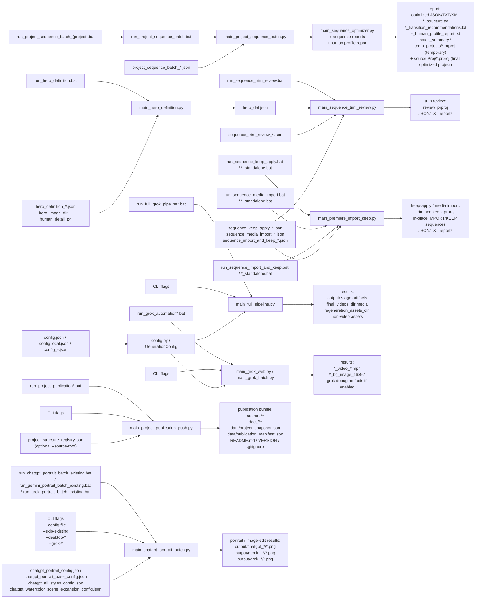

# Руководство пользователя

## Экспресс-запуск за 1 минуту

1. Положите исходные изображения в `input`.
2. Если нужно войти в Grok или обновить логин, запустите `login_grok_profile.bat`, выполните вход, откройте `https://grok.com/imagine` для проверки и затем полностью закройте это окно Chrome.
3. Запустите основной цикл:

```bat
run_full_grok_pipeline.bat --upload-timeout 300
```

4. После успешной обработки:
   - итоговые `mp4` и background-изображения будут в каталоге `final_videos_dir`;
   - prompt-файлы, manifest и остальные не-видео артефакты будут в `regeneration_assets_dir`.
5. Если stage завершился аварийно, проблемные файлы будут перенесены в `error\input` и `error\output`.
6. После завершения генерации видео нужно вручную собрать sequence в Premiere из полученных роликов.
7. Затем нужно запустить оптимизацию sequence и открывать итоговый `.prproj` уже из той же папки, где лежит исходный `project_path`; `reports\temp_projects` хранит только временную рабочую batch-копию.
8. Если после оптимизации вы руками снова меняете порядок клипов, отчеты можно заново пересобрать через `main_sequence_reports.py`.

## Последние рабочие изменения: Premiere и внешний API image

На 2026-08-30 доступны специализированные сценарии TASK_019–025, TASK_028–030
и Alla: timeline assembly, delete/insert/replace, SHORT, двойная доработка,
адаптивный Motion и Lumetri. Полный CLI, таблица фиксированных версий,
JSON-примеры и порядок QA: [PREMIERE_TASK_WORKFLOWS_RU.md](PREMIERE_TASK_WORKFLOWS_RU.md).
Эти скрипты не являются новыми `mode` общего import/KEEP entry point.
TASK-сценарии могут обновлять исходный `.prproj` после backup; переносимые
Motion-режимы используют Save As. TASK_028–030 сохраняют музыку, тогда как
переносимые Motion-шаблоны требуют `OUTPUT_SILENT`. TASK_029/030 и Alla не
принимают `--dry-run` или `--config`; для 029/030 есть `--audit-only`.

### API: одно изображение вне input

`main_full_pipeline_api.py` теперь передаёт в Grok batch реальную папку
`image_path.parent`, поэтому `--image` вне `input/` разрешается корректно.
Используйте `--single-image`, чтобы `read_input_list` из конфигурации не включил
пакетный обход. Подготовьте копию
[`config_api_single_image.example.json`](../examples/config_api_single_image.example.json),
заменив пути доставки, и запустите:

```powershell
.\run_full_grok_pipeline_api.bat --config-file .\examples\config_api_single_image.example.json --image "<LOCAL_PATH>" --single-image --result-timeout 900
```

Нужны настроенные `OPENAI_API_KEY` для подготовки prompt/scene и `XAI_API_KEY`
для генерации; секреты хранятся в окружении или `.env`, не в примерах JSON.
`config_alla_15_humor_api.json` — конкретный проектный пресет: один ролик,
6 секунд, 4 camera segments, без background/final frames/music; пути локальные.

`--no-submit` пропускает только генерацию xAI. Подготовка OpenAI, запись manifest,
очистка `output/` и обработка входной очереди сохраняются. После успеха файл
из `input/` удаляется, внешний исходник не удаляется этим success-cleanup.
При ошибке и `continue_after_failure=true` даже внешний исходник может быть
перемещён в `error/input`; при `false` обработчик перемещает файлы очереди
`input/` и останавливается. Работайте с копиями и не держите посторонние файлы
в рабочих папках. `--no-submit` не является проверкой без побочных эффектов.

Для предварительного просмотра аргументов **без вызова pipeline**:

```powershell
.\examples\scripts\api_single_image.ps1 -Image "<LOCAL_PATH>" -Config .\examples\config_api_single_image.example.json
```

Только добавление `-Run` запускает эту PowerShell-заготовку. Browser-only флаги
(`--profile-dir`, `--chrome-debug-port`, `--reuse-existing-grok-page` и другие)
в API CLI игнорируются; `--result-timeout` задаёт ожидание результата.

## Назначение

Проект предназначен для пакетной подготовки prompt-файлов, генерации background-изображений и видео через Grok, оптимизации порядка sequence в Premiere и формирования отчетов для финальной доводки монтажа. Основной рабочий сценарий: входное изображение -> генерация media -> ручная сборка sequence в Premiere -> оптимизация порядка -> ручная доработка -> повторная сборка финальных рекомендаций по утвержденному порядку.

## Основные каталоги

- `input` — входные изображения для текущего запуска.
- `output` — временные prompt-файлы, manifest-файлы и промежуточные результаты текущего stage.
- `final_videos_dir` — финальный каталог для готовых `mp4` и background-изображений.
- `final_output_dir` — постоянный каталог для готовых portrait/image-edit PNG, которые копируются из проектного runtime-каталога `output` с сохранением той же структуры подпапок.
- `regeneration_assets_dir` — каталог для prompt-файлов, manifest и прочих не-видео артефактов, которые нужны для ручной правки и повторной генерации.
- `reports` — финальный каталог для отчетов по sequence, batch summary и временных batch-артефактов.
- `reports\temp_projects` — временные `.prproj`, которые создаются внутри одного batch-запуска оптимизации и затем могут быть удалены cleanup.
- папка исходного Premiere-проекта из `project_path` — постоянное место хранения финального оптимизированного `.prproj`.
- `error\input` — входные изображения stage, завершившихся с ошибкой.
- `error\output` — prompt-файлы, manifest и отчеты об ошибках для неуспешных stage.
- `.browser-profile\grok-web` — automation-профиль Chrome для Grok.
- `styles` — переиспользуемые списки стилей для portrait/style-сценариев.
- `output\chatgpt_portraits` — готовые PNG-портреты из ChatGPT portrait batch workflow.
- `output\gemini_*` и `output\grok_*` — сервисные зеркала ChatGPT-каталогов для portrait/image-edit результатов.

Пример Windows-путей в `config.json`:

```json
{
  "final_videos_dir": "<LOCAL_PATH>",
  "final_output_dir": "<LOCAL_PATH>",
  "regeneration_assets_dir": "<LOCAL_PATH>",
  "reports_dir": "<LOCAL_PATH>"
}
```

## BAT-файлы

Полный список всех корневых `.bat`. Неповторяющиеся примеры с параметрами — в [`BATCH_RUN_HISTORY.md`](BATCH_RUN_HISTORY.md). Ниже — подробные заметки по основным launcher'ам.

| Launcher | Назначение | Пример |
| --- | --- | --- |
| `copy_sequence_images_sveta_igr_26_2.bat` | Копия только картинок sequence Sveta | `.\copy_sequence_images_sveta_igr_26_2.bat` |
| `copy_sequence_media_sveta_igr_26_2.bat` | Готовый wrapper копирования медиа sequence Sveta | `.\copy_sequence_media_sveta_igr_26_2.bat` |
| `install_premiere_transition_panel.bat` | Установить CEP-панель Premiere transitions | `.\install_premiere_transition_panel.bat` |
| `login_chatgpt_debug_profile.bat` | Ручной вход в ChatGPT debug-профиль на порту 9333 | `.\login_chatgpt_debug_profile.bat` |
| `login_chatgpt_profile.bat` | Ручной вход в ChatGPT web-профиль | `.\login_chatgpt_profile.bat` |
| `login_gemini_profile.bat` | Ручной вход в отдельный Gemini-профиль | `.\login_gemini_profile.bat` |
| `login_grok_profile.bat` | Ручной вход в Grok automation-профиль | `.\login_grok_profile.bat` |
| `open_ai_work_window.bat` | Открыть одно reusable Chrome-окно Grok/ChatGPT на 9222 | `.\open_ai_work_window.bat` |
| `open_ai_work_window_bookmarks_profile.bat` | То же reusable-окно через bookmarks-профиль Chrome | `.\open_ai_work_window_bookmarks_profile.bat` |
| `open_ai_work_window_user_chrome.bat` | То же reusable-окно через обычный user-профиль Chrome | `.\open_ai_work_window_user_chrome.bat` |
| `run_chatgpt_artistic_photo_portret_existing.bat` | Laptop-batch стиля artistic photo portrait | `.\run_chatgpt_artistic_photo_portret_existing.bat --delivery-config-file config_Ziggi.json` |
| `run_chatgpt_pair_batch_existing.bat` | Парные портреты из папок input_pair | `.\run_chatgpt_pair_batch_existing.bat --delivery-config-file .\config_SF.json --skip-existing --continue-on-error` |
| `run_chatgpt_pair_batch_work_window.bat` | Парные портреты через reusable work-window | `.\run_chatgpt_pair_batch_work_window.bat --delivery-config-file .\config_SF.json --skip-existing --continue-on-error` |
| `run_chatgpt_portrait_batch.bat` | Portrait batch ChatGPT через стандартный Python-backend | `.\run_chatgpt_portrait_batch.bat --config-file chatgpt_portrait_config.json --skip-existing` |
| `run_chatgpt_portrait_batch_debug.bat` | Portrait batch ChatGPT через debug Chrome 9333 | `.\run_chatgpt_portrait_batch_debug.bat --config-file chatgpt_portrait_config.json --skip-existing` |
| `run_chatgpt_portrait_batch_existing.bat` | Рекомендуемый desktop-batch портретов ChatGPT | `.\run_chatgpt_portrait_batch_existing.bat --config-file chatgpt_portrait_base_config.json --skip-existing --desktop-reactivate-delay 0 --desktop-click-composer` |
| `run_chatgpt_portrait_batch_work_window.bat` | Portrait batch ChatGPT через reusable work-window | `.\run_chatgpt_portrait_batch_work_window.bat --config-file chatgpt_portrait_base_config.json --skip-existing` |
| `run_chatgpt_style_batch_existing.bat` | Общий style-batch launcher для chatgpt_*_config.json | `run_chatgpt_style_batch_existing.bat chatgpt_all_styles_config.json --skip-existing --continue-on-error` |
| `run_chatgpt_style_menu_existing.bat` | Интерактивное меню банков chatgpt_*_config.json | `.\run_chatgpt_style_menu_existing.bat` |
| `run_chatgpt_watercolor_on_paper_existing.bat` | Laptop-batch watercolor on paper | `.\run_chatgpt_watercolor_on_paper_existing.bat --delivery-config-file config_Ziggi.json` |
| `run_copy_minimal_to_laptop_dir.bat` | Скопировать минимальный laptop-bundle | `.\run_copy_minimal_to_laptop_dir.bat` |
| `run_copy_sequence_images.bat` | Скопировать картинки одной Premiere sequence (CLI) | `.\run_copy_sequence_images.bat --project <prproj> --sequence <sequence> --dest <image_dir>` |
| `run_copy_sequence_media_batch.bat` | Скопировать медиа sequence по JSON-конфигу | `.\run_copy_sequence_media_batch.bat .\copy_sequence_media_sveta_igr_26_2.json` |
| `run_full_grok_pipeline.bat` | Полный Grok web video pipeline из input/ | `.\run_full_grok_pipeline.bat --upload-timeout 300` |
| `run_full_grok_pipeline_api.bat` | Полный Grok video pipeline через xAI API | `.\run_full_grok_pipeline_api.bat --config-file .\config_SF.json` |
| `run_full_grok_pipeline_local.bat` | Полный Grok pipeline через .venv и config.local.json | `.\run_full_grok_pipeline_local.bat --skip-existing --upload-timeout 300` |
| `run_full_grok_pipeline_work_window.bat` | Полный Grok pipeline через reusable debug-окно | `.\run_full_grok_pipeline_work_window.bat --upload-timeout 300` |
| `run_gemini_portrait_batch_existing.bat` | Gemini desktop portrait batch с теми же JSON-конфигами | `.\run_gemini_portrait_batch_existing.bat --config-file chatgpt_portrait_config.json --skip-existing --continue-on-error --desktop-reactivate-delay 0 --desktop-click-composer` |
| `run_grok_automation.bat` | Один Grok job для одного изображения и prompt-файла | `.\run_grok_automation.bat --image .\input\photo.jpg --prompt .\output\photo_20260314_101010_v_prompt_1.txt --upload-timeout 300` |
| `run_grok_automation_all.bat` | Grok batch по уже готовым *_v_prompt_*.txt | `.\run_grok_automation_all.bat --skip-existing --upload-timeout 300` |
| `run_grok_portrait_batch_existing.bat` | Grok web portrait batch с теми же JSON-конфигами | `.\run_grok_portrait_batch_existing.bat --config-file chatgpt_portrait_base_config.json --skip-existing --continue-on-error` |
| `run_hero_definition.bat` | Собрать hero_def.json из эталонных фото | `.\run_hero_definition.bat .\hero_definition_Alice.json` |
| `run_laptop_env_compare.bat` | Сравнить laptop-окружение с watercolor baseline | `.\run_laptop_env_compare.bat` |
| `run_laptop_env_snapshot.bat` | Снять snapshot laptop watercolor-окружения | `.\run_laptop_env_snapshot.bat` |
| `run_local_portrait_batch.bat` | Локальная stylization без UI ChatGPT | `.\run_local_portrait_batch.bat --config-file chatgpt_portrait_config.json --skip-existing` |
| `run_openai_portrait_batch.bat` | Portrait batch через OpenAI Images API | `.\run_openai_portrait_batch.bat --config-file chatgpt_portrait_config.json --skip-existing --api-model gpt-image-1.5` |
| `run_premiere_sequence_motion.bat` | Дублировать Premiere sequence, добавить intrinsic Motion и сделать немой review | `.\run_premiere_sequence_motion.bat .\premiere_sequence_motion_template.json --dry-run` |
| `run_premiere_transform_script.bat` | Собрать Premiere transform JSX из sequence-batch конфига | `.\run_premiere_transform_script.bat .\project_sequence_batch_igor_26_1A.json` |
| `run_premiere_transition_script.bat` | Собрать Premiere transition JSX из sequence-batch конфига | `.\run_premiere_transition_script.bat .\project_sequence_batch_igor_26_1A.json` |
| `run_project_publication_push.bat` | Подготовить, закоммитить, пометить и запушить публичный bundle | `.\run_project_publication_push.bat --source-root .` |
| `run_project_publication_stage.bat` | Подготовить публичный bundle без commit/push | `.\run_project_publication_stage.bat --source-root . --dry-run` |
| `run_project_sequence_batch.bat` | Оптимизировать Premiere sequence по JSON-конфигу | `.\run_project_sequence_batch.bat .\project_sequence_batch_igor_26_1A.json` |
| `run_project_sequence_batch_igor_26_1A.bat` | Готовый wrapper sequence-batch Igor | `.\run_project_sequence_batch_igor_26_1A.bat` |
| `run_project_sequence_batch_nicol_26_T2.bat` | Готовый wrapper sequence-batch Nicol | `.\run_project_sequence_batch_nicol_26_T2.bat` |
| `run_project_sequence_batch_vika_26_1A.bat` | Готовый wrapper sequence-batch Vika | `.\run_project_sequence_batch_vika_26_1A.bat` |
| `run_sequence_import_and_keep.bat` | Импорт списка файлов и KEEP за один проход | `.\run_sequence_import_and_keep.bat .\sequence_import_and_keep_template.json` |
| `run_sequence_import_and_keep_standalone.bat` | Тот же import-and-keep через `main_premiere_import_keep.py` | `.\run_sequence_import_and_keep_standalone.bat .\sequence_import_and_keep_template.json` |
| `run_sequence_keep_apply.bat` | Применить KEEP JSON: копия проекта или новая sequence | `.\run_sequence_keep_apply.bat .\sequence_keep_apply_template.json` |
| `run_sequence_keep_apply_standalone.bat` | Тот же KEEP/apply через `main_premiere_import_keep.py` | `.\run_sequence_keep_apply_standalone.bat .\sequence_keep_apply_template.json` |
| `run_sequence_media_import.bat` | Импортировать файлы в sequence или в новую sequence | `.\run_sequence_media_import.bat .\sequence_media_import_template.json` |
| `run_sequence_media_import_standalone.bat` | Тот же media import через `main_premiere_import_keep.py` | `.\run_sequence_media_import_standalone.bat .\sequence_media_import_template.json` |
| `run_sequence_music_recommendation.bat` | Video-only и персонализированный music report | `.\run_sequence_music_recommendation.bat .\sequence_music_recommendation_Alice.json` |
| `run_sequence_trim_review.bat` | KEEP/DROP review, replay, keep, import или import-and-keep | `.\run_sequence_trim_review.bat .\sequence_trim_review_01.json` |
| `run_video_prompt_story_export.bat` | Экспорт composer JSON после правок HTML-истории | `.\run_video_prompt_story_export.bat <LOCAL_PATH>` |
| `run_video_prompt_story_generate.bat` | Сгенерировать reviewable HTML/JSON video story | `.\run_video_prompt_story_generate.bat` |

### `login_grok_profile.bat`

Назначение:
- открыть Chrome с automation-профилем проекта;
- вручную войти в Grok;
- проверить, что открывается `https://grok.com/imagine`.

Когда использовать:
- при первом запуске;
- если Grok разлогинился;
- если Grok начал требовать `Sign in` или `Sign up`.

Важно:
- этот bat-файл нужен только для ручного входа;
- после проверки доступа окно Chrome нужно полностью закрыть;
- основной pipeline сам запускает Grok во время работы.

### `run_grok_automation.bat`

Назначение:
- запустить Grok для одного изображения / одного prompt-файла.

Пример:

```bat
run_grok_automation.bat --image .\input\photo.jpg --prompt .\output\photo_20260314_101010_v_prompt_1.txt --upload-timeout 300
```

Полезно, когда нужно:
- перепроверить один prompt;
- повторно получить только один background или один ролик;
- локально протестировать Grok-stage без полного pipeline.

### `run_grok_automation_all.bat`

Назначение:
- пройти по всем `*_v_prompt_*.txt` в `output` и запустить Grok batch-режим.

Примеры:

```bat
run_grok_automation_all.bat --upload-timeout 300
run_grok_automation_all.bat --skip-existing --upload-timeout 300
run_grok_automation_all.bat --skip-video --generate-source-background --upload-timeout 300
```

Этот bat-файл полезен, если prompt-файлы уже подготовлены и нужно только выполнить Grok-часть.

### `run_full_grok_pipeline.bat`

Это основной launcher для оператора.

Он делает следующее:
1. берет одно входное изображение из `input`;
2. формирует все stage-файлы в `output`;
3. запускает Grok для этого изображения;
4. сохраняет background-изображение и/или видео;
5. переносит результаты в `final_videos_dir` и `regeneration_assets_dir`;
6. закрывает Grok;
7. переходит к следующему изображению.

Примеры:

```bat
run_full_grok_pipeline.bat --upload-timeout 300
run_full_grok_pipeline.bat --skip-video --generate-source-background --upload-timeout 300
run_full_grok_pipeline.bat --save-grok-debug-artifacts --upload-timeout 300
```

### `run_full_grok_pipeline_api.bat`

Прямой xAI API вместо `run_full_grok_pipeline.bat`. Та же схема `input/` → `output/` → доставка, но без Chrome и Playwright: pipeline вызывает `grok-imagine-video` через `xai-sdk`. Нужен `XAI_API_KEY` в `.env`. Проверка ключа: `python .\scripts\xai_ping.py`.

Примеры:

```bat
run_full_grok_pipeline_api.bat
run_full_grok_pipeline_api.bat --config-file .\config_SF.json
run_full_grok_pipeline_api.bat --skip-video --generate-source-background
```

### `run_sequence_trim_review.bat`

Назначение:
- разрезать Premiere sequence на сегменты KEEP/DROP (`heuristic`, `semantic` или `hero`);
- повторно выложить готовый hero-отчёт на четыре дорожки без OpenAI;
- применить ручной KEEP JSON, если в конфиге `"mode": "apply_keep_ranges"`;
- скопировать source-sequence и сделать KEEP только на копии, если `"mode": "keep_to_new_sequence"`;
- импортировать файлы в новую sequence того же `.prproj`, если `"mode": "import_to_new_sequence"`;
- импортировать файлы и сразу обрезать KEEP, если `"mode": "import_and_keep"`.

Примеры:

```bat
.\run_sequence_trim_review.bat .\sequence_trim_review_01.json
.\run_sequence_trim_review.bat .\sequence_trim_review_Alice_1.json
.\run_sequence_trim_review.bat .\sequence_trim_review_Alice_replay_levels.json
.\run_sequence_trim_review.bat .\sequence_keep_apply_yotam26_2_min.json
```

### `run_premiere_sequence_motion.bat`

Режим `"mode": "premiere_sequence_motion_animation"`:
- проверяет `schema_version: "1.0"`, source/output sequence, fps, размер, длительность и online media;
- сначала пишет детальный dry-run (`--dry-run`) без изменения `.prproj`;
- делает Save As, дублирует source sequence и меняет только копию;
- добавляет два frame-exact keyframes intrinsic Motion → Scale/Position относительно существующего baseline;
- оставляет protected ranges без изменений, удаляет только output-аудиоклипы и сохраняет пустые audio tracks;
- проверяет структуру результата и создаёт немой review MP4.

```bat
.\run_premiere_sequence_motion.bat .\premiere_sequence_motion_template.json --dry-run
.\run_premiere_sequence_motion.bat .\premiere_sequence_motion_template.json
```

Тот же launcher поддерживает комбинированный режим
`"mode": "premiere_sequence_insert_from_sequence_and_motion_animation"`:

- берёт frame-exact video-only диапазон из названной sequence внутри того же проекта;
- вставляет его в дубликат основной sequence и ровно сдвигает последующие picture items;
- сохраняет обе source sequences без изменений;
- не анимирует вставленный live-фрагмент и другие natural-motion видео;
- применяет JSON-профили Motion только к статичным изображениям;
- удаляет output-аудио non-ripple и создаёт немой review.

```bat
.\run_premiere_sequence_motion.bat .\premiere_sequence_insert_motion_template.json --dry-run
.\run_premiere_sequence_motion.bat .\premiere_sequence_insert_motion_template.json
```

Frame-exact решения задаются в JSON:

```json
{
  "semantic_source_range_resolution": {
    "resolved_source_range_frames": [166, 254]
  },
  "destination_insertion": {
    "resolved_destination_frame": 1849
  }
}
```

`correction_source_sequence_name` всегда означает sequence проекта, а не имя
внешнего медиафайла. Полные примеры и описание полей:
`docs/PREMIERE_JSON_EDIT_AND_MOTION_RU.md`.

Тот же JSON можно запустить напрямую:

```powershell
python .\main_premiere_import_keep.py --config .\premiere_sequence_motion_template.json --dry-run
```

### `run_sequence_keep_apply.bat`

Назначение:
- скопировать Premiere `.prproj` и оставить у указанных файлов только source-диапазоны из KEEP JSON;
- скопировать source-sequence в новую output-sequence того же `.prproj` (`keep_to_new_sequence`) без размножения файлов проекта;
- не трогать неперечисленные клипы, bins и имена sequence;
- обрезать связанное аудио вместе с видео и сдвинуть следующие клипы.

Это отдельный launcher для `"mode": "apply_keep_ranges"` и `"mode": "keep_to_new_sequence"`. Он вызывает `main_premiere_import_keep.py`. Тот же JSON принимает `run_sequence_keep_apply_standalone.bat` и `run_sequence_trim_review.bat`.

Примеры:

```bat
.\run_sequence_keep_apply.bat .\sequence_keep_apply_yotam26_2_min.json
.\run_sequence_keep_apply.bat .\sequence_keep_apply_template.json
.\run_sequence_keep_apply.bat .\sequence_keep_to_new_sequence_template.json
.\run_sequence_keep_apply.bat .\sequence_keep_apply_yotam26_macro_styles.json
```

Шаблон: `sequence_keep_apply_template.json`. Шаблон in-place copy+KEEP: `sequence_keep_to_new_sequence_template.json`. Рабочие конфиги Yotam: `sequence_keep_apply_yotam26_2_min.json` и `sequence_keep_apply_yotam26_macro_styles.json`. Диапазоны берутся из `keep_ranges_path` или из inline-полей `clips` / `operations`.

### `run_sequence_media_import.bat`

Назначение:
- дописать список файлов в существующую sequence и сохранить соседний `*_import.prproj` (`import_media`);
- создать `output_sequence_name` внутри того же `.prproj` и импортировать туда (`import_to_new_sequence`);
- переиспользовать Media только если полный путь уже есть в проекте; то же имя в другой папке получает свой `MasterClip`.

Это launcher для `"mode": "import_media"` и `"mode": "import_to_new_sequence"`. Он вызывает `main_premiere_import_keep.py`. Тот же JSON принимает `run_sequence_media_import_standalone.bat` и `run_sequence_trim_review.bat`.

Примеры:

```bat
.\run_sequence_media_import.bat .\sequence_media_import_yotam26_part2.json
.\run_sequence_media_import.bat .\sequence_media_import_template.json
.\run_sequence_media_import.bat .\sequence_media_import_to_new_sequence_template.json
.\run_sequence_media_import.bat .\sequence_media_import_yotam26_macro_styles.json
```

### `run_sequence_import_and_keep.bat`

Назначение:
- за один проход импортировать список файлов на sequence и сразу обрезать их по KEEP JSON;
- промежуточный `*_import.prproj` остаётся, итоговый проект — `*_keep.prproj`;
- `project_path` из KEEP JSON не используется, keep всегда идёт от результата импорта.

Это launcher для `"mode": "import_and_keep"`. Он вызывает `main_premiere_import_keep.py`. Тот же JSON принимает `run_sequence_import_and_keep_standalone.bat` и `run_sequence_trim_review.bat`.

Примеры:

```bat
.\run_sequence_import_and_keep.bat .\sequence_import_and_keep_template.json
.\run_sequence_import_and_keep.bat <LOCAL_PATH>
```

Шаблон: `sequence_import_and_keep_template.json`. Import JSON и KEEP JSON задаются через `import_path` и `keep_ranges_path`.

## Пакетная генерация художественных портретов в ChatGPT, Gemini и Grok

Этот workflow создает готовые художественные портреты для всех поддерживаемых изображений из `input`.
Он использует уже открытый web-интерфейс ChatGPT в Chrome, а не OpenAI API.
Тот же построитель заданий и тот же формат JSON-конфигов можно использовать для отдельного рабочего окна Gemini через `--backend gemini-desktop`, а также для Grok image generation через `--backend grok`.

Основные файлы:
- `main_chatgpt_portrait_batch.py` — строит задания portrait batch по изображениям и стилям.
- `api/chatgpt_desktop_v2.py` — desktop-автоматизация для существующего окна ChatGPT.
- `api/gemini_desktop.py` — desktop-адаптер для существующего окна Gemini.
- `api/grok_web.py` — web-автоматизация Grok, переиспользуемая из video pipeline, но в image-режиме.
- `run_chatgpt_portrait_batch_existing.bat` — рекомендуемый launcher для уже открытой ChatGPT-сессии.
- `run_chatgpt_pair_batch_existing.bat` — launcher ChatGPT для парных портретов из двух фотографий в `input_pair\01`, `input_pair\02` и так далее.
- `login_gemini_profile.bat` — открывает отдельный Chrome-профиль Gemini на `https://gemini.google.com/app`.
- `run_gemini_portrait_batch_existing.bat` — launcher Gemini, который использует те же portrait JSON-конфиги.
- `login_grok_profile.bat` — ручной вход в отдельный Chrome-профиль Grok на `https://grok.com/imagine`.
- `run_grok_portrait_batch_existing.bat` — launcher Grok, который использует те же portrait JSON-конфиги.
- `chatgpt_portrait_config.json` — короткий рабочий набор стилей, сейчас watercolor и pastel.
- `chatgpt_portrait_base_config.json` — полный базовый банк художественных портретных стилей и image-edit сервисов.
- `chatgpt_all_styles_config.json` — batch-конфиг «все стили из base»: тот же полный список `portrait_styles`, что в `chatgpt_portrait_base_config.json`, но с отдельным каталогом результатов `output\chatgpt_all_styles`. Для подмножества стилей удалите лишние элементы из массива `portrait_styles`.
- `chatgpt_pair_base_config.json` — банк prompt для построения одной общей кинематографической художественной фотографии пары из двух исходных фотографий.
- `chatgpt_watercolor_scene_expansion_config.json` — специальный конфиг для `watercolor` и `scene_expansion`.
- `BATCH_RUN_HISTORY.md` — неповторяющиеся примеры запуска всех batch-файлов с параметрами.
- `styles\art_styles_Prompt_list.txt` — исходный человекочитаемый список style prompts.

Базовый конфиг содержит полный банк portrait/style prompts: Rembrandt, Renaissance, Impressionist, Renoir, Andrei Rublev, Watercolor, post-impressionism Van Gogh, art nouveau Klimt, Art Deco, черно-белый студийный Karsh, Pop Art, Cubist, Picasso graphic, poetic modernism Chagall, PHOTO_PORTRET, ARTISTIC_PORTRAIT, а также сервисные стили MODERN_COLOR, COLORIZE, FACE_ENLARGEMENT и SCENE_EXPANSION.

Конфиг `chatgpt_all_styles_config.json` дублирует весь этот банк для массового прогона: для каждого изображения из `input\` batch последовательно применяет все стили и сохраняет `<image_stem>_<slug>.png` в `output\chatgpt_all_styles`.

Результаты:
- готовые PNG записываются в `output\chatgpt_portraits`;
- Gemini записывает те же задания в зеркальные `output\gemini_*` каталоги;
- Grok записывает те же задания в зеркальные `output\grok_*` каталоги;
- если передан `--delivery-config-file .\config_Yakov.json` или другой пользовательский конфиг, каждый новый PNG одновременно копируется в его `final_output_dir` с той же относительной структурой, что и в проектном дереве `output\...`, а проектная копия сохраняется для корректной работы `--skip-existing`;
- например, проектный файл `output\grok_portraits\portrait.png` попадет в `<LOCAL_PATH>`;
- имя файла строится как `<image_stem>_<style_slug>.png`, например `IMG-001_rembrandt.png`;
- `--skip-existing` позволяет безопасно перезапускать batch и пропускать уже сохраненные портреты.

Результаты парных портретов:
- положите две исходные фотографии в каждую номерную папку `input_pair`, например `input_pair\01\person_a.jpg` и `input_pair\01\person_b.jpg`;
- перед отправкой в ChatGPT batch создает одну временную side-by-side reference-картинку в `output\pair\_pair_references`, поэтому desktop composer должен принять только одно вложение;
- pair batch создает по одному изображению пары для каждой номерной папки и сохраняет его в `output\pair`;
- имя файла строится как `<pair_id>_art_pair_<YYYYMMDD_HHMMSS>.png`, например `01_art_pair_20260522_153000.png`, поэтому папки `01`, `02`, `03` можно позже использовать с другими фотографиями без перезаписи старых результатов;
- если передан `--delivery-config-file .\config_SF.json`, результат также копируется в `final_output_dir\pair` этого пользовательского конфига.

Рекомендуемая автоматическая команда:

```bat
.\run_chatgpt_portrait_batch_existing.bat --config-file chatgpt_portrait_base_config.json --skip-existing --desktop-reactivate-delay 0 --desktop-click-composer
```

Команда для всех стилей base-банка (отдельный output-каталог):

```bat
.\run_chatgpt_portrait_batch_existing.bat --config-file chatgpt_all_styles_config.json --skip-existing --continue-on-error --desktop-reactivate-delay 0 --desktop-click-composer
```

На лэптопе тот же config можно запустить через универсальный style-launcher:

```bat
run_chatgpt_style_batch_existing.bat chatgpt_all_styles_config.json --delivery-config-file config_Ziggi.json --skip-existing
```

Команда для watercolor + scene expansion:

```bat
.\run_chatgpt_portrait_batch_existing.bat --config-file chatgpt_watercolor_scene_expansion_config.json --skip-existing --continue-on-error --desktop-reactivate-delay 0 --desktop-click-composer
```

Только реалистичный психологический портрет в стиле Ильи Репина:

```bat
.\run_chatgpt_portrait_batch_existing.bat --config-file chatgpt_ilya_repin_config.json --skip-existing --continue-on-error --desktop-reactivate-delay 0 --desktop-click-composer
```

Стиль `ILYA_REPIN` также включён в полные банки `chatgpt_portrait_base_config.json` и `chatgpt_all_styles_config.json`. Специальный конфиг записывает результаты в `output\chatgpt_ilya_repin`.

Команда для короткого рабочего набора:

```bat
.\run_chatgpt_portrait_batch_existing.bat --skip-existing
```

Команда для парных портретов:

```bat
.\run_chatgpt_pair_batch_existing.bat --delivery-config-file .\config_SF.json --skip-existing --continue-on-error
```

Gemini desktop-flow с теми же config-файлами:

```bat
.\login_gemini_profile.bat
.\run_gemini_portrait_batch_existing.bat --config-file chatgpt_portrait_config.json --skip-existing --continue-on-error --desktop-reactivate-delay 0 --desktop-click-composer
```

Gemini использует те же JSON-конфиги, что и ChatGPT, но автоматически зеркалит ChatGPT-каталоги результата в Gemini-каталоги, если `--output-dir` не передан явно. Например, `output\chatgpt_portraits` становится `output\gemini_portraits`, а `output\chatgpt_watercolor_scene_expansion` становится `output\gemini_watercolor_scene_expansion`. Если для задачи нужна своя папка, передайте `--output-dir` после bat-команды.
Сохранение Gemini сначала пытается нажать кнопку результата `Download full size` / `Скачать в полном размере`, дождаться завершения загрузки браузером и перенести скачанное изображение в нужный output path. Если кнопка недоступна, остается fallback через старое browser context menu. Gemini bat теперь по умолчанию работает тихо; добавляйте `--desktop-verbose` только для диагностики UI-сбоев.

Grok web-flow с теми же config-файлами:

```bat
.\login_grok_profile.bat
.\run_grok_portrait_batch_existing.bat --config-file chatgpt_portrait_base_config.json --skip-existing --continue-on-error
```

Grok использует `.browser-profile\grok-web`, `https://grok.com/imagine` и Playwright-автоматизацию в image-режиме. Если `--output-dir` не передан явно, ChatGPT-каталоги из конфига зеркалятся в Grok-каталоги: например, `output\chatgpt_portraits` становится `output\grok_portraits`, а `output\chatgpt_watercolor_on_paper` становится `output\grok_watercolor_on_paper`. Grok сохраняет через browser download/source capture и не использует Windows-диалог `Save As`.

Постоянная доставка portrait/image-edit результатов в пользовательский проект:

```bat
.\run_chatgpt_portrait_batch_existing.bat --config-file chatgpt_portrait_config.json --delivery-config-file .\config_Yakov.json --skip-existing --desktop-reactivate-delay 0 --desktop-click-composer
.\run_gemini_portrait_batch_existing.bat --config-file chatgpt_portrait_config.json --delivery-config-file .\config_Yakov.json --skip-existing --continue-on-error --desktop-reactivate-delay 0 --desktop-click-composer
.\run_grok_portrait_batch_existing.bat --config-file chatgpt_portrait_config.json --delivery-config-file .\config_Yakov.json --skip-existing --continue-on-error
```

Portrait-конфиг по-прежнему отвечает за стили и проектный output-каталог. Пользовательский delivery-конфиг передается отдельно и задает корень постоянной зеркальной копии через `final_output_dir`; сервисные и стилевые подпапки из проектного `output` сохраняются ниже него. В этом же project config разрешены общие metadata-пути `hero_image_dir`, `human_detail_txt` и `reports_dir`; они не меняют доставку PNG, но позволяют безопасно использовать один `config_Alice.json` во всех project workflows.

Ручной fallback по фокусу:
- держите уже проверенное окно ChatGPT открытым в Chrome;
- запускайте bat без `--desktop-reactivate-delay 0`;
- во время каждого countdown кликайте внутри поля сообщения ChatGPT;
- дальше скрипт сам прикрепляет исходное изображение, вставляет prompt, отправляет запрос, ждет сгенерированный результат и сохраняет картинку.

Важно:
- автоматизация не обходит human-check или CAPTCHA в ChatGPT; такую проверку нужно пройти вручную в браузере;
- не запускайте два portrait batch одновременно;
- держите рабочий ChatGPT для генерации в отдельном Chrome-окне с одной видимой вкладкой; `run_chatgpt_portrait_batch_existing.bat` теперь требует это через `--desktop-require-single-tab-window`;
- если открыто несколько окон ChatGPT, single-tab окно генерации является единственной безопасной целью для desktop batch;
- desktop-ввод защищен: перед кликами, вставкой, Enter и командами сохранения скрипт проверяет, что foreground-окно — это выбранный ChatGPT или настоящий диалог `Save As`/`Open`; если сверху другое приложение, batch останавливается и не отправляет ввод туда;
- после сохранения ChatGPT может оставлять последнюю сгенерированную картинку раскрытой на экране. Это нормально, если batch продолжает работу;
- если batch остановился, запускайте ту же команду снова с `--skip-existing`.
- Gemini использует ту же защиту foreground-окна и то же правило одной видимой вкладки; держите его в отдельном Chrome-окне, открытом на `https://gemini.google.com/app`.
- вход в Gemini, проверки Google и сервисные лимиты не обходятся; их нужно пройти вручную в выделенном окне Gemini до запуска batch.
- вход в Grok и сервисные проверки не обходятся; используйте `login_grok_profile.bat`, если профиль Grok требует ручного входа, а затем закройте login-окно перед managed portrait batch.

## Новые флаги генерации

### `generate_video`

Управляет видеогенерацией. По умолчанию: `true`.

В `config.json`:

```json
{
  "generate_video": true
}
```

CLI-параметры:

```bat
--generate-video
--skip-video
```

Поведение:
- если `generate_video = true` — pipeline генерирует видео в Grok;
- если `generate_video = false` и `generate_source_background = true` — pipeline делает только background-изображения;
- если `generate_video = false` и `generate_source_background = false` — stage завершается ошибкой, потому что генерировать нечего.

Если в кадре есть люди, `*_v_prompt_*.(txt|json)` и `*_v_prm_ru_*.(txt|json)` теперь должны чаще выбирать безопасную для идентичности камеру: более дальний или средне-общий план, ракурс сбоку, сверху, снизу, с воздуха или мягкое пространственное раскрытие сцены вместо агрессивного укрупнения лица. Это нужно для снижения искажений лица в сгенерированном видео.

Теперь такое безопасное поведение стало режимом по умолчанию, но его можно переключать шестью framing-флагами и одним ключом пропорции в JSON:

```json
{
  "prefer_face_closeups": false,
  "use_ai_optimal_framing": false,
  "use_ai_optimal_then_identity_safe_framing": false,
  "ai_optimal_then_identity_safe_ai_optimal_percent": 70,
  "generate_dual_framing_videos": false,
  "generate_identity_safe_closeup_videos": false,
  "generate_triple_framing_videos": false
}
```

Правила режимов кадрирования:
- если все шесть флагов равны `false`, pipeline оставляет стандартный identity-safe режим и старается не укрупнять лицо слишком агрессивно;
- если `prefer_face_closeups = true`, крупный лицевой план разрешён и может становиться предпочтительным;
- если `use_ai_optimal_framing = true`, AI выбирает самый сильный кинематографический кадр по исходному изображению, но не должен значительно увеличивать лицо или искажать его;
- если `use_ai_optimal_then_identity_safe_framing = true`, из одного изображения строится одно видео, где первые `ai_optimal_then_identity_safe_ai_optimal_percent` процентов идут как AI-optimal, а оставшаяся часть плавно переводит камеру в identity-safe режим с более безопасной дистанцией;
- если `ai_optimal_then_identity_safe_ai_optimal_percent` не указан, по умолчанию используется соотношение `70 / 30`; например, значение `50` означает `50%` AI-optimal и `50%` identity-safe.
- если `generate_dual_framing_videos = true`, pipeline строит две ветки от одного и того же исходного кадра: identity-safe и AI-optimal.
- если `generate_identity_safe_closeup_videos = true`, pipeline строит две ветки от одного и того же исходного кадра: identity-safe и face-closeup.
- если `generate_triple_framing_videos = true`, pipeline строит три ветки от одного и того же исходного кадра: identity-safe, face-closeup и AI-optimal.

Количество видео в dual-режиме:
- при `video_count = 1` dual-режим даёт `2` видео;
- при `video_count = N` dual-режим даёт `2 x N` видео.

Одновременно можно включать только один из этих шести framing-флагов. Процентный ключ не является отдельным режимом, а только уточняет hybrid-режим.

### `generate_grok_multiscene_json_prompt`

Управляет специальным режимом Grok, в котором обычный `*_v_prompt_*.txt` заменяется JSON prompt-артефактом.

В `config.json`:

```json
{
  "generate_grok_multiscene_json_prompt": true,
  "grok_multiscene_prompt_size": 2000
}
```

Поведение:
- pipeline пишет `*_v_prompt_*.json` на английском и `*_v_prm_ru_*.json` на русском вместо TXT prompt-файлов;
- каждый JSON-файл представляет собой массив из одного объекта с полем `prompt`, по смыслу аналогично `Gen_Video_Seedance`;
- Grok автоматически извлекает английский `prompt` из этого JSON, поэтому batch-запуск продолжает работать через обычные Grok-runner'ы;
- prompt трактуется как компактный трехсценный план видео, построенный из одного входного изображения, где `@image1` — это само входное изображение.

Текущая фиксированная схема:
- `Shot 1`, `0-2s`: самый сильный на сегодня AI-optimal кинематографичный вариант;
- `Shot 2`, `2-4s`: альтернативный AI-optimal вариант с явно другим решением камеры;
- `Shot 3`, `4-6s`: более безопасный дистанционный ракурс с более широким раскрытием пространства.

Текущие ограничения:
- общая длительность фиксирована как `6s`;
- aspect ratio фиксирован как `16:9`;
- английский prompt валидируется по настроенному `grok_multiscene_prompt_size` в символах, а лимит слов вычисляется автоматически как примерно `size / 5`.

Параметр размера prompt:
- `grok_multiscene_prompt_size` — по умолчанию `1000`, что даёт примерно `200` слов;
- значение `2000` даёт примерно `400` слов и позволяет строить более подробный JSON video prompt для Grok;
- builder всё равно старается держать prompt компактным, но при увеличении лимита может сохранить больше деталей сцены.

Когда включать `--skip-video`:
- если нужно получить только background-изображения;
- если видео временно не нужны;
- если вы хотите сначала собрать фон, а видеогенерацию сделать позже.

### `generate_source_background`

Управляет генерацией background-изображения в Grok.

CLI-параметры:

```bat
--generate-source-background
--skip-source-background
```

Текущее поведение:
- для background используется `*_assoc_bg_prompt.txt`;
- этот дескриптор описывает ассоциативное реалистичное изображение, подходящее как фон;
- Grok строит новый background по этому дескриптору и использует исходное фото как опору.

### `save_grok_debug_artifacts`

Управляет сохранением диагностических файлов Grok. По умолчанию: `false`.

В `config.json`:

```json
{
  "save_grok_debug_artifacts": false
}
```

CLI-параметры:

```bat
--save-grok-debug-artifacts
--skip-grok-debug-artifacts
```

Что происходит:
- если `false` — candidate/debug-файлы не остаются в `output`, рабочая папка остается чистой;
- если `true` — в `output` сохраняются диагностические артефакты Grok.

Какие файлы могут появиться:
- `*_bg_image_16x9.candidate_*.png`
- `*_bg_image_16x9_candidates.json`
- `*_grok_debug.png`
- `*_grok_debug.html`
- `*_grok_debug.json`

Когда включать:
- если Grok сохранил не то background-изображение;
- если нужно понять, какой кандидат нашелся на странице;
- если идет отладка сохранения результата из интерфейса Grok.

Когда лучше держать выключенным:
- при обычной эксплуатации;
- когда важно, чтобы `output` не засорялся служебными файлами.

### `continue_after_failure`

Управляет поведением pipeline после аварийного stage.

Поведение:
- если `false` — pipeline остановится на первой ошибке;
- если `true` — проблемный stage уйдет в `error`, а обработка продолжится со следующим изображением.

Когда включать:
- если входных изображений много;
- если среди них могут быть слишком большие или проблемные файлы;
- если удобно потом отдельно разбирать только ошибочные stage.

## Полный справочник по конфигурации генерации

Все актуальные поля `GenerationConfig`:

- `generate_video` — по умолчанию `true`; включает генерацию видео и video-stage.
- `generate_grok_multiscene_json_prompt` — по умолчанию `false`; писать Grok-ready EN/RU JSON prompt-артефакты вместо TXT video prompt-файлов, используя фиксированную трехсценную схему `6s` из одного входного изображения.
- `grok_multiscene_prompt_size` — по умолчанию `1000`; максимальный размер prompt для Grok multiscene JSON режима в условных символах. Лимит слов вычисляется автоматически, например `1000 -> 200 слов`, `2000 -> 400 слов`.
- `video_count` — по умолчанию `2`; сколько видео строить из одного исходного кадра для каждого активного режима кадрирования.
- `camera_segments` — по умолчанию `1`; сколько сегментов движения камеры планируется внутри одного video prompt.
- `motion_source` — по умолчанию `table`; брать движения камеры из локальной таблицы или из AI (`ai`).
- `motion_model` — по умолчанию `gpt-4.1`; OpenAI-модель для AI-подбора движений камеры при `motion_source = ai`.
- `generate_source_background` — по умолчанию `false`; создавать background-prompt и запускать background-stage в Grok.
- `save_grok_debug_artifacts` — по умолчанию `false`; сохранять диагностические candidate/debug-артефакты Grok в `output`.
- `final_videos_dir` — по умолчанию `final_project/videos`; финальный каталог для готовых `mp4` и background-изображений.
- `final_output_dir` — по умолчанию `final_project/output`; финальный корневой каталог для постоянных копий portrait/image-edit PNG, которые создаются через ChatGPT, Gemini, Grok, API или local batch при наличии `--delivery-config-file`. Подпапки проектного `output/...` зеркалятся ниже этого корня.
- `regeneration_assets_dir` — по умолчанию `final_project/regeneration_assets`; каталог для prompt-файлов, manifest и не-видео артефактов stage.
- `hero_image_dir` — необязательный project metadata-путь к эталонным изображениям героя.
- `human_detail_txt` — необязательный project metadata-путь к текстовому описанию героя.
- `reports_dir` — необязательный общий каталог project reports.
- `continue_after_failure` — по умолчанию `false`; продолжать со следующим изображением после переноса ошибочного stage в `error`.
- `write_description` — по умолчанию `true`; записывать текстовый description / analysis-файл stage.
- `generate_final_frames` — по умолчанию `false`; генерировать final frame через image API.
- `read_input_list` — по умолчанию `true`; читать все поддерживаемые исходные изображения из `input`.
- `generate_music` — по умолчанию `false`; генерировать музыкальный prompt после последнего обработанного изображения.
- `prefer_face_closeups` — по умолчанию `false`; разрешать и предпочитать более близкий лицевой план, если он соответствует исходному кадру.
- `use_ai_optimal_framing` — по умолчанию `false`; позволять AI выбирать самый сильный кинематографический кадр, но без значительного укрупнения или искажения лица.
- `use_ai_optimal_then_identity_safe_framing` — по умолчанию `false`; создавать одно видео, где первая часть идет в AI-optimal режиме, а оставшаяся часть переходит в identity-safe дистанцию и ракурсы.
- `ai_optimal_then_identity_safe_ai_optimal_percent` — по умолчанию `70`; используется только при `use_ai_optimal_then_identity_safe_framing = true`; сколько процентов длительности видео отдавать AI-optimal части. Допустимый диапазон: `1..99`. Доля identity-safe вычисляется автоматически как `100 - value`.
- `generate_dual_framing_videos` — по умолчанию `false`; строить две ветки видео из одного исходного кадра: identity-safe и AI-optimal.
- `generate_identity_safe_closeup_videos` — по умолчанию `false`; строить две ветки видео из одного исходного кадра: identity-safe и face-closeup.
- `generate_triple_framing_videos` — по умолчанию `false`; строить три ветки видео из одного исходного кадра: identity-safe, face-closeup и AI-optimal.
- `hide_phone_in_selfie` — по умолчанию `true`; если входной кадр похож на selfie / автопортрет, сохранять ощущение selfie, но по возможности не показывать телефон, фотоаппарат, видеокамеру или их отражение.
- `prefer_loving_kindness_tone` — по умолчанию `true`; там, где это уместно именно для данного входного изображения, деликатно смещать prompts в сторону любящей доброты, благожелательности, дружелюбия, теплой доброй атмосферы, света, цвета, среды и фона.

Важное правило по кадрированию:
- Одновременно можно включать только один из флагов `prefer_face_closeups`, `use_ai_optimal_framing`, `use_ai_optimal_then_identity_safe_framing`, `generate_dual_framing_videos`, `generate_identity_safe_closeup_videos` или `generate_triple_framing_videos`.

## Архитектура и контроль изменений

Для карты структуры проекта, потоков данных, инвариантов и checklist по impact-анализу см. `PROJECT_STRUCTURE.md`.
Для автоматизированного сопровождения и машинного change-review см. `project_structure_registry.json`.
Для быстрого impact-анализа используйте `python .\main_change_impact.py --change-type generation_flag --changed-file config.py`.
Для обновления отдельного репозитория с документацией проекта используйте `python .\main_project_publication.py --target-dir .\project_publication\Memory-to-Video_Agent`.
Публичный bundle теперь также включает полное безопасное зеркало исходников в `source/`, исключая секреты, медиа-артефакты и runtime-папки.
Для безопасного publish-flow в публичный локальный клон используйте `python .\main_project_publication_push.py --repo-dir <path-to-local-Memory-to-Video_Agent-clone> --stage`.
Для самого короткого preview/stage-only запуска без push используйте `.\run_project_publication_stage.bat`.
Для самого короткого ручного запуска используйте `.\run_project_publication_push.bat`.

## Карта Batch / Program / Parameters

Эта компактная схема нужна, когда надо быстро понять, какой `.bat` запускает какую Python-программу и откуда берутся основные параметры.

Полная построчная матрица **Parameter → Program → Batch → Config → Result** находится в `docs/PARAMETER_PROGRAM_BATCH_MATRIX_RU.md`. Она обязательна для сопровождения: при добавлении параметра нужно указать Python consumer, batch-файл, default, конфиг и выходной артефакт.

Особенно важно различать два потока данных о герое:

- `human_detail_txt` используется в `main_project_sequence_batch.py` при `generate_personalized_report=true` для персонализированного отчёта, рекомендаций по образу героя и музыке;
- `human_detail_txt` вместе с `hero_image_dir` передаётся в `main_hero_definition.py`, который создаёт `hero_def.json`;
- `hero_def.json` используется в `main_sequence_trim_review.py` с `"engines": ["hero"]` для разбора грязного видео на HIGH, MEDIUM, REVIEW и DROP;
- готовый hero trim JSON можно повторно экспортировать через `"mode": "report_replay"` без новых OpenAI-запросов;
- ручной KEEP JSON применяется через `"mode": "apply_keep_ranges"` и создаёт копию `.prproj` без ненужных кусков указанных файлов;
- `"mode": "keep_to_new_sequence"` копирует source-sequence в новую sequence того же `.prproj` и обрезает только копию;
- `"mode": "import_to_new_sequence"` создаёт новую sequence в существующем `.prproj` и импортирует туда список файлов.



Левая часть схемы показывает запуск и источники параметров, а правая часть показывает, какие отчеты и результатные артефакты появляются на выходе.

Обычный приоритет параметров такой:

1. Аргументы, жестко заданные в `.bat`-оболочке.
2. Дополнительные аргументы, проброшенные через `%*`.
3. Значения из JSON-конфига.
4. Значения по умолчанию в Python-коде.

## Развертывание В Другом Месте

Для чистого локального развертывания в другой папке или на другой машине используйте:

```powershell
powershell -ExecutionPolicy Bypass -File .\setup_project.ps1
```

Скрипт:
- создает `.venv`;
- устанавливает зависимости из `requirements.txt`;
- создает локальные рабочие папки `input`, `output`, `final_project\videos`, `final_project\regeneration_assets`;
- записывает `.env.template`;
- создает `config.local.json` с относительными локальными путями.

Дальше:
- заполните реальные ключи в `.env`;
- положите исходные изображения в `input\`;
- для нового клона один раз запустите `login_grok_profile.bat` и выполните вход в Grok именно в этом клоновом Chrome-профиле;
- запускайте `.\run_full_grok_pipeline_local.bat`.

Или используйте единый скрипт bootstrap/check/run:

```powershell
powershell -ExecutionPolicy Bypass -File .\deploy_and_run.ps1
```

Он сначала выполняет bootstrap, затем проверяет:
- `.env` и наличие `OPENAI_API_KEY`;
- доступность локального Chrome;
- что клоновый Grok-профиль в `.browser-profile\grok-web` уже авторизован для `https://grok.com/imagine`;
- наличие подходящих исходных изображений в `input\`.
- Важно: каждый клон по умолчанию использует собственный Grok Chrome-профиль в `.browser-profile\grok-web`, если вы явно не передали другой `--profile-dir`.

Если этот Grok-профиль еще не авторизован, `deploy_and_run.ps1` теперь останавливается до запуска pipeline и подсказывает запустить `login_grok_profile.bat`.

Для dry-run проверки без запуска pipeline:

```powershell
powershell -ExecutionPolicy Bypass -File .\deploy_and_run.ps1 -CheckOnly
```

## Короткая Рабочая Памятка Из 3 Команд

Для повседневной работы в основной директории проекта используйте такую короткую последовательность:

```powershell
cd <LOCAL_PATH>
powershell -ExecutionPolicy Bypass -File .\deploy_and_run.ps1 -CheckOnly
python .\main_project_publication_push.py --repo-dir <LOCAL_PATH> --commit-message "Update project publication" --push
```

Смысл команд:
- `работать` — перейти в основную рабочую директорию;
- `проверить` — проверить окружение, клоновый Grok-профиль и `input\`;
- `опубликовать` — обновить и отправить публичное зеркало проекта.

## Что куда переносится после успешного stage

В `final_videos_dir`:
- `*.mp4`;
- итоговые background-изображения.

В `regeneration_assets_dir\<stage_id>`:
- `description`;
- `scene_analysis`;
- `v_prompt`;
- `v_prm_ru`;
- `bg_prompt`;
- `bg_prm_ru`;
- `assoc_bg_prompt`;
- `assoc_bg_prm_ru`;
- `manifest`;
- другие не-видео stage-файлы.

Не копируется в `regeneration_assets_dir`:
- исходное изображение;
- финальные `mp4`;
- финальный background-файл.

## Что происходит при ошибке

Если stage завершился с ошибкой:
- файлы stage из `output` переносятся в `error\output\<stage_id>`;
- входное изображение переносится в `error\input\<stage_id>`;
- рядом сохраняется файл `<stage_id>_error.txt` с текстом ошибки.

Это удобно для ручного разбора и повторной обработки только проблемных изображений.

Если Grok закрывает текущую вкладку сразу после `submit`, automation теперь пытается подхватить другую живую Grok-вкладку или уже начавшуюся загрузку, прежде чем считать stage ошибочным.
Для незавершенных stage, у которых уже есть готовый `*_v_prompt_*.txt`, можно безопасно повторять только video-step без повторной генерации background.

## Workflow для sequence в Premiere

После завершения генерации видео нормальный процесс такой:

1. Вручную собрать sequence в Premiere из сгенерированных `mp4`.
2. Если для сырца уже есть KEEP JSON, сначала запустить `run_sequence_keep_apply.bat` и получить укороченную копию проекта.
3. Запустить batch-оптимизацию sequence, чтобы получить новые sequence вида `_oNN` из утвержденных `_eNN`.
4. Проверить оптимизированный результат в Premiere.
5. Если нужно, еще раз вручную изменить порядок клипов после оптимизации.
6. Пересобрать отчеты уже по текущему ручному порядку.
7. Хранить финальный оптимизированный проект рядом с исходным Premiere-проектом, а отчеты держать в `reports`.

Важное правило по путям:

- `reports` — это финальный результат по отчетам и batch summary.
- `reports\temp_projects` — это временная batch-зона для `.prproj`, которую потом можно чистить.
- постоянный оптимизированный `.prproj` лежит рядом с `project_path`.
- `output` — это временная рабочая зона.
- Если все завершилось успешно, `output` в идеале должен оказаться пустым.

Оптимизатор теперь может работать не только с `mp4`, но и с визуальными timeline, где на одной дорожке смешаны фотографии и видео. Если включить это в batch-config, программа пишет edit plan в JSON/TXT отчет и может применить его при экспорте `.prproj`:

- рекомендуемая длительность фотографии на timeline;
- мягкая корректировка длительности видеофрагмента;
- рекомендация перехода `image -> image`;
- рекомендация перехода `image -> video`;
- рекомендация перехода `video -> image`;
- рекомендация перехода `video -> video`.

## Batch-оптимизация sequence

Запуск:

```bat
.\run_project_sequence_batch.bat .\project_sequence_batch_igor_26_1A.json
```

```powershell
python .\main_project_sequence_batch.py --config .\project_sequence_batch_igor_26_1A.json
```

Пример ключевых полей config:

```json
{
  "project_path": "<LOCAL_PATH>",
  "regeneration_assets_dir": "<LOCAL_PATH>",
  "output_project_path": "<LOCAL_PATH>",
  "reports_dir": "<LOCAL_PATH>",
  "transition_mode": "apply",
  "enable_auto_transitions": true,
  "enable_visual_transitions": true,
  "enable_auto_durations": true,
  "enable_auto_transforms": true,
  "generate_premiere_transform_script": true,
  "premiere_transform_script_add_video_effects": true,
  "include_visual_media": true,
  "generate_personalized_report": false,
  "human_detail_txt": "<LOCAL_PATH>",
  "sequence_jobs": [
    {
      "source_sequence_name": "Igor26_baby_1_e01",
      "new_sequence_name": "Igor26_baby_1_o01"
    }
  ]
}
```

## Определение героя

Перед hero-aware разбором грязного видеоматериала создайте `hero_def.json`:

```bat
.\run_hero_definition.bat .\hero_definition_Alice.json
```

Программа `main_hero_definition.py` объединяет эталонные изображения из `hero_image_dir` и текст `human_detail_txt`. Полученный визуальный профиль используется для поиска того же человека в кадрах, но не заменяет текстовый профиль в персонализированном музыкальном отчёте.

Полная таблица параметров, программ и batch-файлов: `docs/PARAMETER_PROGRAM_BATCH_MATRIX_RU.md`.

## Sequence Trim Review

Нужен, когда sequence — длинный сырец и надо рекомендовать, **что оставить / что выбросить внутри каждого клипа**.

```bat
.\run_sequence_trim_review.bat .\sequence_trim_review_01.json
```

```powershell
python .\main_sequence_trim_review.py --config .\sequence_trim_review_template.json
```

Результат generic-режима:

- один review `.prproj` с двумя sequence: `*_trim_heuristic` и `*_trim_semantic`
- каждый исходный клип разрезан на сегменты `[KEEP]` / `[DROP]`
- KEEP на V1, DROP на V2 (выключите V2, чтобы смотреть компактный cut)
- отчёты в `reports_dir`

Движки:

- `heuristic` — бюджет по длине/позиции
- `semantic` — кадры + OpenAI vision (`OPENAI_API_KEY`)
- `hero` — сравнение кадров с `hero_def.json`, уровни `[KEEP-HIGH]`, `[KEEP-MEDIUM]`, `[KEEP-REVIEW]`, `[DROP]`

Для hero-режима укажите:

```json
{
  "engines": ["hero"],
  "hero_definition_path": "<LOCAL_PATH>"
}
```

Готовый per-engine JSON можно повторно экспортировать без OpenAI:

```bat
.\run_sequence_trim_review.bat .\sequence_trim_review_Alice_replay_levels.json
```

Режим `"mode": "report_replay"` создаёт одну sequence с четырьмя синхронными video tracks: V1 HIGH, V2 MEDIUM, V3 REVIEW, V4 DROP. Машинным источником служит `review_json_path`; TXT остаётся человекочитаемым отчётом.

Режим `"mode": "apply_keep_ranges"` не анализирует клипы заново. Он копирует исходный `.prproj` и для файлов из KEEP JSON оставляет только указанные **source-диапазоны** файла (`in`/`out` в Timecode или секундах), а не позицию на timeline. Остальные клипы, bins и имена sequence сохраняются. Связанное аудио режется вместе с видео. При `ripple_compact: true` следующие клипы сдвигаются влево. Исходный проект не меняется. Поле `prin_path` только справочное и не читается.

Основной launcher:

```bat
.\run_sequence_keep_apply.bat .\sequence_keep_apply_yotam26_2_min.json
```

Тот же конфиг через общий launcher trim-review:

```bat
.\run_sequence_trim_review.bat .\sequence_keep_apply_yotam26_2_min.json
```

Новый проект по шаблону:

```bat
.\run_sequence_keep_apply.bat .\sequence_keep_apply_template.json
```

Прямой вызов Python:

```powershell
python .\main_sequence_trim_review.py --config .\sequence_keep_apply_yotam26_2_min.json
```

Рабочий конфиг Yotam (`sequence_keep_apply_yotam26_2_min.json`):

```json
{
  "mode": "apply_keep_ranges",
  "project_path": "<LOCAL_PATH>",
  "prin_path": "<LOCAL_PATH>",
  "keep_ranges_path": "<LOCAL_PATH>",
  "source_sequence_name": "Yotam26_2_min_v1",
  "output_project_path": "<LOCAL_PATH>",
  "reports_dir": "<LOCAL_PATH>",
  "ripple_compact": true,
  "write_project": true
}
```

KEEP JSON может быть старым списком `clips` / `keep` или новым самодостаточным форматом с `project_path`, `sequence_name` и `operations`:

```json
{
  "project_path": "<LOCAL_PATH>",
  "sequence_name": "Yotam26_2_min_vtr_2",
  "operations": [
    {
      "file": "IMG_5104_3.mp4",
      "keep_ranges": [
        {"in": "00:00:00.350", "out": "00:00:02.300"},
        {"in": "00:00:10.000", "out": "00:00:12.000"}
      ]
    }
  ]
}
```

В wrapper-конфиге можно не повторять `project_path` и `sequence_name`, если они уже есть в KEEP JSON. Поля wrapper важнее, если заданы оба. Несколько `keep_ranges` становятся несколькими клипами. Диапазон вне текущего In/Out восстанавливается из исходного медиафайла. Для фото вместо `keep_ranges` можно указать `"duration": "00:00:01.500"` — клип укорачивается от текущего InPoint. Если указанный `.prproj` пустой, берётся соседний `*_import.prproj`.

Второй проход Yotam:

```bat
.\run_sequence_keep_apply.bat .\sequence_keep_apply_yotam26_2_min_vtr_2.json
```

Operations JSON можно передать напрямую:

```bat
.\run_sequence_keep_apply.bat <LOCAL_PATH>
```

### Копия source-sequence и KEEP только на копии

Режим `"mode": "keep_to_new_sequence"` копирует `source_sequence_name` в новую `output_sequence_name` **внутри того же** `.prproj` и обрезает только копию. Исходная sequence не меняется. Отдельный `.prproj` не создаётся, пока не задан `output_project_path`. Перед записью закройте Premiere (или не сохраняйте поверх файла). `fail_if_output_sequence_exists` (по умолчанию `true` в этом режиме) останавливает запуск, если output-имя уже занято. В `operations` можно указать `file` (имя файла) или `source_path` (полный путь; нужен, если одно и то же имя встречается больше одного раза). Для фото — `"duration"`. Matching идёт по полному пути, поэтому `chatgpt_watercolor_on_paper\260806_01__wcp.png` и `chatgpt_all_styles\1\260806_01__wcp.png` остаются двумя клипами.

Начните с шаблона, затем compact-пример в репозитории, затем полный job:

```bat
.\run_sequence_keep_apply.bat .\sequence_keep_to_new_sequence_template.json
.\run_sequence_keep_apply.bat .\sequence_keep_apply_yotam26_macro_styles.json
.\run_sequence_keep_apply.bat <LOCAL_PATH>
```

```json
{
  "mode": "keep_to_new_sequence",
  "project_path": "<LOCAL_PATH>",
  "source_sequence_name": "Yt_macro_styles_IMPORT_v01",
  "output_sequence_name": "Yt_macro_styles_KEEP_v01",
  "create_output_sequence_from_source": true,
  "preserve_source_sequence": true,
  "fail_if_output_sequence_exists": true,
  "ripple_compact": true,
  "write_project": true,
  "operations": [
    {
      "order": 1,
      "source_path": "<LOCAL_PATH>",
      "duration": "00:00:0.800"
    },
    {
      "order": 2,
      "source_path": "<LOCAL_PATH>",
      "duration": "00:00:1.100"
    }
  ]
}
```

### Импорт списка файлов из корневой папки

Режим `"mode": "import_media"` принимает три списка. `files` ищет имена внутри `root_directory` только по полному имени с расширением; дубли задаются как `{"file": "...", "relative_path": "..."}`. Новый формат `items` задаёт абсолютные `source_path` и `order` — поиск по имени не выполняется, `root_directory` не нужен. Пустой `sequence_name` берёт первую sequence кроме `lib`. Исходный `.prproj` не меняется. Если sequence нет и `create_sequence_if_missing=true`, она создаётся. Если в проекте ещё нет клипов, за основу берётся `template_project_path` или соседний `.prproj` с клипами, а новая sequence клонируется уже из этого файла. `SecondaryContentItem` с ссылками на объекты только донора отбрасывается. У каждого импортированного файла свой `MasterClip` и свои `VideoStream`/`AudioStream`, поэтому превью на timeline не повторяют шаблон. Media уже в проекте переиспользуется только если совпадает полный путь. Дополнительные эффекты шаблона (Lumetri, Gaussian Blur и т.п.) не копируются; Motion сбрасывается в центр и Scale 100%.

```bat
.\run_sequence_media_import.bat .\sequence_media_import_yotam26_part2.json
```

```bat
.\run_sequence_media_import.bat <LOCAL_PATH>
```

Пример Yotam (`11_Yotam_minimal_part2_import.json`):

```json
{
  "project_path": "<LOCAL_PATH>",
  "sequence_name": "Yotam26_20_v01",
  "create_sequence_if_missing": true,
  "root_directory": "<LOCAL_PATH>",
  "files": ["IMG_4531.MP4", "IMG_4588_4.mp4", "IMG_4793.jpg"]
}
```

### Импорт списка файлов в новую sequence того же проекта

Режим `"mode": "import_to_new_sequence"` создаёт `output_sequence_name` внутри существующего `.prproj` и кладёт туда файлы. Остальные sequence не меняются. Отдельный `.prproj` не создаётся, пока не задан `output_project_path`. `fail_if_sequence_exists` (по умолчанию `true` в этом режиме) останавливает запуск, если такое имя уже есть. Перед записью закройте Premiere. Одинаковое имя в двух папках — два клипа: каждый со своим `source_path`. Если `source_path` нет на диске, импорт пробует `__`↔`_` в той же папке, затем уникальный поиск под ближайшим существующим родителем. В `items` можно указать `source_name` и искать его в `root_search_paths` (или `root_directory`) без абсолютного `source_path`; совпадение только по полному имени с расширением. Одно и то же `source_name` можно повторить, чтобы поставить несколько клипов из одного файла.

Начните с шаблона, затем compact-пример в репозитории, затем полный job:

```bat
.\run_sequence_media_import.bat .\sequence_media_import_to_new_sequence_template.json
.\run_sequence_media_import.bat .\sequence_media_import_yotam26_macro_styles.json
.\run_sequence_media_import.bat <LOCAL_PATH>
```

```json
{
  "mode": "import_to_new_sequence",
  "project_path": "<LOCAL_PATH>",
  "output_sequence_name": "Yt_macro_styles_IMPORT_v01",
  "create_sequence_if_missing": true,
  "fail_if_sequence_exists": true,
  "write_project": true,
  "items": [
    {
      "order": 1,
      "source_path": "<LOCAL_PATH>"
    },
    {
      "order": 2,
      "source_path": "<LOCAL_PATH>"
    }
  ]
}
```

### Импорт и keep в одном проходе

Режим `"mode": "import_and_keep"` сначала импортирует файлы, затем обрезает их по KEEP JSON. `project_path` из KEEP JSON игнорируется: keep всегда применяется к промежуточному `*_import.prproj`. Исходный проект не меняется.

```bat
.\run_sequence_import_and_keep.bat <LOCAL_PATH>
```

```json
{
  "mode": "import_and_keep",
  "import_path": "<LOCAL_PATH>",
  "keep_ranges_path": "<LOCAL_PATH>",
  "output_project_path": "<LOCAL_PATH>"
}
```

Откройте итоговый `Yotam26_1min_keep_v01.prproj`. Промежуточный импорт остаётся рядом как `*_import.prproj`.

Файлы, которые уже есть в проекте, переиспользуют существующий Media только если совпадает полный путь. Новые файлы берутся из `items[].source_path` или по первому точному имени под `root_directory`. Фото получают `still_duration_seconds` (по умолчанию 5 с). Для видео берётся длительность файла.

После успешного запуска:

1. Откройте новый проект, для Yotam это `Yotam26_2_min_keep.prproj`, а не исходный файл.
2. Имена sequence те же; указанные видео короче; фото и неперечисленные клипы на месте.
3. Отчёты в `reports_dir`: `<project>_keep_apply.json`, `<project>_keep_apply.txt` и `sequence_keep_apply_progress.log`.
4. В консоли: `Keep apply completed successfully.`

Compact keep (`compact_keep: true`):

- фото/still: примерно **1.5–3.0 с**
- видео: короткие keep-острова примерно **2.0–8.0 с**

В исходной sequence нужны две video-дорожки. Пустая V2 в Premiere часто без `TrackItems` — экспортёр создаёт контейнер сам.
`include_visual_media` нужен, когда исходная sequence содержит фотографии и видео на одной визуальной дорожке. `enable_auto_durations` включает автоматический подбор длительности клипов. `transition_mode: "apply"` вместе с `enable_auto_transitions` и `enable_visual_transitions` позволяет записывать переходы в экспортируемый `.prproj` для смешанных пар, а не только для чистых mp4-пар. Автоматический выбор переходов теперь использует широкий безопасный пул из template: dissolve/fade, dip, wipe/iris, slide/push/zoom и light/stylized transition. `Morph Cut` намеренно исключен из автоматического применения, потому что Premiere может падать с ошибкой `Can't apply to a single clip`; оставляйте его только для ручного применения после проверки handles и условий клипов. `enable_auto_transforms` и `generate_premiere_transform_script` создают дополнительный `<sequence>_apply_transforms.jsx` для Transform-эффектов неподвижных кадров: `Grow`, `Shrink`, `Move` и fallback `Transform`. `Offset` намеренно оставлен только для ручной настройки, потому что в Premiere он требует аккуратной композиционной подгонки. Выбор Transform теперь учитывает содержимое кадра и соседние кадры: портреты чаще получают `Grow`, группы и широкие/context-кадры - `Shrink`, action-кадры - `Move`, а похожие соседние кадры варьируются, чтобы не повторять один и тот же zoom.

Сгенерированный transform JSX запускается из той же Premiere-панели, что и transition-скрипты. Сначала откройте оптимизированную sequence в Premiere, затем запустите `<sequence>_apply_transforms.jsx`. При `premiere_transform_script_add_video_effects: true` скрипт применяет настоящие Premiere Transform-эффекты (`Grow`, `Shrink`, `Move`) к запланированным неподвижным кадрам и не трогает встроенный `Motion > Scale`. Устанавливайте `false` только если специально нужен старый fallback через scale-keyframes. Список/template Transform-эффектов описан в `styles\List of Video transform effects.txt`.

Итоговый оптимизированный `.prproj` теперь хранится рядом с исходным `project_path`. Во время batch-запуска программа также держит временный рабочий `.prproj` внутри `reports\temp_projects`, и cleanup позже может удалить эту временную копию.

Если старый config по-прежнему указывает `output_project_path` внутрь `reports`, имя файла все равно сохраняется, но постоянный оптимизированный проект будет записан рядом с `project_path`.

В обычной работе лучше держать рядом с шаблоном отдельный batch-конфиг под конкретный проект, например `project_sequence_batch_slava_26_1.json`, и запускать batch уже из него, не редактируя шаблон каждый раз.

После успешного batch-запуска в `reports` обычно находятся:

- `batch_summary.json`;
- `batch_summary.txt`;
- `batch_transition_recommendations.txt`;
- JSON и TXT отчеты по отдельным sequence;
- `*_structure.txt`;
- `*_human_profile_report.txt`, если был запрошен персонализированный отчет;
- `*_transition_recommendations.txt`;
- временные рабочие проекты `temp_projects\*.prproj`, включая последний batch-проект.

Постоянный итоговый оптимизированный `.prproj` лежит в той же папке, где находится исходный Premiere-проект из `project_path`.

Чтобы batch автоматически строил персонализированные отчеты, в config должны быть одновременно включены:

- `"generate_personalized_report": true`
- `"human_detail_txt": "<LOCAL_PATH>"`

Если `generate_personalized_report` остается `false`, batch работает как раньше и никаких дополнительных персонализированных отчетов не создает.

## Пересборка отчетов после ручных изменений sequence

Если после автоматической оптимизации вы руками снова поменяли порядок sequence, можно заново собрать отчеты без повторной оптимизации:

```powershell
python .\main_sequence_reports.py `
  --prproj "<LOCAL_PATH>" `
  --sequence-name "Igor26_baby_1_o01" `
  --optimization-report-json "<LOCAL_PATH>" `
  --output-dir "<LOCAL_PATH>"
```

Команда заново строит:

- `<sequence>_manual_order.json`;
- `<sequence>_manual_order_music.txt`;
- `<sequence>_manual_order_structure.txt`;
- `<sequence>_manual_order_transition_recommendations.txt`.

Это нужно в тот момент, когда пользователь руками улучшил sequence после автоматической оптимизации и хочет получить свежие рекомендации по монтажу, описанию видео и музыке уже для утвержденного порядка.

Теперь в этом сценарии музыка идет первой: `main_sequence_reports.py` всегда пишет отдельный `music-first` отчет для текущей sequence раньше, чем structure и transition recommendations.
Этот `music-first` отчет теперь также начинается с одного варианта трека с самым высоким приоритетом для данного видео, а уже потом дает расширенные списки по категориям.

Если для текущей sequence нужна только рекомендация по музыке, используйте:

```powershell
python .\main_sequence_reports.py `
  --prproj "<LOCAL_PATH>" `
  --sequence-name "Igor26_baby_1_o01" `
  --optimization-report-json "<LOCAL_PATH>" `
  --output-dir "<LOCAL_PATH>" `
  --music-only
```

В режиме `--music-only` команда все равно пересобирает текущий JSON-контекст sequence, но не создает structure- и transition-отчеты.

## Music-First только из project и sequence

Если у вас есть только проект Premiere и sequence, а прежнего optimization JSON еще нет, используйте прямой режим `project + sequence -> music-first`:

```powershell
python .\main_sequence_music_first.py `
  --prproj "<LOCAL_PATH>" `
  --sequence-name "Igor26_2w_e05" `
  --max-sampled-clips 12
```

Этот режим:

- напрямую читает текущую sequence из `.prproj`;
- равномерно выбирает репрезентативные клипы по текущему порядку;
- извлекает из них опорные кадры;
- прогоняет эти кадры через scene-analysis;
- сохраняет JSON-контекст и music-first отчет.
- этот `music-first` отчет сначала называет один трек с самым высоким приоритетом для sequence, а затем уже показывает расширенные списки по категориям.

Этот режим нужен именно для полностью новой sequence, которая еще не проходила старый stage-based pipeline оптимизации.

Если для этой же новой sequence нужна и вторая очередь рекомендаций, используйте:

```powershell
python .\main_sequence_music_first.py `
  --prproj "<LOCAL_PATH>" `
  --sequence-name "Igor26_2w_e05" `
  --full-recommendations
```

В режиме `--full-recommendations` команда сохраняет музыку как главный первый отчет, а затем дополнительно:

- анализирует текущие клипы sequence и предлагает рекомендуемый порядок уже без старого `optimization-report-json`;
- пишет `*_music_first_structure.txt` как отчет по рекомендуемой последовательности/структуре;
- пишет `*_music_first_transition_recommendations.txt` как рекомендации по переходам между соседними рекомендуемыми клипами.

Если sequence очень длинная, глубину второй очереди можно ограничить через `--max-analyzed-clips`, но лучший полноразмерный совет по порядку получается без этого ограничения, когда анализируются все текущие клипы.

Теперь `*_structure.txt` осторожнее отделяет взрослые travel/leisure-последовательности от семейного портрета. Сам по себе пожилой герой, большая группа людей или общий портретный кадр больше не должны автоматически переводить описание в семейную тему, если видеоряд явно построен вокруг поездки, отдыха и локаций.

Повторяющиеся домашние животные теперь тоже должны подниматься в `*_structure.txt` заметнее. Если собаки, кошки или другие питомцы встречаются в нескольких клипах, этот мотив должен попадать в основную тему или краткое описание, а не теряться.

Формулировки для `adult_family_portrait` теперь по умолчанию тоже гендерно-нейтральные. Отчет не должен описывать sequence как ролик "про женщин" или "про мужчин", если сам видеоряд не дает для этого устойчивого повторяющегося основания.

Короткие английские слова про животных теперь тоже проверяются аккуратнее. Слова вроде `capturing` больше не должны создавать ложный мотив `cat`, а повторяющиеся мотивы свадьбы, жениха и невесты или рыбалки, рыбака и рыбы теперь должны подниматься в `*_structure.txt`, если они реально проходят через sequence.

Если такие мотивы занимают только часть sequence, отчет должен описывать их как заметную линию или акцент внутри большой истории, а не превращать весь ролик только в “свадьбу” или только в “рыбалку”.

Формулировка про свадьбу теперь тоже стала строже: sequence должен переходить в свадебный мотив только при явных признаках `wedding / bride / groom` или `свадьба / невеста / жених`. Просто романтические сцены, поцелуи и парные портреты сами по себе не должны переименовывать весь ролик в “свадьбу”. Family-travel sequence с доминирующим travel тоже должны оставаться travel-centered.

## Как добавить human-detail в отчет

Обычный `*_structure.txt` нужно сохранять как video-only отчет.

Если у вас есть отдельное человеческое описание героя, поверх него нужно строить еще один отдельный отчет, который объединяет:

- то, что реально видно в видео;
- то, что человек знает о герое;
- то, как из-за этого нужно скорректировать музыкальные рекомендации.

Команда:

```powershell
python .\main_human_sequence_report.py `
  --optimization-report-json "<LOCAL_PATH>" `
  --human-detail-txt "<LOCAL_PATH>"
```

В результате создается:

- `01_Maya26_o03_human_profile_report.txt`

Теперь эту же логику можно запускать автоматически прямо из `main_project_sequence_batch.py`, если в batch-config есть:

```json
{
  "generate_personalized_report": true,
  "human_detail_txt": "<LOCAL_PATH>"
}
```

Важное правило:

- основная тема, сюжет и фактическая структура должны оставаться video-only;
- human-text должен корректировать образ героя, тон итогового описания и музыкальные предпочтения;
- профессию, биографию, образование, питание и другие невидимые в кадре детали не нужно превращать в прямой факт видеоряда, если их нет в самой sequence.

### Персонализированная музыка из project + sequence + hero_def

`main_sequence_music_first.py --config` объединяет три уже существующих источника:

- project config (`config_Alice.json`) — `human_detail_txt` и каталог отчётов;
- sequence config (`sequence_trim_review_Alice_1.json`) — Premiere project, sequence и `hero_definition_path`;
- `hero_def.json` — проверяемая связь с тем же исходным human-detail текстом.

Готовый конфиг для Алисы:

```powershell
.\run_sequence_music_recommendation.bat
```

Или явно:

```powershell
python -u .\main_sequence_music_first.py --config .\sequence_music_recommendation_Alice.json
```

В `<LOCAL_PATH>` создаются:

- `*_music_first.json` — результаты анализа representative-кадров и provenance использованных конфигов;
- `*_music_first.txt` — video-only музыкальная рекомендация;
- `*_music_first_personalized_music.txt` — итоговая рекомендация с поправкой на описание Алисы.

`reports_dir` должен указывать на каталог. Путь к файлу `hero_def.json` задаётся отдельно через `hero_definition_path`. Перед запуском проверяется SHA256 human-detail текста из `hero_def.json`, чтобы музыкальная персонализация не использовала другую версию описания героя.

В категории мировой классической музыки приоритет имеют канонические композиторы: Бах, Моцарт, Бетховен, Чайковский, Вивальди, Шопен, Шуберт, Гендель, Брамс, Рахманинов, Мендельсон, Иоганн Штраус II, Верди и Пуччини. Конкретное произведение внутри этого круга выбирается по соответствию теме, настроению и ритму видеоряда.

## Очистка старых и временных файлов

Предпросмотр очистки:

```powershell
python .\main_cleanup_artifacts.py `
  --reports-dir "<LOCAL_PATH>" `
  --older-than-days 7 `
  --include-output-build-dirs `
  --include-test-runtime-items
```

Безопасная очистка с архивом:

```powershell
python .\main_cleanup_artifacts.py `
  --reports-dir "<LOCAL_PATH>" `
  --older-than-days 7 `
  --include-output-build-dirs `
  --include-test-runtime-items `
  --archive-dir "<LOCAL_PATH>" `
  --execute
```

Замечания:

- без `--execute` это только dry-run;
- cleanup-отчеты записываются в `output\cleanup_reports`;
- `--include-test-runtime-items` добавляет в скан top-level артефакты из `test_runtime`;
- если хотите сохранить возможность отката, используйте `--archive-dir`.

Рекомендуемая one-line команда для cleanup всего workspace:

```powershell
python .\main_cleanup_artifacts.py --include-output-build-dirs --include-output-files --include-test-runtime-items --archive-dir ".\cleanup_archive\workspace_$(Get-Date -Format yyyyMMdd_HHmmss)" --execute
```

Рекомендуемый one-line preview без удаления:

```powershell
python .\main_cleanup_artifacts.py --include-output-build-dirs --include-output-files --include-test-runtime-items --archive-dir ".\cleanup_archive\workspace_$(Get-Date -Format yyyyMMdd_HHmmss)"
```

## Финальный стандарт именования

Для новых проектов и новых batch-конфигов используйте короткий стандарт:

- проект в утвержденной ручной работе: `Igor26_1A_w01.prproj`
- проект, полученный после batch-оптимизации: `Igor26_1A_o01.prproj`
- утвержденная ручная sequence: `Igor26_baby_1_e01`
- оптимизированная sequence от программы: `Igor26_baby_1_o01`

Расшифровка:

- `w` = working project
- `e` = editable и утвержденная ручная sequence
- `o` = optimized результат программы
- `01`, `02`, `03` = номер версии

Рекомендуемый цикл:

1. Вручную работать в `Igor26_1A_w01.prproj`.
2. Хранить утвержденную исходную sequence как `Igor26_baby_1_e01`.
3. Запускать оптимизацию и получать `Igor26_1A_o01.prproj` с sequence `Igor26_baby_1_o01`.
4. Проверять и вручную дорабатывать эту оптимизированную sequence.
5. Если она стала новой утвержденной базой, сохранять следующий ручной проект как `Igor26_1A_w02.prproj`.
6. Переименовывать принятую sequence в `Igor26_baby_1_e02`.
7. Если нужен еще один цикл, получать `Igor26_1A_o02.prproj` и `Igor26_baby_1_o02`.
8. Когда sequence окончательно утверждена, пересобирать отчеты по финальному текущему порядку и хранить их в `reports`.

## Типовые команды

Новые API/TASK-примеры (пути и конфиги сначала адаптировать):

```powershell
.\examples\scripts\api_single_image.ps1 -Image "<LOCAL_PATH>"
.\examples\scripts\premiere_task_dry_run.ps1 -Task TASK_021 -Config .\examples\premiere\task_021_ripple_delete.example.json
python .\main_premiere_task_029_adaptive_animation.py --audit-only
python .\main_premiere_task_030_color_finish.py --audit-only
```


Полный цикл:

```bat
run_full_grok_pipeline.bat --upload-timeout 300
```

Только background-изображения:

```bat
run_full_grok_pipeline.bat --skip-video --generate-source-background --upload-timeout 300
```

Полный цикл с отладочными файлами Grok:

```bat
run_full_grok_pipeline.bat --save-grok-debug-artifacts --upload-timeout 300
```

Grok batch только по уже готовым prompt-файлам:

```bat
run_grok_automation_all.bat --upload-timeout 300
```

Пакетная генерация художественных портретов в ChatGPT по всем изображениям из `input` и полному базовому банку стилей:

```bat
.\run_chatgpt_portrait_batch_existing.bat --config-file chatgpt_portrait_base_config.json --skip-existing --desktop-reactivate-delay 0 --desktop-click-composer
```

Пакетная генерация watercolor + scene expansion:

```bat
.\run_chatgpt_portrait_batch_existing.bat --config-file chatgpt_watercolor_scene_expansion_config.json --skip-existing --continue-on-error --desktop-reactivate-delay 0 --desktop-click-composer
```

Короткий ChatGPT batch для watercolor/pastel портретов:

```bat
.\run_chatgpt_portrait_batch_existing.bat --skip-existing
```

Gemini batch с тем же форматом JSON-конфигов и отдельным one-tab Chrome-окном Gemini:

```bat
.\login_gemini_profile.bat
.\run_gemini_portrait_batch_existing.bat --config-file chatgpt_portrait_config.json --skip-existing --continue-on-error --desktop-reactivate-delay 0 --desktop-click-composer
```

Grok batch с тем же форматом JSON-конфигов и Grok automation profile:

```bat
.\login_grok_profile.bat
.\run_grok_portrait_batch_existing.bat --config-file chatgpt_portrait_base_config.json --skip-existing --continue-on-error
```

Premiere Sequence Trim Review:

```bat
.\run_sequence_trim_review.bat .\sequence_trim_review_01.json
.\run_sequence_trim_review.bat .\sequence_trim_review_Alice_1.json
.\run_sequence_trim_review.bat .\sequence_trim_review_Alice_replay_levels.json
```

Premiere intrinsic Motion или sequence-range insert + Motion:

```bat
.\run_premiere_sequence_motion.bat .\premiere_sequence_motion_template.json --dry-run
.\run_premiere_sequence_motion.bat .\premiere_sequence_insert_motion_template.json --dry-run
```

Применить ручной KEEP JSON к копии Premiere-проекта:

```bat
.\run_sequence_keep_apply.bat .\sequence_keep_apply_yotam26_2_min.json
.\run_sequence_keep_apply.bat .\sequence_keep_apply_yotam26_2_min_vtr_2.json
.\run_sequence_keep_apply.bat .\sequence_keep_apply_template.json
.\run_sequence_keep_apply.bat .\sequence_keep_to_new_sequence_template.json
.\run_sequence_keep_apply.bat .\sequence_keep_apply_yotam26_macro_styles.json
.\run_sequence_keep_apply_standalone.bat .\sequence_keep_apply_template.json
.\run_sequence_trim_review.bat .\sequence_keep_apply_yotam26_2_min.json
.\run_sequence_media_import.bat .\sequence_media_import_yotam26_part2.json
.\run_sequence_media_import.bat .\sequence_media_import_to_new_sequence_template.json
.\run_sequence_media_import.bat .\sequence_media_import_yotam26_macro_styles.json
.\run_sequence_media_import_standalone.bat .\sequence_media_import_template.json
.\run_sequence_import_and_keep.bat <LOCAL_PATH>
.\run_sequence_import_and_keep_standalone.bat .\sequence_import_and_keep_template.json
```

Batch-оптимизация sequence Premiere:

```bat
.\run_project_sequence_batch.bat .\project_sequence_batch_igor_26_1A.json
```

```powershell
python .\main_project_sequence_batch.py --config .\project_sequence_batch_igor_26_1A.json
```

Пересборка отчетов по текущему ручному порядку:

```powershell
python .\main_sequence_reports.py --prproj "<project.prproj>" --sequence-name "<sequence>" --optimization-report-json "<report.json>" --output-dir "<reports-dir>"
```

Предпросмотр cleanup:

```powershell
python .\main_cleanup_artifacts.py --reports-dir "<reports-dir>" --older-than-days 7 --include-output-build-dirs --include-test-runtime-items
```

One-line safe cleanup всего workspace:

```powershell
python .\main_cleanup_artifacts.py --include-output-build-dirs --include-output-files --include-test-runtime-items --archive-dir ".\cleanup_archive\workspace_$(Get-Date -Format yyyyMMdd_HHmmss)" --execute
```

Один prompt вручную:

```bat
run_grok_automation.bat --image .\input\photo.jpg --prompt .\output\photo_20260314_101010_v_prompt_1.txt --upload-timeout 300
```

### Полный набор launcher'ов

Каждый корневой `.bat` имеет один канонический пример. Неповторяющиеся комбинации параметров — в [`BATCH_RUN_HISTORY.md`](BATCH_RUN_HISTORY.md).

```bat
.\copy_sequence_images_sveta_igr_26_2.bat
.\copy_sequence_media_sveta_igr_26_2.bat
.\install_premiere_transition_panel.bat
.\login_chatgpt_debug_profile.bat
.\login_chatgpt_profile.bat
.\login_gemini_profile.bat
.\login_grok_profile.bat
.\open_ai_work_window.bat
.\open_ai_work_window_bookmarks_profile.bat
.\open_ai_work_window_user_chrome.bat
.\run_chatgpt_artistic_photo_portret_existing.bat --delivery-config-file config_Ziggi.json
.\run_chatgpt_pair_batch_existing.bat --delivery-config-file .\config_SF.json --skip-existing --continue-on-error
.\run_chatgpt_pair_batch_work_window.bat --delivery-config-file .\config_SF.json --skip-existing --continue-on-error
.\run_chatgpt_portrait_batch.bat --config-file chatgpt_portrait_config.json --skip-existing
.\run_chatgpt_portrait_batch_debug.bat --config-file chatgpt_portrait_config.json --skip-existing
.\run_chatgpt_portrait_batch_existing.bat --config-file chatgpt_portrait_base_config.json --skip-existing --desktop-reactivate-delay 0 --desktop-click-composer
.\run_chatgpt_portrait_batch_work_window.bat --config-file chatgpt_portrait_base_config.json --skip-existing
run_chatgpt_style_batch_existing.bat chatgpt_all_styles_config.json --skip-existing --continue-on-error
.\run_chatgpt_style_menu_existing.bat
.\run_chatgpt_watercolor_on_paper_existing.bat --delivery-config-file config_Ziggi.json
.\run_copy_minimal_to_laptop_dir.bat
.\run_copy_sequence_images.bat --project <prproj> --sequence <sequence> --dest <image_dir>
.\run_copy_sequence_media_batch.bat .\copy_sequence_media_sveta_igr_26_2.json
.\run_full_grok_pipeline.bat --upload-timeout 300
.\run_full_grok_pipeline_api.bat --config-file .\config_SF.json
.\run_full_grok_pipeline_local.bat --skip-existing --upload-timeout 300
.\run_full_grok_pipeline_work_window.bat --upload-timeout 300
.\run_gemini_portrait_batch_existing.bat --config-file chatgpt_portrait_config.json --skip-existing --continue-on-error --desktop-reactivate-delay 0 --desktop-click-composer
.\run_grok_automation.bat --image .\input\photo.jpg --prompt .\output\photo_20260314_101010_v_prompt_1.txt --upload-timeout 300
.\run_grok_automation_all.bat --skip-existing --upload-timeout 300
.\run_grok_portrait_batch_existing.bat --config-file chatgpt_portrait_base_config.json --skip-existing --continue-on-error
.\run_hero_definition.bat .\hero_definition_Alice.json
.\run_laptop_env_compare.bat
.\run_laptop_env_snapshot.bat
.\run_local_portrait_batch.bat --config-file chatgpt_portrait_config.json --skip-existing
.\run_openai_portrait_batch.bat --config-file chatgpt_portrait_config.json --skip-existing --api-model gpt-image-1.5
.\run_premiere_transform_script.bat .\project_sequence_batch_igor_26_1A.json
.\run_premiere_transition_script.bat .\project_sequence_batch_igor_26_1A.json
.\run_project_publication_push.bat --source-root .
.\run_project_publication_stage.bat --source-root . --dry-run
.\run_project_sequence_batch.bat .\project_sequence_batch_igor_26_1A.json
.\run_project_sequence_batch_igor_26_1A.bat
.\run_project_sequence_batch_nicol_26_T2.bat
.\run_project_sequence_batch_vika_26_1A.bat
.\run_sequence_import_and_keep.bat .\sequence_import_and_keep_template.json
.\run_sequence_import_and_keep_standalone.bat .\sequence_import_and_keep_template.json
.\run_sequence_keep_apply.bat .\sequence_keep_apply_template.json
.\run_sequence_keep_apply_standalone.bat .\sequence_keep_apply_template.json
.\run_sequence_media_import.bat .\sequence_media_import_template.json
.\run_sequence_media_import_standalone.bat .\sequence_media_import_template.json
.\run_sequence_music_recommendation.bat .\sequence_music_recommendation_Alice.json
.\run_sequence_trim_review.bat .\sequence_trim_review_01.json
.\run_video_prompt_story_export.bat <LOCAL_PATH>
.\run_video_prompt_story_generate.bat
```

## Краткие рекомендации оператору

- `login_grok_profile.bat` используйте только когда нужен ручной вход в Grok.
- Для обычной работы запускайте `run_full_grok_pipeline.bat`.
- Если нужны только фоны, используйте `--skip-video` вместе с `--generate-source-background`.
- Если что-то пошло не так с сохранением результата Grok, временно включайте `--save-grok-debug-artifacts`.
- Если stage упал, сначала смотрите в `error\output\<stage_id>\<stage_id>_error.txt`.
- Финальные оптимизированные `.prproj` открывайте из той же папки, где лежит исходный `project_path`; `reports\temp_projects` хранит только временную batch-копию.
- Готовый KEEP JSON применяйте так: `.\run_sequence_keep_apply.bat .\sequence_keep_apply_yotam26_2_min.json`. Открывайте новый `*_keep.prproj`, а не исходный проект.
- Чтобы импортировать стили в новую sequence того же `.prproj`, запустите `.\run_sequence_media_import.bat .\sequence_media_import_yotam26_macro_styles.json`, затем KEEP: `.\run_sequence_keep_apply.bat .\sequence_keep_apply_yotam26_macro_styles.json`. Перед in-place записью закройте Premiere.
- Импорт и keep за один проход: `.\run_sequence_import_and_keep.bat <LOCAL_PATH>`.
- Если после оптимизации порядок sequence был изменен вручную, пересобирайте отчеты через `main_sequence_reports.py`.
- Перед удалением старых артефактов сначала делайте dry-run cleanup и по возможности храните архивную копию.
- Для ChatGPT portrait batch держите активным только один запуск автоматизации и всегда используйте `--skip-existing` при продолжении после UI-сбоя.

## Компоновщик многосценного video prompt

Используйте `main_video_prompt_composer.py`, когда для набора исходных изображений уже существуют `regeneration_assets` и нужно собрать один общий многосценный prompt по сценам и ссылкам `@imageN`.

Обязательное правило двуязычного вывода для задач на генерацию видео:

- Любая задача, которая через `main_video_prompt_composer.py` создает финальные артефакты для генерации видео, должна в одном запуске выпускать и английскую, и русскую версии.
- Это правило относится и к объединенным TXT prompt-файлам, и к Seedance JSON-заданиям, включая все ветки из `scenario_variants`.
- Английский артефакт является рабочим prompt, а русский артефакт является обязательным контрольным файлом для проверки.
- Задача на генерацию видео считается незавершенной, если для нее отсутствует парный RU-файл.

Входной контракт:

- JSON-запрос с полями `technical_preamble`, `total_duration_seconds`, `aspect_ratio`, `regeneration_assets_dir`, `references` и упорядоченным списком `scenes`.
- Либо можно использовать `--config-file` с одним полным JSON/JSONC-конфигом, который содержит и сценарные данные, и настройки генерации Seedance/TXT.
- Необязательный параметр `max_prompt_chars` задает верхний предел длины prompt; по умолчанию это `2000`.
- Необязательный параметр `scenario_variants` позволяет из одного сценария получать несколько альтернативных JSON-заданий на генерацию.
- Каждый элемент `references` связывает имя исходного файла со стабильным тегом `@imageN`.
- Каждая сцена задает `duration_seconds` и короткое описание сцены, в котором можно ссылаться на один или несколько `@imageN`.

Выходные файлы в `regeneration_assets_dir`:

- `Gen_Video_<timestamp>.txt` - английский prompt.
- `Gen_Video_RU_<timestamp>.txt` - русский перевод.
- `Gen_Video_Seedance_<timestamp>.json` - Seedance 2.0 JSON prompt при включенном `--seedance-json`.
- `Gen_Video_Seedance_RU_<timestamp>.json` - русский контрольный JSON для ручной проверки того же Seedance prompt.
- `Gen_Video_Seedance_<VariantId>_<timestamp>.json` и `Gen_Video_Seedance_RU_<VariantId>_<timestamp>.json` - отдельные файлы по каждому варианту сценария, если в `scenario_variants` задано несколько веток.

Типовая команда:

```powershell
.\.venv\Scripts\python.exe -u .\main_video_prompt_composer.py --request-file .\video_prompt_request_slava_volga_example.json --seedance-json
```

Команда с конфиг-файлом:

```powershell
.\.venv\Scripts\python.exe -u .\main_video_prompt_composer.py --config-file .\video_prompt_config_maya_africa_home_two_variants.json
```

Только Seedance JSON:

```powershell
.\.venv\Scripts\python.exe -u .\main_video_prompt_composer.py --request-file .\video_prompt_request_slava_volga_example.json --seedance-json --seedance-json-only
```

Правило вариантов:

- `Variant_1` должен быть наиболее вероятным, наиболее подходящим и самым цельным вариантом.
- `Variant_2` должен быть полностью альтернативным вариантом на основе тех же фактов сценария.

Особенности Seedance:

- Требования загружаются из `docs\Seedance_2.0_Director.md`.
- Английский Seedance JSON имеет строгий формат из одного элемента: `[{"lang":"en","prompt":"..."}]`.
- Парный русский контрольный Seedance JSON имеет строгий формат из одного элемента: `[{"lang":"ru","prompt":"..."}]`.
- Сгенерированный prompt дополнительно валидируется по `Shot N:`, footer `Total:`, aspect ratio, обязательным `@imageN` и лимиту в 2000 символов.
- Генератор должен избегать слишком дальних aerial/drone/bird's-eye ракурсов, при которых персонажи превращаются в крошечные фигуры; общий план допустим только тогда, когда люди остаются хорошо читаемыми и сопоставимыми по масштабу с референсами.
- Полные переиспользуемые примеры конфигов лежат в `video_prompt_composer_config_example.jsonc` и `video_prompt_config_*.json`.
- `seedance_json_only: true` автоматически включает и `seedance_json: true`.

## Предпросмотр многосценной истории в HTML

Используйте `main_video_prompt_story.py`, когда восстановленные изображения уже лежат в `output/chatgpt_photo_restoration`, а stage-метаданные есть в `regeneration_assets`, но сначала нужно **просмотреть и отредактировать историю в HTML**, а уже потом экспортировать composer JSON и генерировать Seedance prompt-файлы.

Workflow:

1. Сгенерировать HTML + JSON-черновик истории через OpenAI.
2. Просмотреть миниатюры, теги `@imageN`, preamble и тексты сцен в браузере.
3. Отредактировать поля и нажать **Обновить черновик**, чтобы обновить встроенный JSON.
4. Экспортировать `video_prompt_config_*.json` для `main_video_prompt_composer.py`.
5. Запустить composer и получить `Gen_Video_Seedance_*.json`.

Базовый тайминг:

- `image_count`: 7
- `scene_count`: 5
- `scene_duration_seconds`: 2
- `total_duration_seconds`: 10
- Для 15 секунд используйте `scene_duration_seconds: 3` и `total_duration_seconds: 15`

Конфиги:

- `video_prompt_story_config.py` — загрузка и валидация
- `video_prompt_story_config_alex_krvz.json` — основная хронологическая история
- `video_prompt_story_config_alex_krvz_alt.json` — альтернативный монтаж
- Необязательный `generation_config_file: config_*.json` наследует пути и `grok_multiscene_prompt_size`

Генерация:

```bat
.\run_video_prompt_story_generate.bat
```

Альтернативная история:

```powershell
.\.venv\Scripts\python.exe -u .\main_video_prompt_story.py --config-file .\video_prompt_story_config_alex_krvz_alt.json --generate
```

Экспорт composer JSON после правок:

```powershell
.\run_video_prompt_story_export.bat path\to\video_prompt_story_YYYYMMDD_HHMMSS.html
```

Запуск composer:

```powershell
.\.venv\Scripts\python.exe -u .\main_video_prompt_composer.py --config-file path\to\video_prompt_config_birthday_hero_primary.json
```

Правила review:

- HTML показывает миниатюры восстановленных файлов, имена и `@imageN` рядом с редактируемыми сценами.
- **Динамическое видео, не слайдшоу:** в каждой сцене персонажи должны двигаться — улыбаться, жестикулировать, идти, танцевать; handheld, push-in, whip pan, match cut. Не строить монтаж на dissolve/crossfade/Ken Burns/static hold. Один главный `@imageN` на сцену; остальные теги — только короткие match cut.
- `story_brief` задаёт факты истории и этот anti-slideshow язык: поздравительный ролик, встреча одноклассников вместо семейной истории, исключённые файлы, нейтральное имя героя (`герой видео`, без личных имён).
- Скрипты `tools/write_*_stories.py` перегенерируют preamble/сцены/composer JSON, если первый черновик OpenAI всё ещё похож на статичный монтаж.
- Теги `@imageN` должны быть inline внутри текста сцены.
- Если Seedance падает на лимите 2000 символов, поднимите `max_prompt_chars` до `2500` в экспортированном composer JSON.
- Если `Variant_2` падает на проверке слишком дальнего ракурса, перезапустите composer только для `Variant_2` и запретите bird's-eye / drone / aerial формулировки.

Выходные файлы:

- `video_prompt_story_<timestamp>.html` / `.json`
- `video_prompt_story_alt_<timestamp>.html` / `.json`
- `video_prompt_config_*.json`
- `Gen_Video_Seedance_Variant_*_<timestamp>.json`
- `Gen_Video_Seedance_RU_Variant_*_<timestamp>.json`

Cursor skill: `.cursor/skills/video-prompt-story/SKILL.md`

## Правило синхронизации документации

Каноническая документация проекта находится в `docs/`. При любом изменении workflow, путей, схемы именования, cleanup-правил или набора отчетов нужно одновременно обновлять:

- `docs/USER_GUIDE_EN.md`;
- `docs/USER_GUIDE_RU.md`;
- соответствующий справочный документ в `docs/` (для portrait-банков также `docs/portrait_styles_tables.md`).

В корне остаются только точки входа `README.md` и `CHANGELOG.md`.
