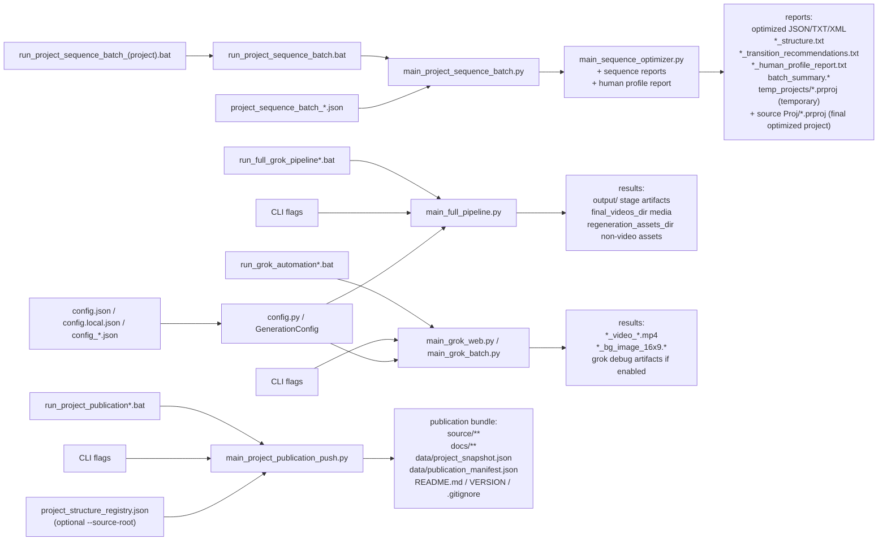

# Руководство пользователя

## Экспресс-запуск за 1 минуту

1. Положите исходные изображения в `input`.
2. Если нужно войти в Grok или обновить логин, запустите `login_grok_profile.bat`, выполните вход, откройте `https://grok.com/imagine` для проверки и затем полностью закройте это окно Chrome.
3. Запустите основной цикл:

```bat
run_full_grok_pipeline.bat --upload-timeout 300
```

4. После успешной обработки:
   - итоговые `mp4` и background-изображения будут в каталоге `final_videos_dir`;
   - prompt-файлы, manifest и остальные не-видео артефакты будут в `regeneration_assets_dir`.
5. Если stage завершился аварийно, проблемные файлы будут перенесены в `error\input` и `error\output`.
6. После завершения генерации видео нужно вручную собрать sequence в Premiere из полученных роликов.
7. Затем нужно запустить оптимизацию sequence и открывать итоговый `.prproj` уже из той же папки, где лежит исходный `project_path`; `reports\temp_projects` хранит только временную рабочую batch-копию.
8. Если после оптимизации вы руками снова меняете порядок клипов, отчеты можно заново пересобрать через `main_sequence_reports.py`.

## Назначение

Проект предназначен для пакетной подготовки prompt-файлов, генерации background-изображений и видео через Grok, оптимизации порядка sequence в Premiere и формирования отчетов для финальной доводки монтажа. Основной рабочий сценарий: входное изображение -> генерация media -> ручная сборка sequence в Premiere -> оптимизация порядка -> ручная доработка -> повторная сборка финальных рекомендаций по утвержденному порядку.

## Основные каталоги

- `input` — входные изображения для текущего запуска.
- `output` — временные prompt-файлы, manifest-файлы и промежуточные результаты текущего stage.
- `final_videos_dir` — финальный каталог для готовых `mp4` и background-изображений.
- `regeneration_assets_dir` — каталог для prompt-файлов, manifest и прочих не-видео артефактов, которые нужны для ручной правки и повторной генерации.
- `reports` — финальный каталог для отчетов по sequence, batch summary и временных batch-артефактов.
- `reports\temp_projects` — временные `.prproj`, которые создаются внутри одного batch-запуска оптимизации и затем могут быть удалены cleanup.
- папка исходного Premiere-проекта из `project_path` — постоянное место хранения финального оптимизированного `.prproj`.
- `error\input` — входные изображения stage, завершившихся с ошибкой.
- `error\output` — prompt-файлы, manifest и отчеты об ошибках для неуспешных stage.
- `.browser-profile\grok-web` — automation-профиль Chrome для Grok.
- `styles` — переиспользуемые списки стилей для portrait/style-сценариев.
- `output\chatgpt_portraits` — готовые PNG-портреты из ChatGPT portrait batch workflow.

Пример Windows-путей в `config.json`:

```json
{
  "final_videos_dir": "E:\\Git\\P_h_o_t_o\\Dv_Rita_1\\Dv_Rita\\2026\\Gen_Vd_AI",
  "regeneration_assets_dir": "E:\\Git\\P_h_o_t_o\\Dv_Rita_1\\Dv_Rita\\2026\\regeneration_assets",
  "reports_dir": "E:\\Git\\P_h_o_t_o\\Igor_Brams_1\\Igor_Brams\\2026\\reports"
}
```

## BAT-файлы

### `login_grok_profile.bat`

Назначение:
- открыть Chrome с automation-профилем проекта;
- вручную войти в Grok;
- проверить, что открывается `https://grok.com/imagine`.

Когда использовать:
- при первом запуске;
- если Grok разлогинился;
- если Grok начал требовать `Sign in` или `Sign up`.

Важно:
- этот bat-файл нужен только для ручного входа;
- после проверки доступа окно Chrome нужно полностью закрыть;
- основной pipeline сам запускает Grok во время работы.

### `run_grok_automation.bat`

Назначение:
- запустить Grok для одного изображения / одного prompt-файла.

Пример:

```bat
run_grok_automation.bat --image .\input\photo.jpg --prompt .\output\photo_20260314_101010_v_prompt_1.txt --upload-timeout 300
```

Полезно, когда нужно:
- перепроверить один prompt;
- повторно получить только один background или один ролик;
- локально протестировать Grok-stage без полного pipeline.

### `run_grok_automation_all.bat`

Назначение:
- пройти по всем `*_v_prompt_*.txt` в `output` и запустить Grok batch-режим.

Примеры:

```bat
run_grok_automation_all.bat --upload-timeout 300
run_grok_automation_all.bat --skip-existing --upload-timeout 300
run_grok_automation_all.bat --skip-video --generate-source-background --upload-timeout 300
```

Этот bat-файл полезен, если prompt-файлы уже подготовлены и нужно только выполнить Grok-часть.

### `run_full_grok_pipeline.bat`

Это основной launcher для оператора.

Он делает следующее:
1. берет одно входное изображение из `input`;
2. формирует все stage-файлы в `output`;
3. запускает Grok для этого изображения;
4. сохраняет background-изображение и/или видео;
5. переносит результаты в `final_videos_dir` и `regeneration_assets_dir`;
6. закрывает Grok;
7. переходит к следующему изображению.

Примеры:

```bat
run_full_grok_pipeline.bat --upload-timeout 300
run_full_grok_pipeline.bat --skip-video --generate-source-background --upload-timeout 300
run_full_grok_pipeline.bat --save-grok-debug-artifacts --upload-timeout 300
```

## Пакетная генерация художественных портретов в ChatGPT

Этот workflow создает готовые художественные портреты для всех поддерживаемых изображений из `input`.
Он использует уже открытый web-интерфейс ChatGPT в Chrome, а не OpenAI API.

Основные файлы:
- `main_chatgpt_portrait_batch.py` — строит задания portrait batch по изображениям и стилям.
- `api/chatgpt_desktop_v2.py` — desktop-автоматизация для существующего окна ChatGPT.
- `run_chatgpt_portrait_batch_existing.bat` — рекомендуемый launcher для уже открытой ChatGPT-сессии.
- `chatgpt_portrait_config.json` — короткий рабочий набор стилей, сейчас watercolor и pastel.
- `chatgpt_portrait_base_config.json` — полный базовый банк художественных портретных стилей.
- `styles\art_styles_Prompt_list.txt` — исходный человекочитаемый список style prompts.

Базовый конфиг сейчас содержит 10 художественных портретных стилей:
Rembrandt, Renaissance, Impressionist, post-impressionism Van Gogh, art nouveau Klimt, Art Deco, черно-белый студийный Karsh, Pop Art, Cubist и poetic modernism Chagall.

Результаты:
- готовые PNG записываются в `output\chatgpt_portraits`;
- имя файла строится как `<image_stem>_<style_slug>.png`, например `IMG-001_rembrandt.png`;
- `--skip-existing` позволяет безопасно перезапускать batch и пропускать уже сохраненные портреты.

Рекомендуемая автоматическая команда:

```bat
.\run_chatgpt_portrait_batch_existing.bat --config-file chatgpt_portrait_base_config.json --skip-existing --desktop-reactivate-delay 0 --desktop-click-composer
```

Команда для короткого рабочего набора:

```bat
.\run_chatgpt_portrait_batch_existing.bat --skip-existing
```

Ручной fallback по фокусу:
- держите уже проверенное окно ChatGPT открытым в Chrome;
- запускайте bat без `--desktop-reactivate-delay 0`;
- во время каждого countdown кликайте внутри поля сообщения ChatGPT;
- дальше скрипт сам прикрепляет исходное изображение, вставляет prompt, отправляет запрос, ждет сгенерированный результат и сохраняет картинку.

Важно:
- автоматизация не обходит human-check или CAPTCHA в ChatGPT; такую проверку нужно пройти вручную в браузере;
- не запускайте два portrait batch одновременно;
- если открыто несколько окон ChatGPT, держите видимым рабочее окно с portrait generation и закрывайте лишние пустые окна ChatGPT, если выбор окна становится нестабильным;
- после сохранения ChatGPT может оставлять последнюю сгенерированную картинку раскрытой на экране. Это нормально, если batch продолжает работу;
- если batch остановился, запускайте ту же команду снова с `--skip-existing`.

## Новые флаги генерации

### `generate_video`

Управляет видеогенерацией. По умолчанию: `true`.

В `config.json`:

```json
{
  "generate_video": true
}
```

CLI-параметры:

```bat
--generate-video
--skip-video
```

Поведение:
- если `generate_video = true` — pipeline генерирует видео в Grok;
- если `generate_video = false` и `generate_source_background = true` — pipeline делает только background-изображения;
- если `generate_video = false` и `generate_source_background = false` — stage завершается ошибкой, потому что генерировать нечего.

Если в кадре есть люди, `*_v_prompt_*.(txt|json)` и `*_v_prm_ru_*.(txt|json)` теперь должны чаще выбирать безопасную для идентичности камеру: более дальний или средне-общий план, ракурс сбоку, сверху, снизу, с воздуха или мягкое пространственное раскрытие сцены вместо агрессивного укрупнения лица. Это нужно для снижения искажений лица в сгенерированном видео.

Теперь такое безопасное поведение стало режимом по умолчанию, но его можно переключать шестью framing-флагами и одним ключом пропорции в JSON:

```json
{
  "prefer_face_closeups": false,
  "use_ai_optimal_framing": false,
  "use_ai_optimal_then_identity_safe_framing": false,
  "ai_optimal_then_identity_safe_ai_optimal_percent": 70,
  "generate_dual_framing_videos": false,
  "generate_identity_safe_closeup_videos": false,
  "generate_triple_framing_videos": false
}
```

Правила режимов кадрирования:
- если все шесть флагов равны `false`, pipeline оставляет стандартный identity-safe режим и старается не укрупнять лицо слишком агрессивно;
- если `prefer_face_closeups = true`, крупный лицевой план разрешён и может становиться предпочтительным;
- если `use_ai_optimal_framing = true`, AI выбирает самый сильный кинематографический кадр по исходному изображению, но не должен значительно увеличивать лицо или искажать его;
- если `use_ai_optimal_then_identity_safe_framing = true`, из одного изображения строится одно видео, где первые `ai_optimal_then_identity_safe_ai_optimal_percent` процентов идут как AI-optimal, а оставшаяся часть плавно переводит камеру в identity-safe режим с более безопасной дистанцией;
- если `ai_optimal_then_identity_safe_ai_optimal_percent` не указан, по умолчанию используется соотношение `70 / 30`; например, значение `50` означает `50%` AI-optimal и `50%` identity-safe.
- если `generate_dual_framing_videos = true`, pipeline строит две ветки от одного и того же исходного кадра: identity-safe и AI-optimal.
- если `generate_identity_safe_closeup_videos = true`, pipeline строит две ветки от одного и того же исходного кадра: identity-safe и face-closeup.
- если `generate_triple_framing_videos = true`, pipeline строит три ветки от одного и того же исходного кадра: identity-safe, face-closeup и AI-optimal.

Количество видео в dual-режиме:
- при `video_count = 1` dual-режим даёт `2` видео;
- при `video_count = N` dual-режим даёт `2 x N` видео.

Одновременно можно включать только один из этих шести framing-флагов. Процентный ключ не является отдельным режимом, а только уточняет hybrid-режим.

### `generate_grok_multiscene_json_prompt`

Управляет специальным режимом Grok, в котором обычный `*_v_prompt_*.txt` заменяется JSON prompt-артефактом.

В `config.json`:

```json
{
  "generate_grok_multiscene_json_prompt": true,
  "grok_multiscene_prompt_size": 2000
}
```

Поведение:
- pipeline пишет `*_v_prompt_*.json` на английском и `*_v_prm_ru_*.json` на русском вместо TXT prompt-файлов;
- каждый JSON-файл представляет собой массив из одного объекта с полем `prompt`, по смыслу аналогично `Gen_Video_Seedance`;
- Grok автоматически извлекает английский `prompt` из этого JSON, поэтому batch-запуск продолжает работать через обычные Grok-runner'ы;
- prompt трактуется как компактный трехсценный план видео, построенный из одного входного изображения, где `@image1` — это само входное изображение.

Текущая фиксированная схема:
- `Shot 1`, `0-2s`: самый сильный на сегодня AI-optimal кинематографичный вариант;
- `Shot 2`, `2-4s`: альтернативный AI-optimal вариант с явно другим решением камеры;
- `Shot 3`, `4-6s`: более безопасный дистанционный ракурс с более широким раскрытием пространства.

Текущие ограничения:
- общая длительность фиксирована как `6s`;
- aspect ratio фиксирован как `16:9`;
- английский prompt валидируется по настроенному `grok_multiscene_prompt_size` в символах, а лимит слов вычисляется автоматически как примерно `size / 5`.

Параметр размера prompt:
- `grok_multiscene_prompt_size` — по умолчанию `1000`, что даёт примерно `200` слов;
- значение `2000` даёт примерно `400` слов и позволяет строить более подробный JSON video prompt для Grok;
- builder всё равно старается держать prompt компактным, но при увеличении лимита может сохранить больше деталей сцены.

Когда включать `--skip-video`:
- если нужно получить только background-изображения;
- если видео временно не нужны;
- если вы хотите сначала собрать фон, а видеогенерацию сделать позже.

### `generate_source_background`

Управляет генерацией background-изображения в Grok.

CLI-параметры:

```bat
--generate-source-background
--skip-source-background
```

Текущее поведение:
- для background используется `*_assoc_bg_prompt.txt`;
- этот дескриптор описывает ассоциативное реалистичное изображение, подходящее как фон;
- Grok строит новый background по этому дескриптору и использует исходное фото как опору.

### `save_grok_debug_artifacts`

Управляет сохранением диагностических файлов Grok. По умолчанию: `false`.

В `config.json`:

```json
{
  "save_grok_debug_artifacts": false
}
```

CLI-параметры:

```bat
--save-grok-debug-artifacts
--skip-grok-debug-artifacts
```

Что происходит:
- если `false` — candidate/debug-файлы не остаются в `output`, рабочая папка остается чистой;
- если `true` — в `output` сохраняются диагностические артефакты Grok.

Какие файлы могут появиться:
- `*_bg_image_16x9.candidate_*.png`
- `*_bg_image_16x9_candidates.json`
- `*_grok_debug.png`
- `*_grok_debug.html`
- `*_grok_debug.json`

Когда включать:
- если Grok сохранил не то background-изображение;
- если нужно понять, какой кандидат нашелся на странице;
- если идет отладка сохранения результата из интерфейса Grok.

Когда лучше держать выключенным:
- при обычной эксплуатации;
- когда важно, чтобы `output` не засорялся служебными файлами.

### `continue_after_failure`

Управляет поведением pipeline после аварийного stage.

Поведение:
- если `false` — pipeline остановится на первой ошибке;
- если `true` — проблемный stage уйдет в `error`, а обработка продолжится со следующим изображением.

Когда включать:
- если входных изображений много;
- если среди них могут быть слишком большие или проблемные файлы;
- если удобно потом отдельно разбирать только ошибочные stage.

## Полный справочник по конфигурации генерации

Все актуальные поля `GenerationConfig`:

- `generate_video` — по умолчанию `true`; включает генерацию видео и video-stage.
- `generate_grok_multiscene_json_prompt` — по умолчанию `false`; писать Grok-ready EN/RU JSON prompt-артефакты вместо TXT video prompt-файлов, используя фиксированную трехсценную схему `6s` из одного входного изображения.
- `grok_multiscene_prompt_size` — по умолчанию `1000`; максимальный размер prompt для Grok multiscene JSON режима в условных символах. Лимит слов вычисляется автоматически, например `1000 -> 200 слов`, `2000 -> 400 слов`.
- `video_count` — по умолчанию `2`; сколько видео строить из одного исходного кадра для каждого активного режима кадрирования.
- `camera_segments` — по умолчанию `1`; сколько сегментов движения камеры планируется внутри одного video prompt.
- `motion_source` — по умолчанию `table`; брать движения камеры из локальной таблицы или из AI (`ai`).
- `motion_model` — по умолчанию `gpt-4.1`; OpenAI-модель для AI-подбора движений камеры при `motion_source = ai`.
- `generate_source_background` — по умолчанию `false`; создавать background-prompt и запускать background-stage в Grok.
- `save_grok_debug_artifacts` — по умолчанию `false`; сохранять диагностические candidate/debug-артефакты Grok в `output`.
- `final_videos_dir` — по умолчанию `final_project/videos`; финальный каталог для готовых `mp4` и background-изображений.
- `regeneration_assets_dir` — по умолчанию `final_project/regeneration_assets`; каталог для prompt-файлов, manifest и не-видео артефактов stage.
- `continue_after_failure` — по умолчанию `false`; продолжать со следующим изображением после переноса ошибочного stage в `error`.
- `write_description` — по умолчанию `true`; записывать текстовый description / analysis-файл stage.
- `generate_final_frames` — по умолчанию `false`; генерировать final frame через image API.
- `read_input_list` — по умолчанию `true`; читать все поддерживаемые исходные изображения из `input`.
- `generate_music` — по умолчанию `false`; генерировать музыкальный prompt после последнего обработанного изображения.
- `prefer_face_closeups` — по умолчанию `false`; разрешать и предпочитать более близкий лицевой план, если он соответствует исходному кадру.
- `use_ai_optimal_framing` — по умолчанию `false`; позволять AI выбирать самый сильный кинематографический кадр, но без значительного укрупнения или искажения лица.
- `use_ai_optimal_then_identity_safe_framing` — по умолчанию `false`; создавать одно видео, где первая часть идет в AI-optimal режиме, а оставшаяся часть переходит в identity-safe дистанцию и ракурсы.
- `ai_optimal_then_identity_safe_ai_optimal_percent` — по умолчанию `70`; используется только при `use_ai_optimal_then_identity_safe_framing = true`; сколько процентов длительности видео отдавать AI-optimal части. Допустимый диапазон: `1..99`. Доля identity-safe вычисляется автоматически как `100 - value`.
- `generate_dual_framing_videos` — по умолчанию `false`; строить две ветки видео из одного исходного кадра: identity-safe и AI-optimal.
- `generate_identity_safe_closeup_videos` — по умолчанию `false`; строить две ветки видео из одного исходного кадра: identity-safe и face-closeup.
- `generate_triple_framing_videos` — по умолчанию `false`; строить три ветки видео из одного исходного кадра: identity-safe, face-closeup и AI-optimal.
- `hide_phone_in_selfie` — по умолчанию `true`; если входной кадр похож на selfie / автопортрет, сохранять ощущение selfie, но по возможности не показывать телефон, фотоаппарат, видеокамеру или их отражение.
- `prefer_loving_kindness_tone` — по умолчанию `true`; там, где это уместно именно для данного входного изображения, деликатно смещать prompts в сторону любящей доброты, благожелательности, дружелюбия, теплой доброй атмосферы, света, цвета, среды и фона.

Важное правило по кадрированию:
- Одновременно можно включать только один из флагов `prefer_face_closeups`, `use_ai_optimal_framing`, `use_ai_optimal_then_identity_safe_framing`, `generate_dual_framing_videos`, `generate_identity_safe_closeup_videos` или `generate_triple_framing_videos`.

## Архитектура и контроль изменений

Для карты структуры проекта, потоков данных, инвариантов и checklist по impact-анализу см. `PROJECT_STRUCTURE.md`.
Для автоматизированного сопровождения и машинного change-review см. `project_structure_registry.json`.
Для быстрого impact-анализа используйте `python .\main_change_impact.py --change-type generation_flag --changed-file config.py`.
Для обновления отдельного репозитория с документацией проекта используйте `python .\main_project_publication.py --target-dir .\project_publication\Memory-to-Video_Agent`.
Публичный bundle теперь также включает полное безопасное зеркало исходников в `source/`, исключая секреты, медиа-артефакты и runtime-папки.
Для безопасного publish-flow в публичный локальный клон используйте `python .\main_project_publication_push.py --repo-dir <path-to-local-Memory-to-Video_Agent-clone> --stage`.
Для самого короткого preview/stage-only запуска без push используйте `.\run_project_publication_stage.bat`.
Для самого короткого ручного запуска используйте `.\run_project_publication_push.bat`.

## Карта Batch / Program / Parameters

Эта компактная схема нужна, когда надо быстро понять, какой `.bat` запускает какую Python-программу и откуда берутся основные параметры.



Левая часть схемы показывает запуск и источники параметров, а правая часть показывает, какие отчеты и результатные артефакты появляются на выходе.

Обычный приоритет параметров такой:

1. Аргументы, жестко заданные в `.bat`-оболочке.
2. Дополнительные аргументы, проброшенные через `%*`.
3. Значения из JSON-конфига.
4. Значения по умолчанию в Python-коде.

## Развертывание В Другом Месте

Для чистого локального развертывания в другой папке или на другой машине используйте:

```powershell
powershell -ExecutionPolicy Bypass -File .\setup_project.ps1
```

Скрипт:
- создает `.venv`;
- устанавливает зависимости из `requirements.txt`;
- создает локальные рабочие папки `input`, `output`, `final_project\videos`, `final_project\regeneration_assets`;
- записывает `.env.template`;
- создает `config.local.json` с относительными локальными путями.

Дальше:
- заполните реальные ключи в `.env`;
- положите исходные изображения в `input\`;
- для нового клона один раз запустите `login_grok_profile.bat` и выполните вход в Grok именно в этом клоновом Chrome-профиле;
- запускайте `.\run_full_grok_pipeline_local.bat`.

Или используйте единый скрипт bootstrap/check/run:

```powershell
powershell -ExecutionPolicy Bypass -File .\deploy_and_run.ps1
```

Он сначала выполняет bootstrap, затем проверяет:
- `.env` и наличие `OPENAI_API_KEY`;
- доступность локального Chrome;
- что клоновый Grok-профиль в `.browser-profile\grok-web` уже авторизован для `https://grok.com/imagine`;
- наличие подходящих исходных изображений в `input\`.
- Важно: каждый клон по умолчанию использует собственный Grok Chrome-профиль в `.browser-profile\grok-web`, если вы явно не передали другой `--profile-dir`.

Если этот Grok-профиль еще не авторизован, `deploy_and_run.ps1` теперь останавливается до запуска pipeline и подсказывает запустить `login_grok_profile.bat`.

Для dry-run проверки без запуска pipeline:

```powershell
powershell -ExecutionPolicy Bypass -File .\deploy_and_run.ps1 -CheckOnly
```

## Короткая Рабочая Памятка Из 3 Команд

Для повседневной работы в основной директории проекта используйте такую короткую последовательность:

```powershell
cd E:\Git\AI_PIC_DEF\def_AI\img-style-ag_1
powershell -ExecutionPolicy Bypass -File .\deploy_and_run.ps1 -CheckOnly
python .\main_project_publication_push.py --repo-dir E:\Git\AI_PIC_DEF\Memory-to-Video_Agent --commit-message "Update project publication" --push
```

Смысл команд:
- `работать` — перейти в основную рабочую директорию;
- `проверить` — проверить окружение, клоновый Grok-профиль и `input\`;
- `опубликовать` — обновить и отправить публичное зеркало проекта.

## Что куда переносится после успешного stage

В `final_videos_dir`:
- `*.mp4`;
- итоговые background-изображения.

В `regeneration_assets_dir\<stage_id>`:
- `description`;
- `scene_analysis`;
- `v_prompt`;
- `v_prm_ru`;
- `bg_prompt`;
- `bg_prm_ru`;
- `assoc_bg_prompt`;
- `assoc_bg_prm_ru`;
- `manifest`;
- другие не-видео stage-файлы.

Не копируется в `regeneration_assets_dir`:
- исходное изображение;
- финальные `mp4`;
- финальный background-файл.

## Что происходит при ошибке

Если stage завершился с ошибкой:
- файлы stage из `output` переносятся в `error\output\<stage_id>`;
- входное изображение переносится в `error\input\<stage_id>`;
- рядом сохраняется файл `<stage_id>_error.txt` с текстом ошибки.

Это удобно для ручного разбора и повторной обработки только проблемных изображений.

Если Grok закрывает текущую вкладку сразу после `submit`, automation теперь пытается подхватить другую живую Grok-вкладку или уже начавшуюся загрузку, прежде чем считать stage ошибочным.
Для незавершенных stage, у которых уже есть готовый `*_v_prompt_*.txt`, можно безопасно повторять только video-step без повторной генерации background.

## Workflow для sequence в Premiere

После завершения генерации видео нормальный процесс такой:

1. Вручную собрать sequence в Premiere из сгенерированных `mp4`.
2. Запустить batch-оптимизацию sequence, чтобы получить новые sequence вида `_oNN` из утвержденных `_eNN`.
3. Проверить оптимизированный результат в Premiere.
4. Если нужно, еще раз вручную изменить порядок клипов после оптимизации.
5. Пересобрать отчеты уже по текущему ручному порядку.
6. Хранить финальный оптимизированный проект рядом с исходным Premiere-проектом, а отчеты держать в `reports`.

Важное правило по путям:

- `reports` — это финальный результат по отчетам и batch summary.
- `reports\temp_projects` — это временная batch-зона для `.prproj`, которую потом можно чистить.
- постоянный оптимизированный `.prproj` лежит рядом с `project_path`.
- `output` — это временная рабочая зона.
- Если все завершилось успешно, `output` в идеале должен оказаться пустым.

## Batch-оптимизация sequence

Запуск:

```powershell
python .\main_project_sequence_batch.py --config .\project_sequence_batch_igor_26_1A.json
```

Пример ключевых полей config:

```json
{
  "project_path": "E:\\Git\\video_projects\\Igor\\Proj\\Igor26_1A_w01.prproj",
  "regeneration_assets_dir": "E:\\Git\\P_h_o_t_o\\Igor_Brams_1\\Igor_Brams\\2026\\regeneration_assets",
  "output_project_path": "E:\\Git\\video_projects\\Igor\\Proj\\Igor26_1A_o01.prproj",
  "reports_dir": "E:\\Git\\P_h_o_t_o\\Igor_Brams_1\\Igor_Brams\\2026\\reports",
  "generate_personalized_report": false,
  "human_detail_txt": "E:\\Git\\AI_PIC_DEF\\def\\Detail_1\\Igor\\Igor_detail.txt",
  "sequence_jobs": [
    {
      "source_sequence_name": "Igor26_baby_1_e01",
      "new_sequence_name": "Igor26_baby_1_o01"
    }
  ]
}
```

Итоговый оптимизированный `.prproj` теперь хранится рядом с исходным `project_path`. Во время batch-запуска программа также держит временный рабочий `.prproj` внутри `reports\temp_projects`, и cleanup позже может удалить эту временную копию.

Если старый config по-прежнему указывает `output_project_path` внутрь `reports`, имя файла все равно сохраняется, но постоянный оптимизированный проект будет записан рядом с `project_path`.

В обычной работе лучше держать рядом с шаблоном отдельный batch-конфиг под конкретный проект, например `project_sequence_batch_slava_26_1.json`, и запускать batch уже из него, не редактируя шаблон каждый раз.

После успешного batch-запуска в `reports` обычно находятся:

- `batch_summary.json`;
- `batch_summary.txt`;
- `batch_transition_recommendations.txt`;
- JSON и TXT отчеты по отдельным sequence;
- `*_structure.txt`;
- `*_human_profile_report.txt`, если был запрошен персонализированный отчет;
- `*_transition_recommendations.txt`;
- временные рабочие проекты `temp_projects\*.prproj`, включая последний batch-проект.

Постоянный итоговый оптимизированный `.prproj` лежит в той же папке, где находится исходный Premiere-проект из `project_path`.

Чтобы batch автоматически строил персонализированные отчеты, в config должны быть одновременно включены:

- `"generate_personalized_report": true`
- `"human_detail_txt": "E:\\...\\hero_detail.txt"`

Если `generate_personalized_report` остается `false`, batch работает как раньше и никаких дополнительных персонализированных отчетов не создает.

## Пересборка отчетов после ручных изменений sequence

Если после автоматической оптимизации вы руками снова поменяли порядок sequence, можно заново собрать отчеты без повторной оптимизации:

```powershell
python .\main_sequence_reports.py `
  --prproj "E:\Git\video_projects\Igor\Proj\Igor26_1A_o01.prproj" `
  --sequence-name "Igor26_baby_1_o01" `
  --optimization-report-json "E:\Git\P_h_o_t_o\Igor_Brams_1\Igor_Brams\2026\reports\01_Igor26_baby_1_o01.json" `
  --output-dir "E:\Git\P_h_o_t_o\Igor_Brams_1\Igor_Brams\2026\reports"
```

Команда заново строит:

- `<sequence>_manual_order.json`;
- `<sequence>_manual_order_music.txt`;
- `<sequence>_manual_order_structure.txt`;
- `<sequence>_manual_order_transition_recommendations.txt`.

Это нужно в тот момент, когда пользователь руками улучшил sequence после автоматической оптимизации и хочет получить свежие рекомендации по монтажу, описанию видео и музыке уже для утвержденного порядка.

Теперь в этом сценарии музыка идет первой: `main_sequence_reports.py` всегда пишет отдельный `music-first` отчет для текущей sequence раньше, чем structure и transition recommendations.
Этот `music-first` отчет теперь также начинается с одного варианта трека с самым высоким приоритетом для данного видео, а уже потом дает расширенные списки по категориям.

Если для текущей sequence нужна только рекомендация по музыке, используйте:

```powershell
python .\main_sequence_reports.py `
  --prproj "E:\Git\video_projects\Igor\Proj\Igor26_1A_o01.prproj" `
  --sequence-name "Igor26_baby_1_o01" `
  --optimization-report-json "E:\Git\P_h_o_t_o\Igor_Brams_1\Igor_Brams\2026\reports\01_Igor26_baby_1_o01.json" `
  --output-dir "E:\Git\P_h_o_t_o\Igor_Brams_1\Igor_Brams\2026\reports" `
  --music-only
```

В режиме `--music-only` команда все равно пересобирает текущий JSON-контекст sequence, но не создает structure- и transition-отчеты.

## Music-First только из project и sequence

Если у вас есть только проект Premiere и sequence, а прежнего optimization JSON еще нет, используйте прямой режим `project + sequence -> music-first`:

```powershell
python .\main_sequence_music_first.py `
  --prproj "E:\Git\video_projects\Igor\Proj\Igor26_2w_v01.prproj" `
  --sequence-name "Igor26_2w_e05" `
  --max-sampled-clips 12
```

Этот режим:

- напрямую читает текущую sequence из `.prproj`;
- равномерно выбирает репрезентативные клипы по текущему порядку;
- извлекает из них опорные кадры;
- прогоняет эти кадры через scene-analysis;
- сохраняет JSON-контекст и music-first отчет.
- этот `music-first` отчет сначала называет один трек с самым высоким приоритетом для sequence, а затем уже показывает расширенные списки по категориям.

Этот режим нужен именно для полностью новой sequence, которая еще не проходила старый stage-based pipeline оптимизации.

Если для этой же новой sequence нужна и вторая очередь рекомендаций, используйте:

```powershell
python .\main_sequence_music_first.py `
  --prproj "E:\Git\video_projects\Igor\Proj\Igor26_2w_v01.prproj" `
  --sequence-name "Igor26_2w_e05" `
  --full-recommendations
```

В режиме `--full-recommendations` команда сохраняет музыку как главный первый отчет, а затем дополнительно:

- анализирует текущие клипы sequence и предлагает рекомендуемый порядок уже без старого `optimization-report-json`;
- пишет `*_music_first_structure.txt` как отчет по рекомендуемой последовательности/структуре;
- пишет `*_music_first_transition_recommendations.txt` как рекомендации по переходам между соседними рекомендуемыми клипами.

Если sequence очень длинная, глубину второй очереди можно ограничить через `--max-analyzed-clips`, но лучший полноразмерный совет по порядку получается без этого ограничения, когда анализируются все текущие клипы.

Теперь `*_structure.txt` осторожнее отделяет взрослые travel/leisure-последовательности от семейного портрета. Сам по себе пожилой герой, большая группа людей или общий портретный кадр больше не должны автоматически переводить описание в семейную тему, если видеоряд явно построен вокруг поездки, отдыха и локаций.

Повторяющиеся домашние животные теперь тоже должны подниматься в `*_structure.txt` заметнее. Если собаки, кошки или другие питомцы встречаются в нескольких клипах, этот мотив должен попадать в основную тему или краткое описание, а не теряться.

Формулировки для `adult_family_portrait` теперь по умолчанию тоже гендерно-нейтральные. Отчет не должен описывать sequence как ролик "про женщин" или "про мужчин", если сам видеоряд не дает для этого устойчивого повторяющегося основания.

Короткие английские слова про животных теперь тоже проверяются аккуратнее. Слова вроде `capturing` больше не должны создавать ложный мотив `cat`, а повторяющиеся мотивы свадьбы, жениха и невесты или рыбалки, рыбака и рыбы теперь должны подниматься в `*_structure.txt`, если они реально проходят через sequence.

Если такие мотивы занимают только часть sequence, отчет должен описывать их как заметную линию или акцент внутри большой истории, а не превращать весь ролик только в “свадьбу” или только в “рыбалку”.

Формулировка про свадьбу теперь тоже стала строже: sequence должен переходить в свадебный мотив только при явных признаках `wedding / bride / groom` или `свадьба / невеста / жених`. Просто романтические сцены, поцелуи и парные портреты сами по себе не должны переименовывать весь ролик в “свадьбу”. Family-travel sequence с доминирующим travel тоже должны оставаться travel-centered.

## Как добавить human-detail в отчет

Обычный `*_structure.txt` нужно сохранять как video-only отчет.

Если у вас есть отдельное человеческое описание героя, поверх него нужно строить еще один отдельный отчет, который объединяет:

- то, что реально видно в видео;
- то, что человек знает о герое;
- то, как из-за этого нужно скорректировать музыкальные рекомендации.

Команда:

```powershell
python .\main_human_sequence_report.py `
  --optimization-report-json "E:\Git\P_h_o_t_o\Dv_Maya\2026\reports\01_Maya26_o03.json" `
  --human-detail-txt "E:\Git\AI_PIC_DEF\def\Detail_1\Maya\Maya_detail_260328_2.txt"
```

В результате создается:

- `01_Maya26_o03_human_profile_report.txt`

Теперь эту же логику можно запускать автоматически прямо из `main_project_sequence_batch.py`, если в batch-config есть:

```json
{
  "generate_personalized_report": true,
  "human_detail_txt": "E:\\Git\\AI_PIC_DEF\\def\\Detail_1\\Maya\\Maya_detail_260328_2.txt"
}
```

Важное правило:

- основная тема, сюжет и фактическая структура должны оставаться video-only;
- human-text должен корректировать образ героя, тон итогового описания и музыкальные предпочтения;
- профессию, биографию, образование, питание и другие невидимые в кадре детали не нужно превращать в прямой факт видеоряда, если их нет в самой sequence.

## Очистка старых и временных файлов

Предпросмотр очистки:

```powershell
python .\main_cleanup_artifacts.py `
  --reports-dir "E:\Git\P_h_o_t_o\Igor_Brams_1\Igor_Brams\2026\reports" `
  --older-than-days 7 `
  --include-output-build-dirs `
  --include-test-runtime-items
```

Безопасная очистка с архивом:

```powershell
python .\main_cleanup_artifacts.py `
  --reports-dir "E:\Git\P_h_o_t_o\Igor_Brams_1\Igor_Brams\2026\reports" `
  --older-than-days 7 `
  --include-output-build-dirs `
  --include-test-runtime-items `
  --archive-dir "E:\Git\P_h_o_t_o\Igor_Brams_1\Igor_Brams\2026\cleanup_archive\20260326" `
  --execute
```

Замечания:

- без `--execute` это только dry-run;
- cleanup-отчеты записываются в `output\cleanup_reports`;
- `--include-test-runtime-items` добавляет в скан top-level артефакты из `test_runtime`;
- если хотите сохранить возможность отката, используйте `--archive-dir`.

Рекомендуемая one-line команда для cleanup всего workspace:

```powershell
python .\main_cleanup_artifacts.py --include-output-build-dirs --include-output-files --include-test-runtime-items --archive-dir ".\cleanup_archive\workspace_$(Get-Date -Format yyyyMMdd_HHmmss)" --execute
```

Рекомендуемый one-line preview без удаления:

```powershell
python .\main_cleanup_artifacts.py --include-output-build-dirs --include-output-files --include-test-runtime-items --archive-dir ".\cleanup_archive\workspace_$(Get-Date -Format yyyyMMdd_HHmmss)"
```

## Финальный стандарт именования

Для новых проектов и новых batch-конфигов используйте короткий стандарт:

- проект в утвержденной ручной работе: `Igor26_1A_w01.prproj`
- проект, полученный после batch-оптимизации: `Igor26_1A_o01.prproj`
- утвержденная ручная sequence: `Igor26_baby_1_e01`
- оптимизированная sequence от программы: `Igor26_baby_1_o01`

Расшифровка:

- `w` = working project
- `e` = editable и утвержденная ручная sequence
- `o` = optimized результат программы
- `01`, `02`, `03` = номер версии

Рекомендуемый цикл:

1. Вручную работать в `Igor26_1A_w01.prproj`.
2. Хранить утвержденную исходную sequence как `Igor26_baby_1_e01`.
3. Запускать оптимизацию и получать `Igor26_1A_o01.prproj` с sequence `Igor26_baby_1_o01`.
4. Проверять и вручную дорабатывать эту оптимизированную sequence.
5. Если она стала новой утвержденной базой, сохранять следующий ручной проект как `Igor26_1A_w02.prproj`.
6. Переименовывать принятую sequence в `Igor26_baby_1_e02`.
7. Если нужен еще один цикл, получать `Igor26_1A_o02.prproj` и `Igor26_baby_1_o02`.
8. Когда sequence окончательно утверждена, пересобирать отчеты по финальному текущему порядку и хранить их в `reports`.

## Типовые команды

Полный цикл:

```bat
run_full_grok_pipeline.bat --upload-timeout 300
```

Только background-изображения:

```bat
run_full_grok_pipeline.bat --skip-video --generate-source-background --upload-timeout 300
```

Полный цикл с отладочными файлами Grok:

```bat
run_full_grok_pipeline.bat --save-grok-debug-artifacts --upload-timeout 300
```

Grok batch только по уже готовым prompt-файлам:

```bat
run_grok_automation_all.bat --upload-timeout 300
```

Пакетная генерация художественных портретов в ChatGPT по всем изображениям из `input` и полному базовому банку стилей:

```bat
.\run_chatgpt_portrait_batch_existing.bat --config-file chatgpt_portrait_base_config.json --skip-existing --desktop-reactivate-delay 0 --desktop-click-composer
```

Короткий ChatGPT batch для watercolor/pastel портретов:

```bat
.\run_chatgpt_portrait_batch_existing.bat --skip-existing
```

Batch-оптимизация sequence Premiere:

```powershell
python .\main_project_sequence_batch.py --config .\project_sequence_batch_igor_26_1A.json
```

Пересборка отчетов по текущему ручному порядку:

```powershell
python .\main_sequence_reports.py --prproj "<project.prproj>" --sequence-name "<sequence>" --optimization-report-json "<report.json>" --output-dir "<reports-dir>"
```

Предпросмотр cleanup:

```powershell
python .\main_cleanup_artifacts.py --reports-dir "<reports-dir>" --older-than-days 7 --include-output-build-dirs --include-test-runtime-items
```

One-line safe cleanup всего workspace:

```powershell
python .\main_cleanup_artifacts.py --include-output-build-dirs --include-output-files --include-test-runtime-items --archive-dir ".\cleanup_archive\workspace_$(Get-Date -Format yyyyMMdd_HHmmss)" --execute
```

Один prompt вручную:

```bat
run_grok_automation.bat --image .\input\photo.jpg --prompt .\output\photo_20260314_101010_v_prompt_1.txt --upload-timeout 300
```

## Краткие рекомендации оператору

- `login_grok_profile.bat` используйте только когда нужен ручной вход в Grok.
- Для обычной работы запускайте `run_full_grok_pipeline.bat`.
- Если нужны только фоны, используйте `--skip-video` вместе с `--generate-source-background`.
- Если что-то пошло не так с сохранением результата Grok, временно включайте `--save-grok-debug-artifacts`.
- Если stage упал, сначала смотрите в `error\output\<stage_id>\<stage_id>_error.txt`.
- Финальные оптимизированные `.prproj` открывайте из той же папки, где лежит исходный `project_path`; `reports\temp_projects` хранит только временную batch-копию.
- Если после оптимизации порядок sequence был изменен вручную, пересобирайте отчеты через `main_sequence_reports.py`.
- Перед удалением старых артефактов сначала делайте dry-run cleanup и по возможности храните архивную копию.
- Для ChatGPT portrait batch держите активным только один запуск автоматизации и всегда используйте `--skip-existing` при продолжении после UI-сбоя.

## Компоновщик многосценного video prompt

Используйте `main_video_prompt_composer.py`, когда для набора исходных изображений уже существуют `regeneration_assets` и нужно собрать один общий многосценный prompt по сценам и ссылкам `@imageN`.

Обязательное правило двуязычного вывода для задач на генерацию видео:

- Любая задача, которая через `main_video_prompt_composer.py` создает финальные артефакты для генерации видео, должна в одном запуске выпускать и английскую, и русскую версии.
- Это правило относится и к объединенным TXT prompt-файлам, и к Seedance JSON-заданиям, включая все ветки из `scenario_variants`.
- Английский артефакт является рабочим prompt, а русский артефакт является обязательным контрольным файлом для проверки.
- Задача на генерацию видео считается незавершенной, если для нее отсутствует парный RU-файл.

Входной контракт:

- JSON-запрос с полями `technical_preamble`, `total_duration_seconds`, `aspect_ratio`, `regeneration_assets_dir`, `references` и упорядоченным списком `scenes`.
- Либо можно использовать `--config-file` с одним полным JSON/JSONC-конфигом, который содержит и сценарные данные, и настройки генерации Seedance/TXT.
- Необязательный параметр `max_prompt_chars` задает верхний предел длины prompt; по умолчанию это `2000`.
- Необязательный параметр `scenario_variants` позволяет из одного сценария получать несколько альтернативных JSON-заданий на генерацию.
- Каждый элемент `references` связывает имя исходного файла со стабильным тегом `@imageN`.
- Каждая сцена задает `duration_seconds` и короткое описание сцены, в котором можно ссылаться на один или несколько `@imageN`.

Выходные файлы в `regeneration_assets_dir`:

- `Gen_Video_<timestamp>.txt` - английский prompt.
- `Gen_Video_RU_<timestamp>.txt` - русский перевод.
- `Gen_Video_Seedance_<timestamp>.json` - Seedance 2.0 JSON prompt при включенном `--seedance-json`.
- `Gen_Video_Seedance_RU_<timestamp>.json` - русский контрольный JSON для ручной проверки того же Seedance prompt.
- `Gen_Video_Seedance_<VariantId>_<timestamp>.json` и `Gen_Video_Seedance_RU_<VariantId>_<timestamp>.json` - отдельные файлы по каждому варианту сценария, если в `scenario_variants` задано несколько веток.

Типовая команда:

```powershell
.\.venv\Scripts\python.exe -u .\main_video_prompt_composer.py --request-file .\video_prompt_request_slava_volga_example.json --seedance-json
```

Команда с конфиг-файлом:

```powershell
.\.venv\Scripts\python.exe -u .\main_video_prompt_composer.py --config-file .\video_prompt_config_maya_africa_home_two_variants.json
```

Только Seedance JSON:

```powershell
.\.venv\Scripts\python.exe -u .\main_video_prompt_composer.py --request-file .\video_prompt_request_slava_volga_example.json --seedance-json --seedance-json-only
```

Правило вариантов:

- `Variant_1` должен быть наиболее вероятным, наиболее подходящим и самым цельным вариантом.
- `Variant_2` должен быть полностью альтернативным вариантом на основе тех же фактов сценария.

Особенности Seedance:

- Требования загружаются из `services\Seedance_2.0_Director.md`.
- Английский Seedance JSON имеет строгий формат из одного элемента: `[{"lang":"en","prompt":"..."}]`.
- Парный русский контрольный Seedance JSON имеет строгий формат из одного элемента: `[{"lang":"ru","prompt":"..."}]`.
- Сгенерированный prompt дополнительно валидируется по `Shot N:`, footer `Total:`, aspect ratio, обязательным `@imageN` и лимиту в 2000 символов.
- Генератор должен избегать слишком дальних aerial/drone/bird's-eye ракурсов, при которых персонажи превращаются в крошечные фигуры; общий план допустим только тогда, когда люди остаются хорошо читаемыми и сопоставимыми по масштабу с референсами.
- Полные переиспользуемые примеры конфигов лежат в `video_prompt_composer_config_example.jsonc` и `video_prompt_config_*.json`.
- `seedance_json_only: true` автоматически включает и `seedance_json: true`.

## Правило синхронизации документации

При любом изменении workflow, путей, схемы именования, cleanup-правил или набора отчетов нужно одновременно обновлять оба файла:

- `USER_GUIDE.md`
- `Руководство_пользователя.md`
